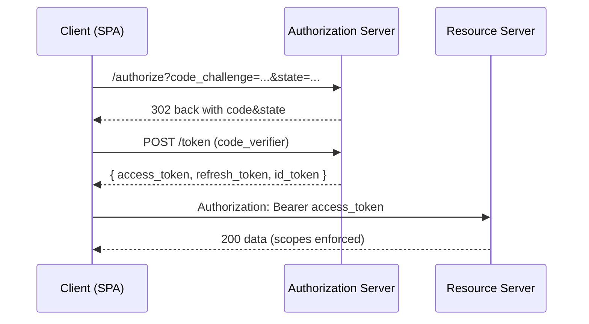

# Cyber Security Bootcamp — 21‑in‑1 (Summary + Weeks 01–20)

_Generated: October 18, 2025_

## Table of Contents
1. [Summary Plan](#summary-plan)
2. [Week 01](#week-01)
3. [Week 02](#week-02)
4. [Week 03](#week-03)
5. [Week 04](#week-04)
6. [Week 05](#week-05)
7. [Week 06](#week-06)
8. [Week 07](#week-07)
9. [Week 08](#week-08)
10. [Week 09](#week-09)
11. [Week 10](#week-10)
12. [Week 11](#week-11)
13. [Week 12](#week-12)
14. [Week 13](#week-13)
15. [Week 14](#week-14)
16. [Week 15](#week-15)
17. [Week 16](#week-16)
18. [Week 17](#week-17)
19. [Week 18](#week-18)
20. [Week 19](#week-19)
21. [Week 20](#week-20)

---

# Summary Plan

# Cyber Bootcamp — 20‑Week Summary Plan

_Generated: October 18, 2025_

This summary gives a 1‑page view of each week’s **focus**, **skills**, and **deliverables**. Use it as the front‑matter of your repo.

## Week 01 – Lab & Monitoring Baseline + Nmap
- **Focus:** See the detailed week file.
- **Core skills:** See the Outcomes section in the week file.
- **Deliverable:** Mini‑project + docs.

## Week 02 – **Bash Mastery + Linux Administration** (In‑Depth)
- **Focus:** See the detailed week file.
- **Core skills:** See the Outcomes section in the week file.
- **Deliverable:** Mini‑project + docs.

## Week 03 – **PowerShell Mastery + Windows Administration** (In‑Depth)
- **Focus:** See the detailed week file.
- **Core skills:** See the Outcomes section in the week file.
- **Deliverable:** Mini‑project + docs.

## Week 04 — **Web/AppSec Foundations + OWASP Mapping** (Extra‑Deep)
- **Focus:** See the detailed week file.
- **Core skills:** See the Outcomes section in the week file.
- **Deliverable:** Mini‑project + docs.

## Week 05 — **API Security I: REST/OpenAPI/Testing & Fuzzing** (Extra‑Deep)
- **Focus:** See the detailed week file.
- **Core skills:** See the Outcomes section in the week file.
- **Deliverable:** Mini‑project + docs.

## Week 06 — **Authentication Deep-Dive: OAuth2/OIDC (Auth Code + PKCE), Sessions vs JWT** (Extra‑Deep)
- **Focus:** See the detailed week file.
- **Core skills:** See the Outcomes section in the week file.
- **Deliverable:** Mini‑project + docs.

## Week 07 — **Database Security: Postgres RLS, Least‑Privilege, & pgAudit** (Extra‑Deep)
- **Focus:** See the detailed week file.
- **Core skills:** See the Outcomes section in the week file.
- **Deliverable:** Mini‑project + docs.

## Week 08 — **Backend Resilience & Hardening**: Rate Limiting • Idempotency • Concurrency Controls • Reliability Patterns (Extra‑Deep)
- **Focus:** See the detailed week file.
- **Core skills:** See the Outcomes section in the week file.
- **Deliverable:** Mini‑project + docs.

## Week 09 — **Burp Suite Mastery** (Extra‑Deep)
- **Focus:** See the detailed week file.
- **Core skills:** See the Outcomes section in the week file.
- **Deliverable:** Mini‑project + docs.

## Week 10 — **Nmap/NSE Mastery**: Recon → Fingerprinting → Scripted Findings (Extra‑Deep)
- **Focus:** See the detailed week file.
- **Core skills:** See the Outcomes section in the week file.
- **Deliverable:** Mini‑project + docs.

## Week 11 — **DFIR Mastery**: Host • Memory • Network Forensics (Extra‑Deep)
- **Focus:** See the detailed week file.
- **Core skills:** See the Outcomes section in the week file.
- **Deliverable:** Mini‑project + docs.

## Week 12 — **Security & System Monitoring Mastery**: Sysmon/Sigma → Loki/Promtail/Grafana (Extra‑Deep)
- **Focus:** See the detailed week file.
- **Core skills:** See the Outcomes section in the week file.
- **Deliverable:** Mini‑project + docs.

## Week 13 — **Kali Ops & Recon**: Nmap → httpx → ffuf → Burp (Extra‑Deep, Real‑World Examples)
- **Focus:** See the detailed week file.
- **Core skills:** See the Outcomes section in the week file.
- **Deliverable:** Mini‑project + docs.

## Week 14 — **Web/API Dev Mastery**: Secure Backend Patterns + OAuth2/OIDC (Auth Code + PKCE) (Extra‑Deep)
- **Focus:** See the detailed week file.
- **Core skills:** See the Outcomes section in the week file.
- **Deliverable:** Mini‑project + docs.

## Week 15 — **Database Security Mastery**: Safe Migrations • Encryption (Transit/At‑Rest/In‑App) • Secrets • Tenant Isolation (Extra‑Deep)
- **Focus:** See the detailed week file.
- **Core skills:** See the Outcomes section in the week file.
- **Deliverable:** Mini‑project + docs.

## Week 16 — **Honeypots + Advanced Security Monitoring** — Capstone Prep (Extra‑Deep)
- **Focus:** See the detailed week file.
- **Core skills:** See the Outcomes section in the week file.
- **Deliverable:** Mini‑project + docs.

## Week 17 — **Backend Mastery II**: Secure File Handling • Queues • Webhooks • SSRF/RCE Hardening (Extra‑Deep)
- **Focus:** See the detailed week file.
- **Core skills:** See the Outcomes section in the week file.
- **Deliverable:** Mini‑project + docs.

## Week 18 — **Shell Mastery Deep Dives**: PowerShell (Core/Windows) + Bash (POSIX/Linux) (Extra‑Deep)
- **Focus:** See the detailed week file.
- **Core skills:** See the Outcomes section in the week file.
- **Deliverable:** Mini‑project + docs.

## Week 19 — **Capstone Build I**: Mini‑XDR/SIEM Platform (Sensors → Monitoring → Secure Backend → DFIR) — Deployable Online (Extra‑Deep)
- **Focus:** See the detailed week file.
- **Core skills:** See the Outcomes section in the week file.
- **Deliverable:** Mini‑project + docs.

## Week 20 — **Capstone Build II**: Long‑Term Store, OSQuery Fleet, Timeline View, TI Enrichment, SLAs & Demo Loader (Extra‑Deep)
- **Focus:** See the detailed week file.
- **Core skills:** See the Outcomes section in the week file.
- **Deliverable:** Mini‑project + docs.


---

# Week 01

# Week 01 – Lab & Monitoring Baseline + Nmap

_Generated: October 18, 2025_

## Outcomes
- Reproducible, dockerized cyber lab that you can demo.
- Initial dashboards and alert to prove value on day 1.
- Nmap fundamentals with automation + CI artifact.
- Threat model seeded and linked to issues.

## Build list
- Spin up a **Dockerized home lab**: reverse proxy + vulnerable targets (DVWA, deliberately vulnerable API), Postgres, Keycloak, Zeek sensor, Loki stack.
- Create a **GitHub monorepo** (`cyber-lab`) with subfolders: `/infra`, `/apps`, `/dfir`, `/dashboards`, `/notes`. Use Issues + Projects board.
- Establish **monitoring baseline**: system metrics, container logs, basic auth logs; wire **Promtail/Winlogbeat** to a local Loki/Elastic.
- Master **Nmap fundamentals**: host discovery, service/version detection, safe scripting (`-sC -sV`).

### Day 1: Kickoff + Lab Skeleton & Dashboards (Day‑1 value)
#### Morning (Build, ~4h)
- Install Docker & Compose; create `docker-compose.yml` with services: `reverse-proxy (Caddy)`, `dvwa`, `vulnapi` (e.g., json-server), `postgres`, `keycloak`, `loki`, `promtail`, `zeek` (on a span port or host net).
- Initialize GitHub monorepo with MIT LICENSE, `README.md`, and `/infra` folder.
- Pin versions (immutable tags); add `.env.example` for secrets.

#### Midday (Learn/Read + Labs, ~3h)
- Add **Promtail** config to ship container logs to **Loki**; start Grafana and import a basic logs dashboard.
- Document network layout with **Mermaid** diagram in README (services, ports, trust zones).

#### Afternoon (Drill/Fuzz/Test, ~3h)
- Run `docker compose up -d`; verify health endpoints; confirm logs visible in Grafana Explore.
- Create initial **Nmap sweep** of your lab network: `nmap -sn 172.18.0.0/16` then `nmap -sC -sV -O -T3 <targets>`.

#### Evening (Document & Share, ~2h)
- Commit infra files; open GitHub Issue: “Baseline Lab & Dashboards” with screenshots and checklists.
- Write a short post-mortem: risks, assumptions, next steps.

#### Why are we doing this?
You need a reproducible lab and visible telemetry **from day one**. Dashboards prove value early; Nmap maps attack surface so every future task is anchored to observable change.

#### Real‑world mapping
- Infra/SecOps: dockerizing services; version pinning; .env handling (12-factor).
- Blue team: central log collection and first dashboards.
- Red team/appsec: identifying exposed services rapidly with Nmap.

#### Acceptance criteria / Demo
- Grafana shows logs for at least 3 services; screenshots committed.
- `nmap` HTML/XML report committed under `/notes/week01/day1/`.
- `docker compose ps` all healthy; README has Mermaid diagram.

#### Notes & Extras
- Keep all commands you run in `/notes/week01/commands.md` for repeatability.


---

### Day 2: Service Fingerprints & Safe Scans
#### Morning (Build, ~4h)
- Enumerate banners: `nmap -sV --version-all -oA scans/day2 <targets>`; store XML for future parsing.
- Run default scripts: `nmap -sC -oN scans/day2_default.nmap <targets>`.

#### Midday (Learn/Read + Labs, ~3h)
- Read **Nmap Reference** sections on timing, host discovery, version detection.
- Practice on a public "test target" in your own lab (never random IPs).

#### Afternoon (Drill/Fuzz/Test, ~3h)
- Compare results with container images’ official ports/docs; validate false positives.
- Add a Makefile target `make scan` for standard scan profiles.

#### Evening (Document & Share, ~2h)
- Update dashboard panels: top talkers, error rates, service counts from scan outputs (manually summarized).
- Write notes: how fingerprint changes when you toggle TLS, headers, banners.

#### Why are we doing this?
Fingerprinting is the backbone of recon and change detection. Safe defaults build muscle memory before aggressive scans.

#### Real‑world mapping
- Pentest scoping: safe vs intrusive flags.
- Change monitoring: detect drift in prod-like environments.

#### Acceptance criteria / Demo
- `scans/` folder with XML + grepable outputs; Makefile committed.
- Dashboard panel showing service inventory snapshot (manual).


---

### Day 3: Dashboards that matter
#### Morning (Build, ~4h)
- Create Grafana panels: HTTP status histogram, container restarts over time, failed logins from Keycloak (if configured).
- Set alert rule: excessive 5xx or container restart storm.

#### Midday (Learn/Read + Labs, ~3h)
- Read Loki & Promtail docs; extract JSON logs, parse labels.
- Add Winlogbeat on a Windows VM and forward to local Elastic (or to Loki via Logstash if you prefer).

#### Afternoon (Drill/Fuzz/Test, ~3h)
- Generate events intentionally (failed logins, 404s) and verify alerts fire.
- Capture PCAP during tests for later DFIR (Zeek will parse).

#### Evening (Document & Share, ~2h)
- Publish screenshots + `dashboards/` JSON exports; document how to reproduce.
- Open a GitHub discussion: feedback you’d want from reviewers.

#### Why are we doing this?
Security monitoring adds immediate visibility and forces you to think in signals and detections.

#### Real‑world mapping
- SRE/SecOps dashboards; early detection of auth abuse or failing services.

#### Acceptance criteria / Demo
- At least 3 Grafana panels functional; one alert fires under load.
- PCAP saved and referenced for Week 13 DFIR.


---

### Day 4: Nmap Output Automation
#### Morning (Build, ~4h)
- Parse XML to Markdown with a small Python script; summarize open ports per host.
- Create a CI job (GitHub Actions) that runs `make scan` against lab and publishes artifact.

#### Midday (Learn/Read + Labs, ~3h)
- Read NSE basics; list scripts relevant to HTTP and SSL/TLS.
- Try `--script=http-title,ssl-cert` on lab services.

#### Afternoon (Drill/Fuzz/Test, ~3h)
- Experiment with safe NSE scripts; document any instability.
- Compare results vs Grafana logs for correlation.

#### Evening (Document & Share, ~2h)
- Commit Python parser under `/tools/nmap_xml_to_md.py` with README.
- Record a short demo GIF showing the CI artifact.

#### Why are we doing this?
You’ll reuse scan automation everywhere: baselining, change detection, pipeline gates.

#### Real‑world mapping
- CI pipelines that fail a build when unexpected ports open.

#### Acceptance criteria / Demo
- CI run visible in Actions; artifact attached with latest scan markdown.
- Script handles at least 2 hosts and outputs a neat table.


---

### Day 5: Threat Model the Lab
#### Morning (Build, ~4h)
- Draw a dataflow diagram (Mermaid) labeling trust boundaries (browser ↔ proxy ↔ apps ↔ DB ↔ IdP).
- Identify assets, actors, entry points; map to **OWASP Top 10** categories.

#### Midday (Learn/Read + Labs, ~3h)
- Read OWASP Top 10 intros (A01–A10).
- Review PortSwigger Academy structure; enroll and bookmark.

#### Afternoon (Drill/Fuzz/Test, ~3h)
- List concrete abuse stories per component (e.g., SSRF via proxy, weak session settings, DB RLS gaps).
- Create issues in GitHub tagged `threat-model`.

#### Evening (Document & Share, ~2h)
- Publish `/notes/week01/threat-model.md` linking issues to components.
- Plan which threats map to upcoming weeks.

#### Why are we doing this?
Design-level thinking prevents band-aids later. You’ll tie tasks to concrete risks.

#### Real‑world mapping
- AppSec program kickoff; backlog seeding for sprints.

#### Acceptance criteria / Demo
- Threat model file + at least 10 actionable issues mapped to Top 10.


---

### Day 6: Hardening Pass 0
#### Morning (Build, ~4h)
- Enable basic headers on reverse proxy: HSTS, X-Frame-Options, X-Content-Type-Options, Referrer-Policy.
- Set strict container resource limits and read-only filesystems where possible.

#### Midday (Learn/Read + Labs, ~3h)
- Read MDN HSTS/CSP; plan CSP for later when app routes are known.
- Document tradeoffs (cookies vs JWT) for later auth weeks.

#### Afternoon (Drill/Fuzz/Test, ~3h)
- Re-run Nmap; compare diffs vs earlier scans; explain any changed banners/ports.
- Update dashboards to include reverse proxy metrics.

#### Evening (Document & Share, ~2h)
- Commit proxy config; open PR with before/after screenshots.
- Write a decision record (ADR-0001) about reverse proxy choices.

#### Why are we doing this?
Early hardening reduces noisy findings and focuses your future testing on meaningful issues.

#### Real‑world mapping
- Security headers and infra baselines that auditors will ask for.

#### Acceptance criteria / Demo
- Headers visible in HTTP responses; diffs captured; ADR merged.


---

### Day 7: Weekly Wrap & Mini‑Project Deploy
#### Morning (Build, ~4h)
- **Mini‑project:** "Lab in a Box" – one-command bring-up with `docker compose`, default dashboards, and a README walkthrough.

#### Midday (Learn/Read + Labs, ~3h)
- Create a release tag `v0.1.0` and a short video walkthrough; publish to GitHub Releases.

#### Afternoon (Drill/Fuzz/Test, ~3h)
- Open ‘good first issues’ for community; write contribution guide.
- Timebox 1–2 PortSwigger Academy labs to keep momentum.

#### Evening (Document & Share, ~2h)
- Reflect: What did you observe? What surprised you? What will you change next week?
- Write a weekly changelog in `/notes/week01/changelog.md`.

#### Why are we doing this?
Shipping small but complete artifacts builds reputation and a public portfolio.

#### Real‑world mapping
- Internal platforms/docs; reproducible labs for red/blue/purple teams.

#### Acceptance criteria / Demo
- Release `v0.1.0` with assets (dashboards JSON, screenshots, demo).
- Two Academy labs solved and documented.


---

## References & Docs
- [Nmap Reference Guide](https://nmap.org/book/man.html)
- [NSE Dev Guide](https://nmap.org/book/nse.html)
- [Grafana docs](https://grafana.com/docs/grafana/latest/)
- [Grafana Loki](https://grafana.com/docs/loki/latest/)
- [Promtail](https://grafana.com/docs/loki/latest/clients/promtail/)
- [Winlogbeat docs](https://www.elastic.co/guide/en/beats/winlogbeat/current/winlogbeat-overview.html)
- [Sigma HQ rules](https://github.com/SigmaHQ/sigma)
- [Wazuh docs](https://documentation.wazuh.com/current/index.html)
- [Zeek docs](https://docs.zeek.org/en/current/)
- [Suricata User Guide](https://docs.suricata.io/)
- [Kali Docs](https://www.kali.org/docs/)
- [Kali Training (Kali Revealed)](https://www.kali.org/docs/general-use/kali-training/)
- [Kali Tools portal](https://www.kali.org/tools/all-tools/)
- [Docker Compose reference](https://docs.docker.com/compose/)
- [Mermaid diagrams in GitHub](https://docs.github.com/en/get-started/writing-on-github/working-with-advanced-formatting/creating-diagrams)

## Starter GitHub Repos
- [docker/compose (reference)](https://github.com/docker/compose)
- [telekom-security/tpotce (for future week, preview)](https://github.com/telekom-security/tpotce)


---

# Week 02

# Week 02 – **Bash Mastery + Linux Administration** (In‑Depth)

_Generated: October 18, 2025_

> **Theme:** Become dangerous with Bash and foundational Linux admin. Ship real, security‑relevant automation while hardening a fresh Linux server (users, groups, sudo, SSH, firewall). Everything ties to OWASP A05 (Misconfiguration) and A09 (Logging/Monitoring), and prepares you for API/DFIR work.

---

## Outcomes
- Write robust Bash scripts using strict mode, safe quoting, functions, `getopts`, arrays, traps, and parallelism.
- Harden a Linux server: users/groups, sudoers (least privilege), SSH hardening, firewall rules, audit basics.
- Automate daily security tasks: log slicing, anomaly summaries, permission audits, service health checks.
- Package scripts with **ShellCheck/shfmt** lint + **Bats** tests + Makefile targets + GitHub Actions CI.
- Publish a **Week 02 mini‑project**: `week02-bash-admin-toolkit` with README, examples, and demo GIFs.

## Repository layout (this week)

```
/week02-bash-admin-toolkit
  ├─ bin/                         # executable scripts (symlink-friendly)
  ├─ lib/                         # shared helpers (sourced)
  ├─ tests/                       # bats tests
  ├─ examples/                    # sample logs/configs for demos
  ├─ Makefile
  ├─ .shellcheckrc
  ├─ .editorconfig
  ├─ .github/workflows/ci.yml
  └─ README.md
```

---

# Day 1 — **Strict‑mode Bash & Project Skeleton**

### Morning (Build, ~4h)
- Create repo `week02-bash-admin-toolkit` and scaffold folders above.
- Add **strict mode** headers to a starter script `bin/say_hello.sh`:

```bash
#!/usr/bin/env bash
set -Eeuo pipefail
IFS=$'\n\t'

cleanup() { :; }          # customize if you create temp files
trap cleanup EXIT

die() { printf 'ERROR: %s\n' "$*" >&2; exit 1; }

main() {
  [[ $# -ge 1 ]] || die "usage: $0 NAME"
  printf 'hello, %s\n' "$1"
}

main "$@"
```
- Write a **library** file `lib/log.sh` with JSON‑line logging helpers: `log_info`, `log_warn`, `log_err` (use `date -Is`).
- Initialize **Makefile** with targets: `make lint` (ShellCheck), `make fmt` (shfmt), `make test` (Bats), `make all`.
- Add `.shellcheckrc` with common suppressions you agree on (e.g., SC1090 for deliberate dynamic source with validation).

### Midday (Learn/Labs, ~3h)
- Read: **ShellCheck** rationale for common errors (SC2086, SC2046, SC2001, SC2155).
- Practice: convert 3 unsafe one‑liners into safe, quoted functions.
- Add a helper `lib/args.sh` that uses `getopts` to parse `-v/--verbose` and `-o/--output` in a safe pattern.

### Afternoon (Drill/Test, ~3h)
- Write **Bats tests** for `say_hello.sh` and `args.sh` to verify quoting and option handling.
- Create **CI** workflow `.github/workflows/ci.yml` to run `make lint test`.
- Add `bin/health.sh` that returns non‑zero exit on failure (used later by monitoring).

### Evening (Document/Share, ~2h)
- Write README: what strict mode prevents, why JSON‑lines logs matter (SIEM friendly).
- Record a short GIF of CI passing using terminal recording (asciinema or peek).

### Why are we doing this?
Strict‑mode + lint/tests is what separates **one‑off scripts** from **production automation**. JSON‑lines logs make every script SIEM‑ready and debuggable.

### Real‑world mapping
- Platform/SecOps: every task runner, cron job, and migration script benefits from strict mode, logging, and tests.
- Compliance & forensics: JSON‑line logs become evidence you can search and correlate.

### Acceptance criteria
- `make lint` and `make test` pass in CI.
- README explains strict mode and includes a log snippet sample.

---

# Day 2 — **Users/Groups, Sudoers, Permissions & ACLs**

### Morning (Build, ~4h)
- Spin up a fresh Ubuntu VM/Container (lab). Create groups: `dev`, `secops`. Create users: `alice` (dev), `bob` (secops).
- Add `bob` to passwordless sudo for **specific** commands only (least privilege):

```bash
# /etc/sudoers.d/secops-bob (edit with visudo)
Cmnd_Alias SECOPS_CMDS = /usr/bin/journalctl, /usr/bin/systemctl status *, /usr/sbin/ss, /usr/bin/du
bob ALL=(root) NOPASSWD: SECOPS_CMDS
```
- Disable root SSH login and password auth in `/etc/ssh/sshd_config`; allow only keys and specific users.

```bash
# /etc/ssh/sshd_config (snippet)
PermitRootLogin no
PasswordAuthentication no
PubkeyAuthentication yes
ChallengeResponseAuthentication no
UsePAM yes
AllowUsers alice bob
MaxAuthTries 3
LoginGraceTime 20
```
- Restart sshd, verify with a second session before closing the original.
- Create a **permission audit** script `bin/perm_audit.sh`: list world‑writable files, SUID/SGID binaries, and home dir perms anomalies.

### Midday (Learn/Labs, ~3h)
- Read: Linux DAC vs ACL; `chmod`/`umask`; sticky bit semantics.
- Lab: set ACL on a shared folder so `dev` can read/write but others cannot (`setfacl/getfacl`).

### Afternoon (Drill/Test, ~3h)
- Run `perm_audit.sh` and capture findings as JSON; push to `examples/perm_audit.jsonl`.
- Write Bats tests with fixture directories to validate audit logic on edge cases.

### Evening (Document/Share, ~2h)
- Document your **least‑privilege** sudoers approach and why blanket `sudo` is dangerous.
- Include a hardening checklist for SSH and accounts in README.

### Why are we doing this?
Account hygiene and SSH hardening stop common breaches. Sudoers **by command** enforces **principle of least privilege** and yields great audit trails.

### Real‑world mapping
- Blue team: reduce lateral movement paths, improve identity posture.
- Pentest prep: many findings begin with weak SSH/permissions.

### Acceptance criteria
- SSH keys only; `PermitRootLogin no`; `PasswordAuthentication no`.
- `perm_audit.sh` outputs JSON‑lines and passes Bats tests.

---

# Day 3 — **Processes, Services (systemd), Logs (journald)**

### Morning (Build, ~4h)
- Write `bin/proc_watch.sh`: list suspicious parent→child relationships (e.g., `bash` spawning `nc`), processes running from world‑writable dirs, or from `/tmp`.
- Create `bin/svc_status.sh`: enumerate `systemctl` services, highlight failed or restarted units (>3 restarts in 10m).

### Midday (Learn/Labs, ~3h)
- Read: `systemd` unit types; `Restart=` policies; `journald` query language.
- Lab: build a simple systemd service that tails a file and fails occasionally to test restarts.

### Afternoon (Drill/Test, ~3h)
- Generate benign suspicious activity (test script in `/tmp` making a web request); ensure `proc_watch.sh` flags it.
- Query logs with `journalctl -u <your-service> --since "1 hour ago"` and export to JSON for later DFIR.

### Evening (Document/Share, ~2h)
- Add Bats tests with mock `ps` output (use fixtures).
- README: playbook – "If `proc_watch` flags a process, what next?"

### Why?
Process/service awareness underpins **incident triage**. Detecting odd parents and temp‑exec is a classic malware signal.

### Real‑world mapping
- SOC triage, IR: identify living‑off‑the‑land abuse (e.g., `curl|bash`).
- SRE: find flapping services before they cascade.

### Acceptance criteria
- Scripts exit non‑zero on findings; structured JSON output.
- At least one **systemd** unit and journald export included in `/examples`.

---

# Day 4 — **Networking, Firewall, Basic Recon**

### Morning (Build, ~4h)
- Write `bin/net_listeners.sh`: list listening sockets (TCP/UDP), owning users, and resolve common services.
- Write `bin/fw_lockdown.sh`: configure UFW (or `nftables`) to allow SSH from your IP, deny inbound by default, allow app ports explicitly.

### Midday (Learn/Labs, ~3h)
- Read: `ss`, `ip`, `ip route`, `nft`, `ufw` fundamentals.
- Lab: open a new service port, verify block/allow behavior end‑to‑end.

### Afternoon (Drill/Test, ~3h)
- Run **Nmap** against your host before and after firewall changes; commit diffs.
- Parse Nmap XML into Markdown table using your Week‑1 parser; link into README.

### Evening (Document/Share, ~2h)
- Document your default‑deny policy; add rollback steps.
- Add a Makefile target `make lockdown` to run fw script safely with prompts.

### Why?
**Default‑deny** and explicit allowlists are critical for attack surface reduction and SSRF containment later.

### Real‑world mapping
- Cloud hardening (NSGs/SecGroups); egress restriction for app nodes.

### Acceptance criteria
- Nmap shows only intended ports open.
- Firewall script is idempotent; re‑running doesn’t duplicate rules.

---

# Day 5 — **Log Slicing & Security Summaries (grep/sed/awk/jq)**

### Morning (Build, ~4h)
- Create `bin/log_slice.sh`: from stdin or file glob, emit JSON‑lines for 4xx/5xx with IP, route, UA, ts. Use `awk` + `jq`.
- Create `bin/auth_fail_summary.sh`: summarize top failed SSH sources (from `/var/log/auth.log`).

### Midday (Learn/Labs, ~3h)
- Read: regex vs ERE; `awk` fields; `jq` selectors; handling multiline logs safely.
- Lab: generate sample logs (curl bursts, bad creds); test scripts on them.

### Afternoon (Drill/Test, ~3h)
- Pipe outputs to **Grafana Loki** or to CSV for a quick dashboard import.
- Write Bats tests with fixture logs covering edge cases (weird UAs, IPv6).

### Evening (Document/Share, ~2h)
- README: add examples & pipelines (`journalctl … | log_slice.sh | tee errors.jsonl`).
- Commit fixtures under `/examples/logs/` with license/README.

### Why?
Being able to **turn messy logs into signals** is a core blue‑team skill and accelerates IR and monitoring work.

### Real‑world mapping
- Build SIEM queries and quick triage pipelines when dashboards are missing.

### Acceptance criteria
- Two slicers produce JSON‑lines; tests cover at least 6 cases.
- Dashboard screenshot showing your data visualized.

---

# Day 6 — **Automation: Cron, systemd Timers, Packaging & CI**

### Morning (Build, ~4h)
- Create **systemd timer** units to run `auth_fail_summary.sh` hourly and `perm_audit.sh` daily. Store outputs under `/var/log/sec/`.
- Write `bin/pkg_bundle.sh` to tar up artifacts with SHA256 manifest.

### Midday (Learn/Labs, ~3h)
- Read: systemd timer `OnCalendar=` syntax; cron pitfalls (env, PATH, shells).
- Lab: simulate failures; ensure timers log to journald and your JSON files.

### Afternoon (Drill/Test, ~3h)
- Add **pre‑commit** hooks: `shellcheck`, `shfmt`.
- CI: upload build artifacts (weekly report tarball) on tagged release.

### Evening (Document/Share, ~2h)
- Write an **Operations Runbook**: how to enable/disable timers, where outputs land, retention policy.
- Create a short screencast (commands only) – link in README.

### Why?
Repeatable, scheduled tasks with artifacts are what make your work **operational**. CI enforces quality.

### Real‑world mapping
- Site reliability & SecOps: scheduled health checks and evidence packs for audit/IR.

### Acceptance criteria
- Timer units present, enabled, and logs prove execution.
- Release built with tarball + manifest in GitHub Releases.

---

# Day 7 — **Mini‑Project & Release: Bash Admin Security Toolkit**

### Morning (Build, ~4h)
- Polish: banner, `--help` for each script, examples, idempotency checks, safe prompts (`read -r -p`).
- Add `bin/bootstrap_server.sh` to orchestrate: users/groups, ssh hardening, firewall default‑deny, timers enable.

### Midday (Learn/Labs, ~3h)
- Do a **clean run** on a new VM to ensure bootstrap covers a blank host safely.
- Re‑scan with Nmap before/after bootstrap; commit diff.

### Afternoon (Drill/Test, ~3h)
- Run `proc_watch`, generate benign suspicious activity, confirm alert JSON is emitted and dashboard shows it.
- Verify timers produced the expected reports in `/var/log/sec/`.

### Evening (Document/Share, ~2h)
- Tag **v0.2.0** release: attach demo GIFs, sample JSON outputs, and your ADRs for SSH/sudo/firewall decisions.
- Write a 1–2 page **real‑world scenario**: "New Ubuntu server joins prod – how this toolkit hardens & monitors day 1".

### Acceptance criteria
- Single command (or Make target) bootstraps a blank VM safely end‑to‑end.
- Public release with clear README, examples, and CI badge.


---

## How this week advances your cybersecurity path
- **Offense**: Knowing default misconfigs and service behaviors accelerates recon/exploitation (you’ll test them safely later).
- **Defense**: You can now harden, observe, and automate on day one of an engagement.
- **Platform/AppSec**: Your scripts integrate with CI and export structured logs – exactly what modern teams expect.
- **DFIR**: Your outputs (JSON, manifests, logs) are **evidence‑ready**.


---

## References / Study Hubs
- [ShellCheck](https://www.shellcheck.net/) – common pitfalls and explanations
- [shfmt](https://github.com/mvdan/sh) – formatting
- [Bats](https://github.com/bats-core/bats-core) – Bash testing
- [GNU coreutils manual](https://www.gnu.org/software/coreutils/manual/coreutils.html) – `grep/sed/awk/sort/find` essentials
- [OpenSSH hardening (Mozilla)](https://infosec.mozilla.org/guidelines/openssh)
- [systemd timers](https://www.freedesktop.org/software/systemd/man/latest/systemd.timer.html) & [journald](https://www.freedesktop.org/software/systemd/man/latest/journald.conf.html)
- [Linux ACLs](https://access.redhat.com/documentation/en-us/red_hat_enterprise_linux/8/html/securing_networks/configuring-file-system-access-control-lists_securing-networks)
- [UFW](https://manpages.ubuntu.com/manpages/focal/man8/ufw.8.html) / [nftables](https://wiki.nftables.org/wiki-nftables/index.php/Main_Page)
- [Mermaid Diagrams](https://mermaid.js.org/) for docs

## Similar GitHub repos / inspiration
- [koalaman/shellcheck](https://github.com/koalaman/shellcheck)
- [mvdan/sh (shfmt)](https://github.com/mvdan/sh)
- [bats-core/bats-core](https://github.com/bats-core/bats-core)
- [awesome-shell](https://github.com/alebcay/awesome-shell) – curated shell scripts & patterns
- [dev-sec/ansible-ssh-hardening](https://github.com/dev-sec/ansible-ssh-hardening) (concepts you’re scripting by hand this week)

## Rubric (Week 2)
- **Code quality**: ShellCheck clean; shfmt formatted; functions modular; no unquoted expansions.
- **Tests**: ≥10 Bats tests across 4+ scripts; CI required for PR merge.
- **Security**: SSH hardened, sudoers least‑privilege, default‑deny firewall, JSON‑line logs.
- **Docs**: README with architecture diagram, runbook, examples, and recorded demo.
- **Release**: v0.2.0 tag with artifacts (toolkit tarball, manifest, screenshots/GIFs).


---

# Week 03

# Week 03 – **PowerShell Mastery + Windows Administration** (In‑Depth)

_Generated: October 18, 2025_

> **Theme:** Build production‑quality PowerShell (modules, tests, lint) and master Windows administration essentials: accounts/groups, JEA, Sysmon, WinRM/Remoting, and log shipping. Everything maps to **OWASP A05 (Misconfiguration)**, **A09 (Logging/Monitoring)**, and prepares you for DFIR and purple‑team drills.

---

## Outcomes
- Author **pipeline‑friendly** PowerShell functions with `CmdletBinding`, parameter validation, robust error handling, and object output.
- Publish a reusable **module** (`Company.SecOps`) with PSScriptAnalyzer clean, Pester tests, and CI.
- Deploy and tune **Sysmon** (SwiftOnSecurity config), and query high‑value events (1, 3, 7, 10, 11, 12, 13, 22).
- Stand up **log collection** (Winlogbeat or WEF) for Security + Sysmon + PowerShell logs into your SIEM (Elastic/Loki).
- Create a **JEA** (Just Enough Administration) endpoint for least‑privilege operator tasks.
- Secure **WinRM over HTTPS**, use **script signing**, and handle secrets safely (SecretManagement/CredMan/DPAPI).
- Publish the **Week 03 mini‑project**: `week03-powershell-admin-suite` with README, scripts, module, configs, tests, and a release.

## Repository layout (this week)

```
/week03-powershell-admin-suite
  ├─ src/Company.SecOps/
  │   ├─ Company.SecOps.psd1         # module manifest
  │   ├─ Company.SecOps.psm1         # module code (exports)
  │   └─ Public/ Private/            # functions
  ├─ scripts/                         # one-off admin scripts (bootstrap, install-sysmon, etc.)
  ├─ configs/
  │   ├─ sysmon-config.xml            # (reference to community config; include link, not vendor files)
  │   ├─ winlogbeat.yml               # sample, Security + Sysmon channels
  │   ├─ JEA/
  │   │   ├─ RoleCapabilities/OperatorTasks.psrc
  │   │   └─ SessionConfigs/OperatorEndpoint.pssc
  ├─ tests/                           # Pester tests
  ├─ examples/                        # sample outputs (JSON/CSV), screenshots
  ├─ .github/workflows/ci.yml
  ├─ .psscriptanalyzersettings.json
  └─ README.md
```

---

# Day 1 — **Module Skeleton, Coding Standards, Analyzer & Tests**

### Morning (Build, ~4h)
- Create folder structure above. Initialize `Company.SecOps.psd1` with `New-ModuleManifest` (set RootModule to `Company.SecOps.psm1`).
- Add a public function **Get-AuthFailures** that queries 4625/529 style failures via `Get-WinEvent -FilterHashtable`. Return **objects**, not strings.
- Add a public function **Get-ProcessNetAnomalies** that correlates processes (4688 or Sysmon 1) with outbound connections (Sysmon 3).
- Add a public function **Get-LocalAdminsDiff** that snapshots `Administrators` group and diffs against yesterday's JSON.

```powershell
function Get-AuthFailures {
  [CmdletBinding()]
  param(
    [int]$Hours = 24
  )
  $since = (Get-Date).AddHours(-$Hours)
  $filter = @{ LogName='Security'; Id=4625; StartTime=$since }
  Get-WinEvent -FilterHashtable $filter | ForEach-Object {
    $xml = [xml]$_.ToXml()
    [pscustomobject]@{
      TimeCreated = $_.TimeCreated
      TargetUser  = $xml.Event.EventData.Data | ? { $_.Name -eq 'TargetUserName' } | % { $_.'#text' }
      IpAddress   = $xml.Event.EventData.Data | ? { $_.Name -eq 'IpAddress' } | % { $_.'#text' }
      LogonType   = $xml.Event.EventData.Data | ? { $_.Name -eq 'LogonType' } | % { $_.'#text' }
      Computer    = $_.MachineName
      EventId     = $_.Id
    }
  }
}
```
### Midday (Learn/Labs, ~3h)
- Read: **Advanced functions** (`[CmdletBinding()]`, `SupportsShouldProcess`, `ValueFromPipeline`).
- Study **ErrorActionPreference**, `try/catch/finally`, and exceptions vs non‑terminating errors.
- Add comment‑based help and examples to each public function.

### Afternoon (Drill/Test, ~3h)
- Create **PSScriptAnalyzer** settings (`.psscriptanalyzersettings.json`) and fix all issues.
- Write **Pester** tests for the three functions (use `Mock` for `Get-WinEvent`).
- Ensure functions **emit objects**, support `-Verbose`, and do not write random host output.

### Evening (Document/Share, ~2h)
- Write README: module goals, exported functions, example usage, and expected output schemas.
- Add CI workflow to run PSScriptAnalyzer + Pester on PRs.

### Why are we doing this?
PowerShell in real environments must be **reliable**, **testable**, and emit **structured objects**. This is what differentiates scripts from **tools**.

### Real‑world mapping
- SOC/IR: query security events quickly and reliably with reusable tooling.
- Platform: modules with tests integrate into enterprise automation safely.

### Acceptance criteria
- Analyzer clean; Pester tests passing in CI.
- Each public cmdlet has help (`Get-Help`) and example output in README.

---

# Day 2 — **Accounts, Groups, Local Policy & Baselines**

### Morning (Build, ~4h)
- Create **New-SecLocalUser** to add a local user with randomized secure password (or key‑based if applicable), non‑expiring optionally, and disabled interactive logon if service account.
- Create **Set-SecLocalPolicy** to toggle local security policies via `secedit` or `LGPO.exe` (if available) for lockout, audit policy, and RDP restrictions.
- Add **Get-LocalAdminsSnapshot** to capture members of the `Administrators` group to JSON with hashes.

### Midday (Learn/Labs, ~3h)
- Read: **Local Users and Groups**, password policy, **UAC** basics, and `AuditPol /get /category:*`.
- Practice: baseline collection then change one setting and capture the diff report.

### Afternoon (Drill/Test, ~3h)
- Build **Compare-AdminsSnapshot** that reads yesterday/today JSON and produces adds/removes.
- Generate a report (CSV + JSON) with who added when; test with a benign add/remove.

### Evening (Document/Share, ~2h)
- Document Joiner/Mover/Leaver flows and how your cmdlets enforce **least privilege**.
- Create troubleshooting notes for common errors (access denied, UAC prompts).

### Why?
Identity posture is the #1 control plane. Clear baselines + diffs make drift and privilege escalation visible.

### Real‑world mapping
- On‑boarding and access reviews (compliance evidence).
- IR: confirm whether an attacker added a local admin.

### Acceptance criteria
- Snapshot/diff works and exits non‑zero on unexpected admin adds.
- Policy function changes at least one auditable setting and logs proof.

---

# Day 3 — **Sysmon Deployment & Event Tuning**

### Morning (Build, ~4h)
- Download **Sysmon** from Microsoft and use the reputable **SwiftOnSecurity** config (link in README).
- Write `scripts/Install-Sysmon.ps1` to install/update Sysmon with hash validation on the config file and idempotent reconfigure.
- Enable **PowerShell logging** (module/script block) via Group Policy/local policy where appropriate.

### Midday (Learn/Labs, ~3h)
- Review Sysmon events: **1 Process Create**, **3 Network Connect**, **7 Image Loaded**, **10 Process Access**, **11 File Create**, **12/13 Registry**, **22 DNS**.
- Lab: generate benign events (open PowerShell, run a web request, create files) and view them in Event Viewer.

### Afternoon (Drill/Test, ~3h)
- Add **Get-SysmonHotspots**: query specific patterns (e.g., `-EncodedCommand`, suspicious parents like `winword.exe` → `powershell.exe`).
- Export hits to JSON and include example outputs under `/examples`.

### Evening (Document/Share, ~2h)
- README section: "Which Sysmon events do we care about and why" with examples per event ID.
- Record a GIF of installing/updating Sysmon and viewing events.

### Why?
Sysmon enriches native logs with **high‑fidelity telemetry** essential for detection engineering.

### Real‑world mapping
- Threat hunting and IR triage with consistent event schemas.
- Purple‑team: verifying detections for common TTPs (living off the land).

### Acceptance criteria
- Sysmon installed and producing events; config under version control (reference to upstream, not vendored binaries).
- `Get-SysmonHotspots` returns data and exits non‑zero on hits (for CI gating).

---

# Day 4 — **Log Collection: Winlogbeat or WEF; Query Packs**

### Morning (Build, ~4h)
- Option A: configure **Winlogbeat** to ship Security + Sysmon + PowerShell logs to Elastic (or OpenSearch).
- Option B: configure **Windows Event Forwarding** to a collector (lab) and ingest centrally.
- Create a `QueryPacks` folder with reusable **Get-WinEvent** filters for: 4624/4625/4672/4688/4720/4728/4732/4756/1102 and Sysmon 1/3/22.

### Midday (Learn/Labs, ~3h)
- Read channel names and provider GUIDs; test subscriptions with small time windows to avoid overload.
- Ensure clocks are synced (NTP), otherwise timelines break.

### Afternoon (Drill/Test, ~3h)
- Generate benign auth failures and process starts; confirm they appear in SIEM within acceptable latency.
- Export a **daily digest** (CSV/HTML) using your module functions and attach to README.

### Evening (Document/Share, ~2h)
- Document Beats/WEF setup with screenshots (sanitized) and common pitfalls (permissions, quotas).
- Add a troubleshooting guide for dropped events.

### Why?
Logs must **leave the box**. Tamper‑resistant centralized logs are essential for forensics and compliance.

### Real‑world mapping
- SOX/PCI/SOC2 evidence, IR timelines, MDR integrations.

### Acceptance criteria
- Events visible centrally; a dashboard or saved search screenshot included.
- Daily digest script runs and creates an artifact in `/examples`.

---

# Day 5 — **Secure Remoting, JEA, Script Signing, and Secrets**

### Morning (Build, ~4h)
- Enable **WinRM over HTTPS** (create self‑signed cert in lab), restrict to specific subnets, and set `TrustedHosts` appropriately for the lab.
- Set execution policy to **AllSigned** (for prod) or **RemoteSigned** (for lab); create a code‑signing cert and **sign your module** with `Set-AuthenticodeSignature`.
- Install **SecretManagement** + **SecretStore** (or Credential Manager backend) and refactor scripts to not embed secrets.

### Midday (Learn/Labs, ~3h)
- Build **JEA Role Capability** (OperatorTasks.psrc) exposing only: `Get-AuthFailures`, `Get-LocalAdminsDiff`, `Get-ProcessNetAnomalies`.
- Create **Session Configuration** (OperatorEndpoint.pssc) and **Register-PSSessionConfiguration**; test with a limited user.

### Afternoon (Drill/Test, ~3h)
- From another host, `Enter-PSSession -ConfigurationName OperatorEndpoint` and verify you cannot run disallowed cmdlets.
- Attempt to modify a protected setting; confirm access is denied and audit logs record it.

### Evening (Document/Share, ~2h)
- Write a **security note** explaining why JEA and signing matter; include sample transcript with signed script validation.
- Add rollback instructions and safety notes for WinRM/HTTPS and execution policy.

### Why?
Least‑privilege operational access and integrity controls reduce blast radius and prevent script tampering.

### Real‑world mapping
- Helpdesk/operator access without domain admin rights.
- Enforceable change control through signed tooling.

### Acceptance criteria
- JEA endpoint usable by a limited user; only approved commands allowed.
- Module or scripts show **Valid** signature; secrets are retrieved via a vault, not in plaintext.

---

# Day 6 — **Scheduled Tasks, Packaging, and CI/CD**

### Morning (Build, ~4h)
- Create a **Scheduled Task** running `Company.SecOps\Get-AuthFailures` and `Get-LocalAdminsDiff` daily, writing to `C:\ProgramData\SecOps\reports`.
- Ensure the task runs under a **least‑privileged service account** with `Log on as a batch job` right.

### Midday (Learn/Labs, ~3h)
- Study **Task Scheduler** security contexts, triggers, and history; handle path quoting and network shares safely.
- Version your module (SemVer) and update the manifest; add `CmdletsToExport` explicitly.

### Afternoon (Drill/Test, ~3h)
- Build a **GitHub Actions** workflow (`windows-latest`) to run Pester + Analyzer; on tags, package the module (`.zip`) and **upload release assets**.
- Add badges (build passing) and a changelog.

### Evening (Document/Share, ~2h)
- Create an **Operations Runbook**: how to import the module, register JEA, deploy Sysmon, and set up logging on a new host.
- Record a short demo of the scheduled task creating the report.

### Why?
Operationalizing the toolkit proves you can deliver **secure automation** that runs reliably and produces evidence.

### Real‑world mapping
- SRE/SecOps: scheduled reports and continuous compliance checks.
- AppSec: CI gates and artifact signing for release integrity.

### Acceptance criteria
- Scheduled task outputs artifacts on schedule; history shows success.
- Release pipeline zips the module and attaches to a GitHub Release on tag.

---

# Day 7 — **Mini‑Project & Release: Windows SecOps Starter Kit**

### Morning (Build, ~4h)
- Polish: add `Get-Help` examples, parameter validation attributes (`ValidateSet`, `ValidateRange`), and `SupportsShouldProcess` where destructive.
- Bundle: module + JEA configs + sample Sysmon config link + Winlogbeat example + runbooks.

### Midday (Learn/Labs, ~3h)
- Run a **clean install** on a fresh Windows VM: import module, enable WinRM HTTPS, register JEA, install Sysmon, start log shipping.
- Verify detections: produce a benign `-EncodedCommand` and observe Sysmon/PowerShell logs flowing to SIEM.

### Afternoon (Drill/Test, ~3h)
- Generate a weekly **security digest** (HTML/CSV) and save under `/examples`.
- Execute `Get-LocalAdminsDiff` across two snapshots showing an add/remove.

### Evening (Document/Share, ~2h)
- Tag **v0.3.0** release with artifacts and screenshots; publish a 1–2 page narrative: "Rolling out Windows SecOps Starter Kit".
- Open `good first issue` tickets and a roadmap for Week 4+ integrations.

### Acceptance criteria
- End‑to‑end lab demo works from clean VM.
- Public release with CI badge, artifacts, and clear instructions.


---

## How this week advances your cybersecurity path
- **DFIR**: High‑value telemetry (Sysmon+Security) and query packs accelerate incident timelines.
- **Blue team**: JEA and scheduled reporting build sustainable operations.
- **AppSec/Platform**: Analyzer+Pester+CI means your automation is safe to trust and easy to integrate.
- **Purple‑team**: You can emulate benign TTPs and measure detections end‑to‑end.


---

## References / Study Hubs
- [PowerShell Docs – Advanced Functions](https://learn.microsoft.com/powershell/scripting/developer/cmdlet/advanced-functions)
- [PSScriptAnalyzer](https://github.com/PowerShell/PSScriptAnalyzer)
- [Pester](https://pester.dev/docs/quick-start)
- [JEA (Just Enough Administration)](https://learn.microsoft.com/powershell/scripting/security/remoting/jea/overview)
- [WinRM over HTTPS](https://learn.microsoft.com/windows/win32/winrm/installation-and-configuration-for-windows-remote-management)
- [Script Signing](https://learn.microsoft.com/powershell/module/microsoft.powershell.core/about/about_Signing)
- [Windows Security Auditing – Event IDs](https://learn.microsoft.com/windows/security/threat-protection/auditing/event-auditing)
- [Sysmon (Microsoft)](https://learn.microsoft.com/sysinternals/downloads/sysmon)
- [SwiftOnSecurity Sysmon Config](https://github.com/SwiftOnSecurity/sysmon-config)
- [Winlogbeat](https://www.elastic.co/guide/en/beats/winlogbeat/current/winlogbeat-overview.html)
- [Windows Event Forwarding (WEF)](https://learn.microsoft.com/windows/security/threat-protection/use-windows-event-forwarding-to-assist-in-intrusion-detection)
- [SecretManagement](https://learn.microsoft.com/powershell/utility-modules/secretmanagement/overview)

## Similar GitHub repos / inspiration
- [PowerShell/PSScriptAnalyzer](https://github.com/PowerShell/PSScriptAnalyzer)
- [pester/Pester](https://github.com/pester/Pester)
- [SwiftOnSecurity/sysmon-config](https://github.com/SwiftOnSecurity/sysmon-config)
- [elastic/beats (Winlogbeat)](https://github.com/elastic/beats)
- [PowerShell/Win32-OpenSSH (reference)](https://github.com/PowerShell/Win32-OpenSSH)
- [redcanaryco/atomic-red-team (for test ideas; review carefully and run safely in lab)](https://github.com/redcanaryco/atomic-red-team)

## Rubric (Week 3)
- **Code quality**: Analyzer clean; advanced functions; comment‑based help; pipeline‑friendly object output.
- **Tests**: ≥12 Pester tests with meaningful `Mock` usage; CI required for PR merge.
- **Security**: JEA endpoint works; WinRM HTTPS; signed scripts; secrets via vault backend.
- **Telemetry**: Sysmon installed and tuned; logs shipping centrally; daily digest generated.
- **Release**: v0.3.0 tag with module zip and documentation.


---

# Week 04

# Week 04 — **Web/AppSec Foundations + OWASP Mapping** (Extra‑Deep)

_Generated: October 18, 2025_

> **Theme:** Cement secure‑by‑default web/API patterns and map them to OWASP Top 10 (Web 2021 + API 2023). You will design, build, break, detect, and automate a hardened baseline for an Express/Node API (or your preferred stack) with clear threat models, abuse‑case tests, and CI gates (ZAP baseline + Semgrep). Burp is used for passive/targeted manual verification this week; full Burp mastery weeks follow later.

---

## Outcomes
- Threat model your API (dataflows, trust boundaries, abuse stories) and convert risks into backlog issues.
- Ship a **secure baseline**: headers (CSP/HSTS), error handling, structured logging with correlation IDs, rate limiting, request size limits, schema validation at the edge.
- Build **negative tests** for common classes (type confusion, boundary, object access, idempotency) mapped to OWASP items.
- Stand up **ZAP Baseline** in CI and **Semgrep** rules to enforce authZ checks and dangerous‑sink bans.
- Document how each control mitigates OWASP risks and add detection hooks (logs/metrics) to verify in practice.
- Publish `week04-secure-app-baseline` with working app, tests, ZAP/semgrep configs, and a mini report.

## Repository layout (this week)

```
/week04-secure-app-baseline
  ├─ app/
  │  ├─ src/
  │  │  ├─ index.ts|js
  │  │  ├─ routes/
  │  │  ├─ middleware/
  │  │  └─ lib/
  │  ├─ test/
  │  │  ├─ unit/
  │  │  └─ negative/
  │  ├─ openapi.yaml
  │  ├─ package.json
  │  └─ .semgrep.yml
  ├─ ci/
  │  ├─ zap-baseline.yaml
  │  └─ github-actions.yml
  ├─ docs/
  │  ├─ threat-model.md
  │  ├─ abuse-cases.md
  │  └─ controls-matrix.md  # OWASP -> Control -> Test -> Log
  ├─ dashboards/
  │  └─ panels.json         # status codes, errors, rate limit hits
  └─ README.md
```

---

# Day 1 — **Threat Modeling & Controls Matrix**

### Morning (Build, ~4h)
- Draw a **Mermaid** dataflow diagram (DFD) with trust boundaries: Client ↔ Reverse Proxy ↔ API ↔ DB ↔ IdP (OIDC). Mark sensitive stores (PII, tokens).
- Create `docs/threat-model.md` with sections: *Assets*, *Actors*, *Entry Points*, *Dataflows*, *Abuse Stories*, *Existing Controls*, *Gaps*.
- Seed `docs/controls-matrix.md`: a table mapping **OWASP items** to **preventive** and **detective** controls + **tests** + **logs**.

### Midday (Learn/Labs, ~3h)
- Read **OWASP Top 10 (Web 2021)** summaries (A01–A10) and **OWASP API Top 10 (2023)** (API1–API10). Write 1–2 sentence *risk‑in‑your‑context* blurbs.
- Pick 2 PortSwigger Academy labs you will replicate conceptually in your code this week (e.g., Broken Access Control scenario, basic SQLi).

### Afternoon (Drill/Test, ~3h)
- Convert abuse stories into **falsifiable tests**: list 6 negative checks you will implement (IDOR, over‑posting, boundary overflow, rate abuse, replay, SSRF).
- Create GitHub issues labeled `abuse-case` with acceptance criteria and links to tests you will add.

### Evening (Document/Share, ~2h)
- Commit diagrams, docs, and issues. Add a *How to read the matrix* section explaining your evidence columns (test/log).
- Record a short walkthrough of the model and controls matrix.

### Why are we doing this?
Threat modeling prevents **cargo‑cult controls**. The matrix ensures every control has a **test** and a **signal** so you can detect failures and regressions.

### Real‑world mapping
- AppSec program backlogs and architecture reviews.
- Audit/compliance evidence for design‑level controls.

### Acceptance criteria
- `threat-model.md` with DFD and at least 10 abuse stories.
- `controls-matrix.md` with 10 rows mapping OWASP items to tests and logs.

---

# Day 2 — **Security Headers, Error Handling, and Logging**

### Morning (Build, ~4h)
- Add **Helmet** (or equivalent) for basic headers; implement **CSP** (script/style allowlists, `frame-ancestors 'none'`).
- Enable **HSTS** with preload (lab) and secure cookies (if any).
- Add centralized **error handler** that returns sanitized JSON while logging stack traces to stderr (never to clients).
- Implement **correlation IDs** (per‑request UUID in header + context); propagate to logs.

```js
// app/src/middleware/security.js (Express example)
import helmet from "helmet";
import { v4 as uuidv4 } from "uuid";

export function correlation(req, res, next) {
  const cid = req.header("X-Request-ID") || uuidv4();
  res.setHeader("X-Request-ID", cid);
  req.correlationId = cid;
  next();
}

export const securityHeaders = [
  helmet(), // sensible defaults
  helmet.hsts({ maxAge: 15552000, preload: true }),
  helmet.frameguard({ action: "deny" }),
  helmet.referrerPolicy({ policy: "no-referrer" })
];

export function errorHandler(err, req, res, next) {
  console.error(JSON.stringify({ level: "error", cid: req.correlationId, err: err.message }));
  res.status(500).json({ error: "Internal error", cid: req.correlationId });
}
```
### Midday (Learn/Labs, ~3h)
- Study **CSP** report‑only vs enforce; craft a minimal policy for your routes.
- Review **HSTS** implications in dev vs prod; learn how to avoid locking yourself out.

### Afternoon (Drill/Test, ~3h)
- Add tests asserting presence of headers and **no stack traces** in responses.
- Make requests with and without `X-Request-ID`; verify correlation ID propagation in logs.

### Evening (Document/Share, ~2h)
- Update `controls-matrix.md`: A05 (Misconfig) mitigated by headers, A09 by structured logs/correlation IDs.
- Before/after header screenshots; sample sanitized error log in `examples/`.

### Acceptance criteria
- Headers present on all routes; CSP enforced on main pages/APIs.
- Errors are sanitized to clients; detailed stack traces only in server logs with CID.

---

# Day 3 — **Schema Validation, Limits, and Input Normalization**

### Morning (Build, ~4h)
- Validate **every request** at the edge using Zod/Joi/express‑openapi‑validator mapped to `openapi.yaml`.
- Set **request size limits** (JSON body size), **timeout**, and **rate limits** per route.
- Implement **idempotency keys** for state‑changing endpoints to prevent replay/race duplication.

```js
// app/src/middleware/limits.js
import rateLimit from "express-rate-limit";
export const limiter = rateLimit({ windowMs: 60_000, max: 60, standardHeaders: true });
export const jsonLimit = { limit: "256kb" };
export function requireIdempotencyKey(req, res, next){
  if(req.method !== "GET" && !req.header("Idempotency-Key")) {
    return res.status(400).json({ error: "Idempotency-Key required" });
  }
  return next();
}
```
### Midday (Learn/Labs, ~3h)
- Deep dive **OpenAPI** schema features: enums, oneOf/anyOf, string formats, parameter styles.
- Read about **deserialization** pitfalls and mass assignment.

### Afternoon (Drill/Test, ~3h)
- Write **negative tests**: wrong types, missing fields, extra unexpected properties; assert 400 not 500.
- Write a **replay test**: send same `Idempotency-Key` twice and assert the second call returns cached/duplicate‑blocked behavior.

### Evening (Document/Share, ~2h)
- Update controls matrix for **API4 (Resource Consumption)** and **A03 (Injection)** defenses via strict schemas and allowlists.
- Include a sample OpenAPI diff showing stricter types.

### Acceptance criteria
- All routes have validators tied to OpenAPI; request/response mismatch fails tests.
- Idempotency required on mutating routes and verified by tests.

---

# Day 4 — **Access Control Basics: Object & Function Level**

### Morning (Build, ~4h)
- Add a simple **role** system (`user`, `admin`) and decorate routes with **function‑level** checks.
- Implement **object‑level** checks by ensuring a `tenant_id`/`owner_id` predicate is applied to all read/write queries.
- Create a **policy helper** `authorize(resource, subject)` used by all handlers (even if Week 7 will add RLS in DB).

```js
// app/src/lib/authz.js
export function authorize({ actor, action, resourceOwnerId }) {
  if(actor.role === 'admin') return true;
  if(action === 'read' || action === 'update') {
    return actor.userId === resourceOwnerId;
  }
  return false;
}
```
### Midday (Learn/Labs, ~3h)
- Read **OWASP API1 (BOLA)** & API5 (Function‑level) examples; note test strategies (ID swaps; role‑based endpoints).
- Review **mass assignment** and **BOPLA** (property‑level) concerns; plan to block unknown/immutable fields.

### Afternoon (Drill/Test, ~3h)
- Add **negative tests**: cross‑tenant ID swaps; normal user hitting admin routes; over‑posting hidden fields (should be ignored or 403).
- Log all **403** with CID and principal details for detection tuning.

### Evening (Document/Share, ~2h)
- Update controls matrix: A01/API1 mapped to explicit checks + tests; reference log queries to spot repeated cross‑tenant attempts.
- Add `docs/abuse-cases.md` section for IDOR test patterns.

### Acceptance criteria
- All protected routes call a single **authorize** helper; Semgrep rule later will enforce presence near handlers.
- Negative tests prove IDOR and function‑level access are blocked.

---

# Day 5 — **Semgrep Rules + ZAP Baseline CI**

### Morning (Build, ~4h)
- Add **Semgrep** with rules: (1) handler must call `authorize`, (2) forbid raw SQL string concatenation, (3) deny `eval`/`child_process.exec` sinks.
- Create **.semgrep.yml** with custom patterns and exclusions; add a Makefile target.

```yaml
# app/.semgrep.yml (snippet)
rules:
- id: route-must-authorize
  patterns:
    - pattern: |
        app.$METHOD("$ROUTE", (req, res) => {
          $BODY
        })
    - pattern-not: |
        app.$METHOD("$ROUTE", (req, res) => {
          ... authorize(...)
        })
  message: "Route handler must call authorize()"
  severity: ERROR
  languages: [javascript, typescript]
```
### Midday (Learn/Labs, ~3h)
- Study **ZAP Baseline** scan; configure it to run against your dev server with **non‑destructive** passive checks.
- Review how to **suppress** known‑good alerts with justification (not blanket ignores).

### Afternoon (Drill/Test, ~3h)
- Add **GitHub Actions**: run Semgrep + ZAP Baseline on PR; fail on High/Critical.
- Introduce a deliberate failure (missing `authorize`) and watch CI fail; fix and re‑run.

### Evening (Document/Share, ~2h)
- Check in ZAP report artifact (HTML) in Releases; link from README.
- Controls matrix: log which findings the ZAP passive rules catch by default.

### Acceptance criteria
- CI blocks merges on missing `authorize` and on High/Critical passive alerts.
- ZAP report attached to workflow artifacts; documented suppression strategy.

---

# Day 6 — **Burp Passive Verification + Abuse‑Case Library**

### Morning (Build, ~4h)
- Run **Burp** in **passive** mode to verify headers, cookies, CSP, and error responses. Annotate Site Map by feature.
- Export a **suite of Repeater tabs** for canonical CRUD requests and save as a Burp project file in `/burp/` (folders by resource).

### Midday (Learn/Labs, ~3h)
- Complete 1–2 **PortSwigger** labs in Broken Access Control or Input Validation; replicate the exploit idea against your vulnerable branch, then prove fix.
- Read Burp docs: Logger and Comparer usage for before/after diffs.

### Afternoon (Drill/Test, ~3h)
- Add 6 **abuse‑case tests** (unit/integration): IDOR, over‑posting, invalid pagination, replay without idempotency key, huge JSON body, unexpected content type.
- Ensure each test logs a **security event** (with CID) on denial.

### Evening (Document/Share, ~2h)
- Publish `docs/abuse-cases.md` with examples, expected status codes, and log fields. Include sanitized Burp screenshots.
- Record a short demo: run tests, show ZAP/CI green, show Burp headers OK.

### Acceptance criteria
- Abuse‑case library contains ≥6 failing‑then‑fixed tests with clear names and evidence.
- Burp passive checks show expected headers/CSP/cookies correctly set.

---

# Day 7 — **Mini‑Project & Release: Secure App Baseline**

### Morning (Build, ~4h)
- Polish README: architecture diagram, getting started, **controls matrix excerpt**, how to read logs, and how to run CI locally.
- Create sample dashboards: status codes by route, 403 spikes, rate‑limit hits, request size rejections.

### Midday (Learn/Labs, ~3h)
- Do a fresh **from‑scratch** setup; run all tests and CI locally; capture timings and flakiness notes.
- Re‑run PortSwigger lab concepts against your app to ensure they fail as intended.

### Afternoon (Drill/Test, ~3h)
- Add a **CHANGELOG.md**; tag **v0.4.0**. Generate ZAP report and attach to the release.
- Optionally deploy to a free host (Render/Railway/Fly.io) with env‑guardrails.

### Evening (Document/Share, ~2h)
- Publish a 2–3 page **mini report** summarizing mitigated OWASP risks and how to test/observe them.
- Open issues for Week 5+ (API testing and fuzzing), Week 6 (OIDC), Week 7 (RLS).

### Acceptance criteria
- Release tagged with artifacts (ZAP report, screenshots, controls matrix, dashboard JSON).
- All tests pass; CI green; Burp passive checks OK.


---

## How this week advances your cybersecurity path
- **AppSec & API**: You now own a secure baseline with proofs (tests + logs).
- **Purple‑team**: You can create a vuln branch, exploit, then prove non‑repro with CI and Burp evidence.
- **SecOps/Monitoring**: Panels and logs are designed for detection engineering, not just dev convenience.


---

## References / Study Hubs
- [OWASP Top 10 (Web 2021)](https://owasp.org/Top10/)
- [OWASP API Security Top 10 (2023)](https://owasp.org/API-Security/editions/2023/en/0x00-header/)
- [MDN: CSP](https://developer.mozilla.org/en-US/docs/Web/HTTP/CSP) & [HSTS](https://developer.mozilla.org/en-US/docs/Web/HTTP/Headers/Strict-Transport-Security)
- [Helmet](https://helmetjs.github.io/) / [express-rate-limit](https://github.com/nfriedly/express-rate-limit)
- [OpenAPI 3.1](https://spec.openapis.org/oas/latest.html) & [express-openapi-validator](https://github.com/cdimascio/express-openapi-validator-example)
- [Semgrep](https://semgrep.dev/) – writing custom rules
- [ZAP Baseline](https://www.zaproxy.org/docs/docker/baseline-scan/) – CI usage
- [PortSwigger Web Security Academy](https://portswigger.net/web-security) – labs to mirror in your app

## Similar GitHub repos / inspiration
- [cdimascio/express-openapi-validator-example](https://github.com/cdimascio/express-openapi-validator-example)
- [helmetjs/helmet](https://github.com/helmetjs/helmet)
- [zaproxy/zaproxy](https://github.com/zaproxy/zaproxy)
- [returntocorp/semgrep-rules](https://github.com/returntocorp/semgrep-rules)
- [projectdiscovery/nuclei-templates](https://github.com/projectdiscovery/nuclei-templates) (for ideas later)

## Rubric (Week 4)
- **Design**: threat model with ≥10 abuse stories; controls matrix with tests/logs mapping.
- **Security**: headers (CSP/HSTS) enforced; sanitized errors; correlation IDs in logs; rate/size/time caps; edge validation tied to OpenAPI.
- **AuthZ**: all protected routes call `authorize`; BOLA/BOPLA tests present.
- **Automation**: Semgrep rules + ZAP Baseline block merges on serious issues.
- **Evidence**: ZAP report artifact; screenshots; dashboards; mini report released as v0.4.0.


---

# Week 05

# Week 05 — **API Security I: REST/OpenAPI/Testing & Fuzzing** (Extra‑Deep)

_Generated: October 18, 2025_

> **Theme:** Go **spec‑first** and build an end‑to‑end API testing rig that proves security at the edges: schema validation, negative testing, fuzzing, discovery of hidden surfaces, and auth harnesses for BOLA/BOPLA checks. You’ll ship a mini vulnerable branch to exploit (then fix) and wire everything into CI (Spectral + Schemathesis + ZAP Baseline + oasdiff + Semgrep). Maps to **OWASP Web A03/A05/A09** and **OWASP API API1/API3/API4/API5/API8**.

---

## Outcomes
- Write/own an **OpenAPI 3.1** spec for a small multi‑tenant API (users, items, orders).
- Implement **edge validation** tied to OpenAPI; enforce `additionalProperties: false`; normalize inputs.
- Build **negative tests** and **schema‑based fuzz** (Schemathesis) to catch type confusion, boundary, and content‑type tricks.
- Discover **undocumented** endpoints/params with **ffuf/httpx** and **Param Miner (Burp)** and keep spec in sync.
- Create an **auth harness** with multiple users/tenants to test **BOLA/BOPLA** and function‑level access rules.
- Add **rate limits, size/time caps**, idempotency on mutating routes, and **429/too‑big** tests.
- CI gates: **Spectral** lint, **Schemathesis** (JUnit), **ZAP Baseline** (passive), **oasdiff** (breaking changes), and **Semgrep** (handlers must call `authorize`).
- Publish `week05-api-test-fuzz-lab` with a vuln branch + report.

## Repository layout (this week)

```
/week05-api-test-fuzz-lab
  ├─ app/
  │  ├─ src/
  │  │  ├─ index.ts|js
  │  │  ├─ routes/
  │  │  ├─ middleware/
  │  │  └─ lib/
  │  ├─ openapi.yaml
  │  ├─ package.json
  │  └─ .semgrep.yml
  ├─ tests/
  │  ├─ schemathesis/            # property-based tests from OpenAPI
  │  ├─ dredd/                   # contract tests (optional)
  │  ├─ negative/                # custom negative tests
  │  ├─ discovery/               # ffuf/httpx scripts & findings
  │  └─ auth/                    # multi-user/tenant harness
  ├─ ci/
  │  ├─ spectral.yaml
  │  ├─ zap-baseline.yaml
  │  └─ github-actions.yml
  ├─ wordlists/
  │  ├─ endpoints.txt
  │  └─ params.txt
  ├─ burp/
  │  └─ week05-passive.burp
  ├─ docs/
  │  ├─ threat-map.md
  │  ├─ test-plan.md
  │  ├─ owasp-matrix.md
  │  └─ report-week05.md
  └─ README.md
```

---

# Day 1 — **Spec‑First & Mocking, then Contract Tests**

### Morning (Build, ~4h)
- Design **OpenAPI 3.1** with 6–10 endpoints: `/auth/login`, `/users/{id}`, `/tenants/{id}/items`, `/orders`, `/orders/{id}`, `/admin/metrics` (admin‑only).
- Model **schemas** with strict types, enums, min/max, formats; set `additionalProperties: false` to prevent over‑posting (API3/BOPLA).
- Add **error schema** (problem+json style) for 4xx/5xx with `traceId`/`cid`.

### Midday (Learn/Labs, ~3h)
- Spin up a **mock** (Prism or openapi‑backend) so you can test clients without the app.
- Read OpenAPI features: `oneOf/anyOf`, `nullable`, `pattern`, `style=form|simple`, parameter encoding rules.

### Afternoon (Drill/Test, ~3h)
- Run **Dredd** or **Schemathesis** in `--checks=all` mode against the mock to ensure the **spec is self‑consistent**.
- Commit `docs/test-plan.md` describing success/negative paths per route.

### Evening (Document/Share, ~2h)
- Commit `openapi.yaml` and mock config; include a minimal **changelog** section describing design choices.
- Add a diagram (Mermaid) of resource relationships & tenant boundaries.

### Acceptance criteria
- OpenAPI validates; mock responds; contract checks pass; docs committed.
- `additionalProperties: false` present on all request bodies with allowlists.

---

# Day 2 — **Edge Validation + Schema‑Based Fuzzing (Schemathesis)**

### Morning (Build, ~4h)
- Wire **express-openapi-validator** (or zod/joi adapter) to validate **every request** and **response** against OpenAPI.
- Return 400 on mismatches (never 500), with sanitized problem+json body and correlation ID.

```js
// app/src/index.js (snippet)
import { OpenApiValidator } from 'express-openapi-validator';
import express from 'express';
import bodyParser from 'body-parser';

const app = express();
app.use(bodyParser.json({ limit: '256kb' }));

new OpenApiValidator({
  apiSpec: './openapi.yaml',
  validateRequests: true,
  validateResponses: true
}).install(app);
```
### Midday (Learn/Labs, ~3h)
- Install **Schemathesis**; read about **hypothesis** strategies and custom hooks (headers, auth).
- Plan **custom checks**: unexpected 500s, missing headers, content‑type confusion, huge numbers/strings.

### Afternoon (Drill/Test, ~3h)
- Write `tests/schemathesis/test_api.py`: run against app, seed auth header, set rate limit delays, and record **JUnit** results.
- Add checks for **boundary values** (min/max, pattern violations), enum out‑of‑set, and random extra fields (should be rejected).

```python
# tests/schemathesis/test_api.py (snippet)
import schemathesis as st
schema = st.from_path("app/openapi.yaml")

@schema.parametrize()
def test_api(case):
    case.headers = {"Authorization": "Bearer TESTTOKEN"}
    response = case.call()
    case.validate_response(response)
```
### Evening (Document/Share, ~2h)
- Save JUnit XML + HTML report artifacts; summarize top failures and fixes.
- Update `owasp-matrix.md`: A03/API3 mitigated by strict schema + allowlists.

### Acceptance criteria
- Edge validators enabled for all routes; Schemathesis runs & reports.
- 500s eliminated for malformed inputs; 400s are consistent with error schema.

---

# Day 3 — **Discovery: Hidden Endpoints & Parameters**

### Morning (Build, ~4h)
- Create **ffuf** wordlists for `wordlists/endpoints.txt` & `wordlists/params.txt`; include common admin/debug names.
- Write a small **httpx** (ProjectDiscovery) workflow to crawl your base URL and collect candidate endpoints.

### Midday (Learn/Labs, ~3h)
- Plan scopes: only your lab hosts. Configure ffuf throttle (rate/sleep) to avoid DoS on your dev stack.
- Read **Burp Param Miner** docs to understand how hidden params get discovered.

### Afternoon (Drill/Test, ~3h)
- Run ffuf & httpx against your app; log **404/403/200** findings and create issues for undocumented endpoints.
- Update **OpenAPI** to reflect any legit routes; add **deny** rules for debug paths.

### Evening (Document/Share, ~2h)
- Commit discovery reports to `tests/discovery/` and link in README.
- Add an **API surface inventory** panel (count by status code, by prefix).

### Acceptance criteria
- Discovery yields a **report**; spec updated; debug routes blocked by default.
- Documented **denylist** or auth requirement for any sensitive path.

---

# Day 4 — **Auth Harness & Access Control Tests (BOLA/BOPLA/Function)**

### Morning (Build, ~4h)
- Seed test data: at least **2 tenants**; users `alice` (tenant A), `bob` (tenant B), `admin` (global).
- Create `tests/auth/harness.js` to obtain tokens/cookies for each role; export helpers to attach headers.

```js
// tests/auth/harness.js (sketch)
export async function getUserTokens(role='alice'){ /* login flow here */ }
export function as(role){ return { headers: { Authorization: `Bearer ${getUserTokens(role).access}` } } }
```
### Midday (Learn/Labs, ~3h)
- Review **API1 (BOLA)** and **API3 (BOPLA)** examples; design ID swap and over‑posting tests.
- Mass assignment defense: use allowlist mapping or strip unknown/immutable fields on update.

### Afternoon (Drill/Test, ~3h)
- Write tests: `alice` cannot read/update `bob`’s resource (should be 403/404).
- Write tests: client over‑posts a `role` or `tenantId` field → ignored or 403; assert DB didn’t change restricted fields.

```js
// app/src/routes/items.js (allowlist)
const ALLOWED = ['name','price','description'];
const body = Object.fromEntries(Object.entries(req.body).filter(([k]) => ALLOWED.includes(k)));
```
### Evening (Document/Share, ~2h)
- Add logs for **403** with user/tenant/cid; create a dashboard panel for cross‑tenant attempts.
- Update `owasp-matrix.md` with test names & log queries.

### Acceptance criteria
- BOLA and over‑posting tests exist and pass; function‑level admin route blocked to normal users.
- Unknown/immutable fields never persisted; verified by test & DB query.

---

# Day 5 — **Injection & Content‑Type Confusion (Lab Branch)**

### Morning (Build, ~4h)
- Create a **vulnerable branch** (lab only) that concatenates a query or uses dynamic field names; add a route accepting multiple content types without validation.
- In main branch, ensure **parameterized queries** and enforced `Content-Type: application/json` + `charset` checks.

### Midday (Learn/Labs, ~3h)
- Review **A03 (Injection)** & API8 (Security misconfiguration of parsing); understand JSON vs form vs multipart pitfalls.
- Prepare **payload packs** (boolean/time‑based, NoSQL operators, UTF‑7/odd encodings).

### Afternoon (Drill/Test, ~3h)
- Use **Schemathesis** custom strategies to try special chars and long strings; assert 400 not 500.
- Manual: exploit the vuln branch (sqlmap or crafted payloads) then prove fix in main branch.

### Evening (Document/Share, ~2h)
- Write a short **attack→fix→non‑repro** note with logs (cid) and DB evidence.
- Keep the vuln branch private or clearly marked as lab‑only.

### Acceptance criteria
- Main branch resists payloads; returns structured 400s; logs evidence present.
- Vuln branch demonstrates exploit for learning; fixed branch verified.

---

# Day 6 — **CI Gates: Spectral, Schemathesis, ZAP, oasdiff, Semgrep**

### Morning (Build, ~4h)
- Add **Spectral** rules: require operationId, security on protected routes, 2xx/4xx/5xx response schemas, error schema reference.
- Add **oasdiff** to compare PR spec vs main; **fail on breaking changes** (removed/changed types).

```yaml
# ci/github-actions.yml (snippet)
jobs:
  api-security:
    runs-on: ubuntu-latest
    steps:
    - uses: actions/checkout@v4
    - name: Spectral lint
      run: npx @stoplight/spectral-cli lint app/openapi.yaml
    - name: Schemathesis
      run: st run app/openapi.yaml --junit-xml=schemathesis.xml --checks=all --stateful=links
    - name: ZAP Baseline
      run: docker run -t owasp/zap2docker-stable zap-baseline.py -t http://api:3000 -r zap.html
    - name: oasdiff (breaking)
      run: npx oasdiff breaking --fail-on-diff app/openapi.yaml main:app/openapi.yaml
```
### Midday (Learn/Labs, ~3h)
- Study how to **triage** ZAP passive findings; map relevant ones to your controls matrix.
- Tune Spectral to your style; add ignore justifications in YAML.

### Afternoon (Drill/Test, ~3h)
- Introduce a deliberate **breaking change** in spec; confirm CI fails; then fix.
- Introduce a missing `authorize` call and watch **Semgrep** block the PR.

### Evening (Document/Share, ~2h)
- Publish CI artifacts (JUnit, ZAP HTML) with the release; add badge to README.
- Update `test-plan.md` to reflect automated vs manual checks.

### Acceptance criteria
- CI blocks merges on Spectral/ZAP High/Critical/Semgrep violations and breaking spec diffs.
- Artifacts attached; PR template instructs devs on resolving failures.

---

# Day 7 — **Mini‑Project & Release: API Test & Fuzz Lab**

### Morning (Build, ~4h)
- Polish README: how to run mock → app → tests; how to reproduce discovery; how to read reports; how to toggle vuln branch for demos.
- Add dashboards (status codes by route, 400/403 spikes, validation errors, rate limit hits).

### Midday (Learn/Labs, ~3h)
- Final run from scratch; capture timings; fix flakes; ensure deterministic seeds for Schemathesis where useful.
- Optionally deploy to a cheap host; never expose vuln branch.

### Afternoon (Drill/Test, ~3h)
- Generate **release artifacts**: ZAP report, JUnit XML, discovery findings, oasdiff output, screenshots.
- Tag **v0.5.0** and create a GitHub Release.

### Evening (Document/Share, ~2h)
- Publish a 2–3 page **week05 report** mapping tests/detections to OWASP API items (API1/3/4/5/8).
- Open issues for Week 6 (OIDC), Week 7 (RLS), Week 8 (Rate/Idempotency races).

### Acceptance criteria
- Release includes test reports, ZAP HTML, discovery outputs, and docs.
- Spec/tests/CI all pass; vuln branch clearly documented and isolated.


---

## How this week advances your cybersecurity path
- **AppSec**: You can prove your API enforces schemas and limits with tests, not opinions.
- **API Security**: You can detect BOLA/BOPLA & misconfig through harnessed tests and discovery workflows.
- **Purple‑team**: You have a vuln branch to demonstrate exploit → fix → non‑repro with evidence.
- **SecOps**: Dashboards/logs designed for detection – validation failures, 403 spikes, rate limits.


---

## References / Study Hubs
- [OpenAPI 3.1](https://spec.openapis.org/oas/latest.html)
- [OWASP API Security Top 10 (2023)](https://owasp.org/API-Security/editions/2023/en/0x00-header/)
- [express-openapi-validator](https://github.com/cdimascio/express-openapi-validator-example)
- [Stoplight Prism (mock)](https://github.com/stoplightio/prism)
- [Schemathesis](https://schemathesis.readthedocs.io/)
- [Dredd](https://dredd.org/en/latest/)
- [Spectral](https://github.com/stoplightio/spectral)
- [oasdiff](https://github.com/Tufin/oasdiff)
- [ZAP Baseline Docker](https://www.zaproxy.org/docs/docker/baseline-scan/)
- [ffuf](https://github.com/ffuf/ffuf) & [httpx](https://github.com/projectdiscovery/httpx)
- [Burp Param Miner](https://github.com/PortSwigger/param-miner)

## Similar GitHub repos / inspiration
- [OWASP crAPI](https://github.com/OWASP/crAPI) (intentionally vulnerable API)
- [cdimascio/express-openapi-validator-example](https://github.com/cdimascio/express-openapi-validator-example)
- [stoplightio/prism](https://github.com/stoplightio/prism)
- [schemathesis/schemathesis](https://github.com/schemathesis/schemathesis)
- [apiaryio/dredd](https://github.com/apiaryio/dredd)
- [returntocorp/semgrep-rules](https://github.com/returntocorp/semgrep-rules)

## Rubric (Week 5)
- **Spec**: OpenAPI complete; strict schemas; deny extra properties; error schema standardized.
- **Tests**: Schemathesis covers all operations; negative tests for type/bounds/content‑type; auth harness for BOLA/BOPLA.
- **Discovery**: ffuf/httpx run book & findings; spec updated; denies in place for debug paths.
- **CI**: Spectral/Schemathesis/ZAP Baseline/oasdiff/Semgrep block risky PRs; artifacts published.
- **Release**: v0.5.0 with reports and documentation; vuln branch clearly labeled and isolated.


---

# Week 06

# Week 06 — **Authentication Deep-Dive: OAuth2/OIDC (Auth Code + PKCE), Sessions vs JWT** (Extra‑Deep)

_Generated: October 18, 2025_

> **Theme:** Build a production-grade login system end-to-end using **OIDC Authorization Code + PKCE** with an IdP (Keycloak/Auth0). Implement **secure session cookies** *and* an **access/refresh token** path (rotation + reuse detection), add **step‑up MFA**, instrument detections, and validate with **Burp** macros + negative tests. Map everything to OWASP A07 (Identification & Authentication), A05 (Misconfiguration), API2 (Broken Auth), and API6 (Business Flow).

---

## Outcomes
- Stand up an IdP (Keycloak) with a public client using **Auth Code + PKCE**; register redirect/logout URIs and scopes.
- Implement **server-side sessions** (HttpOnly, Secure, SameSite=Lax/Strict) and compare against a **short‑lived JWT** approach.
- Add **refresh token rotation** with reuse detection; on reuse, revoke session family and require re‑auth.
- Implement **MFA step‑up** (TOTP) for sensitive routes using `acr_values`/`max_age` semantics.
- Defend against **CSRF**, **session fixation**, **token replay**, and **state/nonce** tampering.
- Instrument logs/metrics and dashboards: login success/fail, refresh/reuse, logout, step‑ups, new device.
- Ship `week06-authn-authz-baseline` with tests, Burp project file, and a mini-report.

## Repository layout (this week)

```
/week06-authn-authz-baseline
  ├─ app/
  │  ├─ src/
  │  │  ├─ server.ts|js
  │  │  ├─ auth/
  │  │  │  ├─ oidcClient.ts
  │  │  │  ├─ sessionStore.ts
  │  │  │  ├─ routes.ts          # /login /callback /logout /refresh
  │  │  │  ├─ mfa.ts             # step-up helpers
  │  │  │  └─ tokens.ts          # rotate/revoke/reuse-detect
  │  │  ├─ middleware/
  │  │  │  ├─ csrf.ts
  │  │  │  ├─ requireAuth.ts
  │  │  │  └─ secureHeaders.ts
  │  │  └─ lib/
  │  ├─ test/
  │  │  ├─ integration/
  │  │  │  ├─ login.spec.ts
  │  │  │  ├─ refresh.spec.ts
  │  │  │  ├─ csrf.spec.ts
  │  │  │  ├─ fixation.spec.ts
  │  │  │  └─ stepup.spec.ts
  │  ├─ openapi.yaml              # auth endpoints & error schemas
  │  ├─ package.json
  │  └─ .semgrep.yml
  ├─ idp/
  │  ├─ docker-compose.yaml       # Keycloak + DB
  │  └─ realm-export.json         # client config (sanitized)
  ├─ burp/
  │  └─ week06-login.burp         # macros/session rules
  ├─ dashboards/
  │  └─ auth-panels.json          # login/refresh/reuse
  ├─ docs/
  │  ├─ flows.md                  # sequence diagrams & cookies
  │  ├─ threats.md                # CSRF/fixation/replay/…
  │  └─ report-week06.md
  └─ README.md
```

---

# Day 1 — **Identity Provider (IdP) + PKCE Client**

### Morning (Build, ~4h)
- Bring up **Keycloak** via docker-compose; create a realm and a **public client** with `authorization code` flow and `PKCE (S256)`.
- Register **redirect URIs** (`http://localhost:3000/callback`) and **post-logout redirect**; set **Allowed CORS origins** if SPA used for demo only.
- Export sanitized **realm JSON** to `idp/realm-export.json` for reproducibility.

### Midday (Learn/Labs, ~3h)
- Read **RFC 6749 (OAuth2)**, **RFC 7636 (PKCE)** basics, and **OIDC Core** sections on `authorization_code`, `nonce`, `state`.
- Sketch **sequence diagrams** (Mermaid) for: (1) Login with PKCE, (2) Logout (RP-initiated), (3) Refresh rotation.

### Afternoon (Drill/Test, ~3h)
- CLI sanity: call IdP discovery `/.well-known/openid-configuration`; fetch JWKS.
- Configure **openid-client** (Node) with discovery URL; build `/login` and `/callback` routes; verify you can read the user’s `sub`, `email`, `groups`.

### Evening (Document/Share, ~2h)
- Commit `idp/docker-compose.yaml` and `realm-export.json` (no secrets).
- Add `docs/flows.md` with your sequence diagrams.

### Why?
Without a real IdP, you can’t test PKCE, nonce/state, or RP-initiated logout correctly. Sequence diagrams lock in shared understanding.

### Real‑world mapping
- SaaS enterprises commonly use Keycloak/Auth0/Okta; PKCE is mandatory for public/mobile/Spa clients.
- Auditors will ask for redirect URI allowlists and flow diagrams.

### Acceptance criteria
- Keycloak up; client registered; `/login` → IdP → `/callback` returns a session with claims.
- Realm export and diagrams are committed.

---

# Day 2 — **Secure Sessions vs JWTs**

### Morning (Build, ~4h)
- Implement **server-side sessions**: `express-session` with Redis store; cookie `HttpOnly`, `Secure`, `SameSite=Lax` (or `Strict` if UX allows), `Domain` scoped narrowly.
- Alternate path: **short‑lived JWT access token** stored in **memory** (not localStorage) and session cookie only for refresh (server side).

```js
// app/src/server.ts (cookie + session basics)
import session from "express-session";
import connectRedis from "connect-redis";
import Redis from "ioredis";

const RedisStore = connectRedis(session);
const redis = new Redis(process.env.REDIS_URL);

app.use(session({
  store: new RedisStore({ client: redis }),
  name: "sid",
  secret: process.env.SESSION_SECRET,
  resave: false,
  saveUninitialized: false,
  cookie: {
    httpOnly: true,
    secure: true,            // true behind TLS
    sameSite: "lax",
    maxAge: 1000 * 60 * 15   // 15 min rolling
  }
}));
```
### Midday (Learn/Labs, ~3h)
- Compare **session fixation** risks vs stateless JWTs; understand why **rotating session IDs** on login is essential.
- Review **SameSite** modes and CSRF risks; plan a **double-submit cookie** or state token for UI POSTs.

### Afternoon (Drill/Test, ~3h)
- Add `requireAuth` middleware; rotate session ID on successful login (`req.session.regenerate`).
- Write tests: session cookie cannot be used from other origin; fixate attempt fails; unauthorized access 302/401 as expected.

### Evening (Document/Share, ~2h)
- Document trade-offs in README: **server sessions** vs **access JWT**; when to use which.
- Add cookie header examples and security rationale.

### Acceptance criteria
- Session store running; session ID rotation implemented on login.
- Tests cover SameSite behavior and fixation denial.

---

# Day 3 — **Refresh Tokens: Rotation & Reuse Detection**

### Morning (Build, ~4h)
- Implement `/refresh` route using **openid-client** token endpoint; **store refresh tokens server‑side** keyed by session and **rotate** on each use.
- Track **token family** (current token hash, previous hash, last use ts, device fingerprint). Mark a family **compromised** on reuse.

```ts
// app/src/auth/tokens.ts (sketch)
export async function rotateRefresh(sessionId, oldToken) {
  const rec = await db.getFamily(sessionId);
  if (!rec || hash(oldToken) != rec.currentHash) {
    // reuse detected
    await db.markCompromised(sessionId);
    await revokeFamily(sessionId);
    throw new Error("refresh_reuse_detected");
  }
  const newTokens = await oidcClient.refresh(oldToken);
  await db.updateFamily(sessionId, {
    currentHash: hash(newTokens.refresh_token),
    prevHash: hash(oldToken),
    lastRotatedAt: new Date()
  });
  return newTokens;
}
```
### Midday (Learn/Labs, ~3h)
- Study **refresh token rotation** (Auth0 docs pattern) and **reuse detection** rationale; understand `invalid_grant` and why to revoke the family.
- Consider **device binding** heuristics (UA/IP) and limitations.

### Afternoon (Drill/Test, ~3h)
- Write tests: use refresh token twice (second should trigger family revoke).
- Attempt **replay after logout**: should fail; log events must show revocation.

### Evening (Document/Share, ~2h)
- Add dashboards: refresh success/fail, reuse detections, revocations over time.
- Document incident flow for reuse detection (for Week 10 monitoring).

### Acceptance criteria
- Rotation works; family reuse triggers revoke and requires re‑auth.
- Dashboards show refresh usage and anomalies.

---

# Day 4 — **CSRF, State/Nonce, and OIDC Logout**

### Morning (Build, ~4h)
- Add **CSRF protection** for form POSTs: double‑submit cookie or library middleware; exempt pure API with SameSite+token headers.
- Ensure **`state`** and **`nonce`** are per‑request, unpredictable, and validated on callback; store in session.

```ts
// app/src/middleware/csrf.ts (double-submit sketch)
export function csrf(req, res, next){
  if (req.method === "GET") return next();
  const csrfHeader = req.get("X-CSRF-Token");
  const csrfCookie = req.cookies["csrf"];
  if (!csrfHeader || !csrfCookie || csrfHeader !== csrfCookie) {
    return res.status(403).json({ error: "csrf_violation" });
  }
  next();
}
```
### Midday (Learn/Labs, ~3h)
- Review **RP-Initiated Logout** in OIDC; when to clear app session and call IdP end-session endpoint.
- Study **SameSite** + CORS interactions for cross-site POSTs.

### Afternoon (Drill/Test, ~3h)
- Tests: missing/invalid CSRF token blocked; `state`/`nonce` mismatch in callback → 401; logout clears cookie and invalidates session server‑side.
- Add Burp passive checks: headers present; verify `Set-Cookie` flags.

### Evening (Document/Share, ~2h)
- Update `docs/threats.md` with CSRF, fixation, and state/nonce attacks and your mitigations.
- Add **Burp project** under `/burp/week06-login.burp` capturing the login/logout baseline.

### Acceptance criteria
- CSRF protections enforced; tests green; Burp shows cookies with HttpOnly/Secure/SameSite.
- Logout works: app session cleared, IdP logout invoked.

---

# Day 5 — **MFA Step‑Up & ACR/Max_Age**

### Morning (Build, ~4h)
- Enable **TOTP** for user in IdP. Implement a **step‑up** route that redirects to IdP with `acr_values` or `max_age=0` (force re‑auth/MFA).
- Mark sensitive endpoints (`/transfer`, `/delete-account`) with middleware that checks recent MFA claim in session (e.g., `amr` or `acr`).

```ts
// app/src/auth/mfa.ts (sketch)
export function requireRecentMFA(windowSecs=300){
  return (req,res,next)=>{
    const mfaAt = req.session?.mfaAt;
    if (!mfaAt || (Date.now()-mfaAt) > windowSecs*1000){
      return res.status(401).json({ stepUpRequired: true });
    }
    next();
  }
}
```
### Midday (Learn/Labs, ~3h)
- Read IdP docs for **ACR** values and **AMR** claims; understand how to store proof of MFA in session claims.
- Decide UX: how to prompt for step‑up and persist the timestamp securely.

### Afternoon (Drill/Test, ~3h)
- Tests: calling sensitive route without step‑up returns 401 with `stepUpRequired`; after step‑up, call succeeds within window then expires.
- Negative test: replaying an old step‑up outside window fails.

### Evening (Document/Share, ~2h)
- Update dashboards: count of step‑ups, failures, and window expiries; unusual patterns alerting placeholder.
- Document recovery paths if users lose MFA devices (admin-only flow).

### Acceptance criteria
- SStep‑up enforced on sensitive actions; tests simulate full flow.
- Metrics show step‑ups over time; logs include `acr`/`amr` evidence.

---

# Day 6 — **Burp Macros, Session Rules & Abuse Tests**

### Morning (Build, ~4h)
- Record a **Burp Macro** to perform login (follow redirects, capture anti-CSRF if present).
- Create **Session Handling Rules** so Repeater requests stay authenticated and refresh when tokens expire.

### Midday (Learn/Labs, ~3h)
- Review PortSwigger docs: macros, handling post-auth flows, cookie jar usage.
- Plan **negative tests** in Burp: reuse refresh token after rotation; use cookie after logout; cross-site POST without CSRF.

### Afternoon (Drill/Test, ~3h)
- Run negative tests and capture evidence with **Comparer** (before/after).
- Export the Burp project `.burp` file and check into `/burp`.

### Evening (Document/Share, ~2h)
- Add `docs/report-week06.md` summarizing abuses, results, and fixes with screenshots.
- Link Burp file and test scripts in README.

### Acceptance criteria
- Burp macro works; session rules keep Repeater authenticated.
- Replay attempts (cookie post-logout / old refresh token) fail with clear 401/403 and logs.

---

# Day 7 — **Mini‑Project & Release: Auth Baseline**

### Morning (Build, ~4h)
- Polish: secure headers, error format, OpenAPI auth sections (`securitySchemes`, per‑route `security`).
- Add **idempotency key** requirement to all mutating endpoints (ties to Week 8).

### Midday (Learn/Labs, ~3h)
- Run a clean install; re-execute all tests; simulate refresh reuse and step‑up again.
- Verify logs and dashboards are populated; export Grafana panels JSON.

### Afternoon (Drill/Test, ~3h)
- Create a **CHANGELOG**; tag **v0.6.0** release; attach Burp project and screenshots.
- Optional deploy to a free platform via reverse proxy; keep IdP local.

### Evening (Document/Share, ~2h)
- Publish a 2–3 page **auth report** mapping controls to OWASP/API items and evidence of tests/detections.
- Open follow-up issues for DPoP/MTLS sender-constrained tokens (future work).

### Acceptance criteria
- Release includes Burp file, tests, dashboards, and docs; all checks green.
- Auth flows are reproducible with scripts and diagrams.


---

## How this week advances your cybersecurity path
- **API & AppSec:** You can build/assess modern auth stacks, detect common flaws, and write failing tests first.
- **Purple‑team:** You can script valid abuse (replay, reuse, CSRF) and prove non‑repro after fixes.
- **SecOps:** You’ve defined log fields and panels that real teams depend on (login/refresh/step‑up telemetry).


---

## References / Study Hubs
- [RFC 6749 – OAuth 2.0](https://datatracker.ietf.org/doc/html/rfc6749)
- [RFC 7636 – PKCE](https://datatracker.ietf.org/doc/html/rfc7636)
- [OIDC Core 1.0](https://openid.net/specs/openid-connect-core-1_0.html)
- [JWT (RFC 7519)](https://datatracker.ietf.org/doc/html/rfc7519)
- [MDN: Cookies, SameSite, HttpOnly](https://developer.mozilla.org/en-US/docs/Web/HTTP/Guides/Cookies)
- [Keycloak Docs](https://www.keycloak.org/documentation)
- [openid-client (Node)](https://github.com/panva/node-openid-client)
- [Auth0: Refresh token rotation & reuse detection](https://auth0.com/docs/secure/tokens/refresh-tokens/refresh-token-rotation)
- [PortSwigger: Macros & Session Handling](https://portswigger.net/burp/documentation/desktop/settings/sessions)

## Similar GitHub repos / inspiration
- [panva/node-openid-client examples](https://github.com/panva/node-openid-client/tree/main/docs)
- [keycloak/keycloak-quickstarts](https://github.com/keycloak/keycloak-quickstarts)
- [oauth2-proxy/oauth2-proxy](https://github.com/oauth2-proxy/oauth2-proxy) (reverse-proxy pattern)
- [expressjs/session](https://github.com/expressjs/session)
- [redis/ioredis](https://github.com/redis/ioredis)

## Rubric (Week 6)
- **Flows**: PKCE login works; logout clears app & IdP; state/nonce verified.
- **Sessions**: HttpOnly+Secure+SameSite cookies; rotation on login; fixation test present.
- **Tokens**: refresh rotation + reuse detection; family revoke on reuse; replay after logout blocked.
- **MFA**: step‑up enforced for sensitive actions; `acr/amr` proof present; time window enforced.
- **Evidence**: Burp macro/session rules; negative tests; dashboards; mini report; v0.6.0 release.


---

# Week 07

# Week 07 — **Database Security: Postgres RLS, Least‑Privilege, & pgAudit** (Extra‑Deep)

_Generated: October 18, 2025_

> **Theme:** Implement **strong multi‑tenant data isolation** with **Row‑Level Security (RLS)**, engineer **least‑privilege roles**, integrate **application‑level identity → DB session settings**, and light up **pgAudit** + dashboards to detect exfil and abuse. You’ll also build a **safe vs vulnerable branch** to see how injection interacts with RLS, and you’ll practice backups/migrations/rotation. Maps to **OWASP A03 Injection**, **A01/API1 Broken Access Control**, **A05 Misconfiguration**, and **A09 Logging/Monitoring**.

---

## Outcomes
- Data model & **RLS policies** that enforce tenant/user isolation in the DB (defense‑in‑depth for BOLA).
- Least‑privilege **role design**: authenticator → app role (no DDL), immutable `search_path`, only needed schemas.
- App integration: set `app.current_tenant`, `app.current_user`, `app.current_roles` per‑request/transaction.
- **pgAudit** logging for SELECT/INSERT/UPDATE/DELETE/COPY + role changes; dashboards & alerts (exfil patterns).
- Injection lab: parameterized queries vs concat; how RLS helps & what it cannot stop.
- Backups/migrations: repeatable schema changes, restore drill, and password rotation.
- Ship `week07-db-security-rls` with schema, policies, tests, app integration, audit, and a mini‑report.

## Repository layout (this week)

```
/week07-db-security-rls
  ├─ db/
  │  ├─ schema.sql
  │  ├─ policies.sql
  │  ├─ seed.sql
  │  ├─ roles.sql
  │  └─ pgaudit.sql
  ├─ app/
  │  ├─ src/
  │  │  ├─ db.ts                 # pool, SET LOCAL helpers
  │  │  ├─ repos/                # parameterized queries only
  │  │  ├─ routes/
  │  │  └─ tests/
  │  └─ package.json
  ├─ docker/
  │  ├─ docker-compose.yml       # Postgres + pgAudit enabled + log shipping
  │  └─ postgres.conf
  ├─ dashboards/
  │  └─ pgaudit-panels.json
  ├─ docs/
  │  ├─ rls-design.md
  │  ├─ role-model.md
  │  ├─ audit-playbook.md
  │  └─ report-week07.md
  ├─ vuln-branch-notes/          # intentionally vulnerable snippets
  └─ README.md
```

---

# Day 1 — **Model, Roles, and Baseline RLS**

### Morning (Build, ~4h)
- Design a minimal **multi‑tenant** model: `tenants`, `users` (belongs to tenant), `items` (tenant‑scoped), `orders` (tenant‑scoped, user‑owned).
- Create **roles**: `app_authenticator` (login only), `app_user` (no DDL, limited DML), `app_admin` (admin endpoints), `migration` (schema changes only).
- Lock **search_path** to `public, app` and revoke `CREATE` on `public`; create a dedicated `app` schema for tables.

```sql
-- db/roles.sql (snippet)
CREATE ROLE app_authenticator NOINHERIT LOGIN PASSWORD 'dev_only_change_me';
CREATE ROLE app_user NOINHERIT;
CREATE ROLE app_admin NOINHERIT;
CREATE ROLE migration NOLOGIN;

ALTER DATABASE appdb SET search_path = app, public;
REVOKE CREATE ON SCHEMA public FROM PUBLIC;  -- no temp CREATE in public

GRANT USAGE ON SCHEMA app TO app_user, app_admin;
GRANT SELECT, INSERT, UPDATE, DELETE ON ALL TABLES IN SCHEMA app TO app_user;
ALTER DEFAULT PRIVILEGES IN SCHEMA app GRANT SELECT, INSERT, UPDATE, DELETE ON TABLES TO app_user;
```
### Midday (Learn/Labs, ~3h)
- Read **RLS** overview; understand `ENABLE ROW LEVEL SECURITY`, `FOR ALL` vs per‑cmd policies, `USING` vs `WITH CHECK`.
- Decide **tenant key** type (UUID recommended). Plan `app.current_tenant` and `app.current_user` session settings.

### Afternoon (Drill/Test, ~3h)
- Create tables with `tenant_id` + ownership fields. Enable RLS and write **deny‑by‑default** policies.
- Write psql tests where you `SET LOCAL app.current_tenant` and prove cross‑tenant reads fail.

```sql
-- db/policies.sql (snippet)
ALTER TABLE app.items ENABLE ROW LEVEL SECURITY;

-- Only rows from current tenant are visible
CREATE POLICY items_tenant_isolation
  ON app.items
  USING (tenant_id = current_setting('app.current_tenant')::uuid)
  WITH CHECK (tenant_id = current_setting('app.current_tenant')::uuid);
```
### Evening (Document/Share, ~2h)
- Write `docs/rls-design.md` with table diagrams and policy rationale.
- Commit `roles.sql`, `schema.sql`, `policies.sql`, and test transcripts.

### Why?
RLS is your **last line** against IDOR/BOLA: even if an app bug forgets to filter by tenant, the DB refuses cross‑tenant access.

### Real‑world mapping
- Multi‑tenant SaaS isolation; audit & compliance evidence for access segregation.

### Acceptance criteria
- RLS enabled on all tenant‑scoped tables; policies deny cross‑tenant access in psql tests.
- Roles and privileges minimize DDL and limit DML to needed tables.

---

# Day 2 — **User‑level Ownership & Security‑Definer Functions**

### Morning (Build, ~4h)
- Extend policies to include **user ownership** where relevant (e.g., order owner).
- Create **SECURITY DEFINER** functions for complex writes that require extra checks; **pin search_path** inside functions.

```sql
-- Owner policy (read/update only your own within your tenant)
CREATE POLICY orders_owner_read
  ON app.orders FOR SELECT
  USING (tenant_id = current_setting('app.current_tenant')::uuid
         AND owner_user_id = current_setting('app.current_user')::uuid);

CREATE POLICY orders_owner_update
  ON app.orders FOR UPDATE
  USING (tenant_id = current_setting('app.current_tenant')::uuid
         AND owner_user_id = current_setting('app.current_user')::uuid)
  WITH CHECK (tenant_id = current_setting('app.current_tenant')::uuid
         AND owner_user_id = current_setting('app.current_user')::uuid);

-- Security definer with locked search_path
CREATE OR REPLACE FUNCTION app.create_order_safe(p_item uuid, p_qty int)
RETURNS uuid
LANGUAGE plpgsql
SECURITY DEFINER
SET search_path = app, public AS $$
DECLARE oid uuid := gen_random_uuid();
BEGIN
  INSERT INTO app.orders(id, tenant_id, owner_user_id, item_id, qty)
  VALUES (oid, current_setting('app.current_tenant')::uuid,
               current_setting('app.current_user')::uuid, p_item, p_qty);
  RETURN oid;
END $$;
REVOKE ALL ON FUNCTION app.create_order_safe(uuid,int) FROM PUBLIC;
GRANT EXECUTE ON FUNCTION app.create_order_safe(uuid,int) TO app_user;
```
### Midday (Learn/Labs, ~3h)
- Study **SECURITY DEFINER pitfalls**; always set `search_path` explicitly to avoid function hijack.
- Review **immutable vs stable** functions and their impact on policy evaluation.

### Afternoon (Drill/Test, ~3h)
- Add tests: a user cannot update another user’s order even within same tenant.
- Attempt to bypass via crafted queries; confirm RLS/owner checks stop it.

### Evening (Document/Share, ~2h)
- Update `role-model.md` with who can execute which functions and why.
- Record psql sessions demonstrating denials & allowed operations.

### Acceptance criteria
- Owner‑level policies enforced; definer functions set `search_path` and expose minimal surface.
- Tests cover positive and negative ownership cases.

---

# Day 3 — **App Integration: Setting Session Context Per Request**

### Morning (Build, ~4h)
- In the app, on each request (after OIDC auth), start a transaction and `SET LOCAL` the context: `app.current_tenant`, `app.current_user`, and optionally `app.current_roles`.
- Wrap DB calls with a helper that **always** runs inside a transaction and sets context before queries.

```ts
// app/src/db.ts (Node + pg)
import { Pool } from "pg";
const pool = new Pool();

export async function withDbContext(ctx, fn){
  const client = await pool.connect();
  try {
    await client.query('BEGIN');
    await client.query('SET LOCAL app.current_tenant = $1', [ctx.tenantId]);
    await client.query('SET LOCAL app.current_user = $1', [ctx.userId]);
    const result = await fn(client);
    await client.query('COMMIT');
    return result;
  } catch (e) {
    await client.query('ROLLBACK'); throw e;
  } finally {
    client.release();
  }
}
```
### Midday (Learn/Labs, ~3h)
- Study how **prepared statements** and parameterized queries** work in your driver; ensure no string concatenation remains.
- Lock `search_path` at DB level; do not rely on per‑session defaults from untrusted clients.

### Afternoon (Drill/Test, ~3h)
- Write integration tests: cross‑tenant ID swap attempts fail even if a route bug omits tenant filter (DB stops it).
- Simulate missing context (no `SET LOCAL`) and show queries fail by policy.

### Evening (Document/Share, ~2h)
- Add a README section showing **sequence diagrams**: Request → Auth → Set Context → Query → RLS decisions.
- Add logs (CID) capturing tenant/user IDs alongside query summaries.

### Acceptance criteria
- All data access happens under `withDbContext`; unit/integration tests enforce it.
- Cross‑tenant app bugs cannot read/write other tenants due to RLS.

---

# Day 4 — **pgAudit + Log Shipping + Dashboards**

### Morning (Build, ~4h)
- Enable **pgAudit** in Postgres config; log classes READ, WRITE, ROLE, DDL. Route Postgres logs to **Loki/Elastic** with Promtail/Filebeat.
- Add a retention & privacy note (avoid logging PII values; prefer statement summaries).

```sql
-- db/pgaudit.sql (snippet)
CREATE EXTENSION IF NOT EXISTS pgaudit;
ALTER SYSTEM SET pgaudit.log = 'read, write, role, ddl';
ALTER SYSTEM SET pgaudit.log_parameter = off;  -- avoid sensitive values
SELECT pg_reload_conf();
```
### Midday (Learn/Labs, ~3h)
- Read pgAudit docs: statement vs object logging, parameter logging risks.
- Plan detection queries: off‑hours large SELECTs, `COPY TO STDOUT`, sequential scans of large tables.

### Afternoon (Drill/Test, ~3h)
- Generate benign activity and verify events appear in SIEM; index fields: db user, statement class, object, rows.
- Create dashboards: **Top read tables**, **COPY attempts**, **DDL events**, **failed auths**.

### Evening (Document/Share, ~2h)
- Write `audit-playbook.md`: alert runbooks for exfil patterns, who to page, and evidence to capture.
- Export dashboards JSON to `dashboards/pgaudit-panels.json`.

### Acceptance criteria
- pgAudit enabled and visible in dashboards; events for SELECT/INSERT/UPDATE/DELETE/ROLE are searchable.
- At least 3 alerts/panels created with screenshots and JSON exports.

---

# Day 5 — **Injection Lab: Parameterization vs Concat & What RLS Can/Cannot Do**

### Morning (Build, ~4h)
- Create a **vulnerable** route in a lab branch that concatenates a filter (e.g., `name LIKE '${q}%'`).
- Main branch: enforce **parameterized queries** only; deny dynamic `search_path` or `SET ROLE` from app.

### Midday (Learn/Labs, ~3h)
- Review **A03 Injection**: SQLi types, second‑order SQLi, function abuse. Understand how **RLS may still leak** if a policy function is exploitable.
- Plan payloads for sqlmap or custom tests; ensure rate limiting to avoid DoS.

### Afternoon (Drill/Test, ~3h)
- Exploit vuln branch with controlled payloads; capture evidence; then switch to main branch and prove **non‑repro**.
- Test that even with an injection in app layer, **cross‑tenant reads** are still blocked by RLS policies.

### Evening (Document/Share, ~2h)
- Write attack→fix→non‑repro notes showing exact statements and pgAudit evidence.
- Add Semgrep rule: forbid string concatenation to DB methods (`$client.query("..." + var)`).

### Acceptance criteria
- Main branch resists payloads (400/parameterized); pgAudit shows no risky statements.
- RLS prevents cross‑tenant reads even under attempted injection.

---

# Day 6 — **Backups, Migrations, Rotation & Restore Drill**

### Morning (Build, ~4h)
- Create **migration scripts** (Knex/Prisma/Flyway) for schema & policies; run idempotently.
- Add `pg_dump` daily task and a weekly full restore **drill** into a fresh DB (new name).

### Midday (Learn/Labs, ~3h)
- Study **logical vs physical** backups; know PITR basics; understand how RLS/policies/migrations interact with dumps.
- Plan **password rotation** for `app_authenticator` & `app_user` users; update secrets safely.

### Afternoon (Drill/Test, ~3h)
- Perform a restore into a clean DB; point the app to it and run tests.
- Rotate DB passwords/keys; ensure app recovers (pool test).

### Evening (Document/Share, ~2h)
- Document your **restore runbook** with timing metrics and pitfalls.
- Publish a signed release artifact containing migration version and checksums.

### Acceptance criteria
- Successful restore validated by tests; migration version matches; integrity checks pass.
- Credentials rotated; app shows no downtime beyond planned window.

---

# Day 7 — **Mini‑Project & Release: RLS + Audit Pack**

### Morning (Build, ~4h)
- Polish: README with **RLS policy table**, role graph, and session context diagram.
- Add scripts: `make seed`, `make psql`, `make restore`, `make rotate-secrets`.

### Midday (Learn/Labs, ~3h)
- Run a clean bring‑up; re‑execute all psql tests and app integration tests; collect pgAudit dashboards screenshots.
- Optional: add **COPY TO detection** alert and test it safely.

### Afternoon (Drill/Test, ~3h)
- Generate release artifacts (policies.sql, role grants, dashboards JSON, test transcripts).
- Tag **v0.7.0** and create a GitHub Release.

### Evening (Document/Share, ~2h)
- Publish `report-week07.md` mapping RLS & audit to **OWASP API1/A03/A09** with evidence.
- Open issues for Week 8 (rate/race/idempotency at DB level) and Week 10 (monitoring SLOs).

### Acceptance criteria
- Release includes schema/policies/roles, tests, dashboards, and report; CI green.
- RLS and pgAudit are reproducible from README with one command.


---

## How this week advances your cybersecurity path
- **AppSec**: DB‑level guardrails for IDOR/BOLA; security definer patterns without foot‑guns.
- **Blue/DFIR**: pgAudit + dashboards turn DB activity into evidence; exfil patterns are surfaced.
- **Platform**: Migrations, backup/restore drills, and rotation make you production‑credible.


---

## References / Study Hubs
- [PostgreSQL: Row‑Level Security](https://www.postgresql.org/docs/current/ddl-rowsecurity.html)
- [PostgreSQL: Managing Roles & Privileges](https://www.postgresql.org/docs/current/user-manag.html)
- [Search Path & Security](https://www.postgresql.org/docs/current/ddl-schemas.html#DDL-SCHEMAS-PATH)
- [pgAudit](https://github.com/pgaudit/pgaudit)
- [OWASP Top 10](https://owasp.org/Top10/) & [OWASP API Security Top 10](https://owasp.org/API-Security/editions/2023/en/0x00-header/)

## Similar GitHub repos / inspiration
- [pgaudit/pgaudit](https://github.com/pgaudit/pgaudit)
- [Supabase (Postgres + RLS patterns)](https://github.com/supabase/supabase)
- [PostgREST (RLS‑friendly API)](https://github.com/PostgREST/postgrest)
- [knex/knex](https://github.com/knex/knex) / [prisma/prisma](https://github.com/prisma/prisma) (migrations)

## Rubric (Week 7)
- **Design**: RLS on all tenant/user tables; deny‑by‑default; explicit policies; locked search_path.
- **Least‑privilege**: roles limited to needed DML; no ad‑hoc DDL; authenticator role only logs in.
- **Integration**: per‑request `SET LOCAL` context; tests prove DB denies cross‑tenant access even if app misbehaves.
- **Telemetry**: pgAudit enabled; dashboards and alerts for exfil patterns; evidence captured.
- **Resilience**: migrations idempotent; restore drill documented; rotation performed; v0.7.0 release.


---

# Week 08

# Week 08 — **Backend Resilience & Hardening**: Rate Limiting • Idempotency • Concurrency Controls • Reliability Patterns (Extra‑Deep)

_Generated: October 18, 2025_

> **Theme:** Turn your API into a **production‑credible** service: advanced rate limiting (per‑user/IP/tenant), **idempotency keys** with dedupe stores, safe concurrency (optimistic locking, row/advisory locks, SERIALIZABLE), job queues, retries with jitter, circuit breakers, graceful shutdown, and **observability SLOs** (p95 latency, 5xx rate, saturation). Map to **OWASP A05 Misconfiguration**, **A09 Logging/Monitoring**, **API4 Unrestricted Resource Consumption**, **API6 Business Flow**.

---

## Outcomes
- Implement layered **rate limiting** (global, per‑IP, per‑user/tenant) with **token‑bucket** semantics in Redis.
- Add **idempotency keys** to all mutating routes with a **dedupe table** in Postgres (unique constraints) + TTL cleanup.
- Handle concurrency safely using **optimistic locking** (version column + ETag), **SELECT … FOR UPDATE SKIP LOCKED**, and **SERIALIZABLE** transactions for money‑like flows.
- Introduce a job queue (e.g., **BullMQ**) for slow work; use **outbox pattern** to persist events before enqueue.
- Resilience patterns: **retry with jitter**, **circuit breaker**, **bulkheads**, **graceful shutdown** with in‑flight drain.
- Observability: **OpenTelemetry** traces, **pino** structured logs with correlation IDs, dashboards & SLO alerts.
- Ship `week08-backend-resilience` with tests, k6 load scripts, dashboards, and a mini‑report.

## Repository layout (this week)

```
/week08-backend-resilience
  ├─ app/
  │  ├─ src/
  │  │  ├─ server.ts|js
  │  │  ├─ middleware/
  │  │  │  ├─ rateLimiter.ts
  │  │  │  ├─ idempotency.ts
  │  │  │  └─ errors.ts
  │  │  ├─ lib/
  │  │  │  ├─ db.ts
  │  │  │  ├─ locks.ts
  │  │  │  ├─ retry.ts
  │  │  │  └─ breaker.ts
  │  │  ├─ jobs/
  │  │  │  ├─ queue.ts
  │  │  │  └─ workers/
  │  │  ├─ routes/
  │  │  └─ telemetry/
  │  ├─ test/
  │  │  ├─ e2e/
  │  │  ├─ race/
  │  │  └─ load/
  │  ├─ openapi.yaml
  │  └─ package.json
  ├─ db/
  │  ├─ schema.sql
  │  ├─ idempotency.sql
  │  └─ outbox.sql
  ├─ k6/
  │  ├─ bursts.js
  │  └─ races.js
  ├─ dashboards/
  │  └─ backend-panels.json
  ├─ docs/
  │  ├─ patterns.md
  │  ├─ slo.md
  │  └─ report-week08.md
  └─ README.md
```

---

# Day 1 — **Layered Rate Limiting (Token Bucket) with Redis**

### Morning (Build, ~4h)
- Add **global** and **per‑identity** limiters (IP and user/tenant). Consider separate buckets per route group (read vs write).
- Use Redis Lua script or `rate-limiter-flexible` to implement atomic token consumption with TTLs.
- Expose headers: `RateLimit-Limit`, `RateLimit-Remaining`, `RateLimit-Reset`. Return **429** with problem+json.

```ts
// app/src/middleware/rateLimiter.ts (sketch)
import { RateLimiterRedis } from 'rate-limiter-flexible';
import Redis from 'ioredis';
const redis = new Redis(process.env.REDIS_URL);

const burst = new RateLimiterRedis({ storeClient: redis, points: 60, duration: 60 });
const userLimiter = new RateLimiterRedis({ storeClient: redis, points: 120, duration: 60, keyPrefix: 'user' });

export async function rateLimit(req, res, next){
  try {
    const ip = req.ip;
    const userKey = req.user?.id || `anon:${ip}`;
    await burst.consume(ip);
    await userLimiter.consume(userKey);
    res.setHeader('RateLimit-Limit', '120'); // example
    return next();
  } catch (e) {
    return res.status(429).json({ type: 'about:blank', title: 'Too Many Requests', detail: 'Rate limit exceeded' });
  }
}
```
### Midday (Learn/Labs, ~3h)
- Study **token bucket vs leaky bucket**; choose windows (burst vs sustained).
- Plan different limits for **admin** vs **user** vs **anonymous**; consider **cost‑based** limiting (weight per route).

### Afternoon (Drill/Test, ~3h)
- Write e2e tests to simulate bursts and sustained traffic; assert 429 timing and headers.
- Add a **dashboard** panel tracking 429s per route and per user/tenant.

### Evening (Document/Share, ~2h)
- Document limits and rationales; note abuse vectors (distributed clients) and mitigations (IP + user + CAPTCHA for auth flows).
- Commit k6 `bursts.js` to reproduce rate‑limit behavior.

### Acceptance criteria
- Per‑IP and per‑user rate limits enforced with helpful headers.
- 429s visible in dashboards; tests cover burst vs steady traffic.

---

# Day 2 — **Idempotency Keys & Dedupe Store**

### Morning (Build, ~4h)
- Require `Idempotency-Key` for **all mutating** routes; persist a record keyed by `(tenant_id, user_id, route, idempotency_key)` with a **unique constraint**.
- On first request: run handler inside a transaction, store **response hash & status**; on replay: short‑circuit and return same response.

```sql
-- db/idempotency.sql
CREATE TABLE app.idempotency (
  tenant_id uuid NOT NULL,
  user_id   uuid NOT NULL,
  route     text NOT NULL,
  key       text NOT NULL,
  response_status int NOT NULL,
  response_body   bytea NOT NULL,
  created_at timestamptz NOT NULL DEFAULT now(),
  PRIMARY KEY (tenant_id, user_id, route, key)
);
```
```ts
// app/src/middleware/idempotency.ts (sketch)
export async function requireIdempotency(req,res,next){
  if (['POST','PUT','PATCH','DELETE'].includes(req.method)) {
    if (!req.header('Idempotency-Key')) return res.status(400).json({ error: 'Idempotency-Key required' });
  }
  next();
}
```
### Midday (Learn/Labs, ~3h)
- Decide **TTL** (e.g., 24–72h) and storage size; add cleanup job.
- Consider **hash‑only** storage (avoid PII); store minimal response metadata for replay.

### Afternoon (Drill/Test, ~3h)
- Tests: resend the same request concurrently (race); ensure only one commit happens; the other calls return the cached result.
- Fuzz key collisions across tenants/users; verify uniqueness scope works.

### Evening (Document/Share, ~2h)
- Explain how idempotency prevents **double charge/orders** under retries/replays.
- Add diagrams for first‑time vs replay flow.

### Acceptance criteria
- Idempotency enforced on all mutating routes; replays return cached response.
- Unique constraint at DB proves correct dedupe behavior in races.

---

# Day 3 — **Safe Concurrency: Optimistic & Pessimistic**

### Morning (Build, ~4h)
- Add **version column** (`int` or `timestamptz`) to mutable records; enforce **If-Match ETag** on updates (optimistic locking).
- Implement **pessimistic** patterns: `SELECT … FOR UPDATE SKIP LOCKED` for worker queues and **advisory locks** for cross‑row resources.

```sql
-- optimistic
ALTER TABLE app.items ADD COLUMN version int NOT NULL DEFAULT 1;
-- on update: WHERE id=$1 AND version=$2; then SET version = version+1
```
```ts
// app/src/lib/locks.ts (advisory lock helpers)
export async function withAdvisoryLock(client, key, fn){
  await client.query('SELECT pg_advisory_lock($1)', [key]);
  try { return await fn(); } finally { await client.query('SELECT pg_advisory_unlock($1)', [key]); }
}
```
### Midday (Learn/Labs, ~3h)
- Read about **transaction isolation**; when to use **SERIALIZABLE** and how to handle serialization failures with retry/jitter.
- Design **bulkhead** boundaries: separate pools for read vs write; cap queue concurrency.

### Afternoon (Drill/Test, ~3h)
- Create **race tests** that perform concurrent updates with stale ETags → expect **409 Conflict**.
- Implement a worker pulling jobs with `FOR UPDATE SKIP LOCKED`; verify throughput under k6 load.

### Evening (Document/Share, ~2h)
- Explain tradeoffs of optimistic vs pessimistic; show failure modes and logs.
- Add metrics: lock wait time, 409 count, serialization retry count.

### Acceptance criteria
- Optimistic locking enforced via ETag; 409s returned on stale writes.
- Worker pattern avoids double work using `SKIP LOCKED`; tested under load.

---

# Day 4 — **Job Queue + Outbox Pattern**

### Morning (Build, ~4h)
- Add **BullMQ** (Redis) for background jobs; create `email:send` and `order:process` workers.
- Implement **Outbox** table: write domain events inside the same DB transaction as state changes; a relay publishes to the queue.

```sql
-- db/outbox.sql
CREATE TABLE app.outbox (
  id bigserial PRIMARY KEY,
  tenant_id uuid NOT NULL,
  type text NOT NULL,
  payload jsonb NOT NULL,
  created_at timestamptz NOT NULL DEFAULT now(),
  published_at timestamptz
);
```
```ts
// app/src/jobs/queue.ts (sketch)
import { Queue } from 'bullmq';
export const orderQ = new Queue('order', { connection: { url: process.env.REDIS_URL }});
```
### Midday (Learn/Labs, ~3h)
- Understand **at‑least‑once** delivery; design **idempotent** workers using keys from payload.
- Plan dead‑letter queues and alerting on retries exhausted.

### Afternoon (Drill/Test, ~3h)
- Write tests: create order → outbox row exists → relay enqueues → worker processes exactly once (idempotent).
- Kill worker mid‑job; ensure retry works; verify no duplicate side‑effects.

### Evening (Document/Share, ~2h)
- Add runbook: how to drain queues on deploy; how to replay outbox safely.
- Dashboards: queue depth, processing latency, retry counts.

### Acceptance criteria
- Outbox persisted with main transaction; workers idempotent; retries visible.
- Queue depth & retries on dashboards; drain procedure documented.

---

# Day 5 — **Retries, Circuit Breakers, Graceful Shutdown**

### Morning (Build, ~4h)
- Implement **exponential backoff with jitter** for outbound calls (payment/email).
- Add **circuit breaker** (e.g., `opossum`) around unstable dependencies; expose breaker state metrics.

```ts
// app/src/lib/retry.ts
export async function retry(fn, {retries=3, base=100}={}){
  let attempt=0; let last;
  while(attempt<=retries){
    try { return await fn(); } catch(e){ last=e; const jitter = Math.random()*base; await new Promise(r=>setTimeout(r, (2**attempt)*base + jitter)); attempt++; }
  }
  throw last;
}
```
```ts
// app/src/lib/breaker.ts
import CircuitBreaker from 'opossum';
export function wrapBreaker(fn){
  return new CircuitBreaker(fn, { timeout: 3000, errorThresholdPercentage: 50, resetTimeout: 10000 });
}
```
### Midday (Learn/Labs, ~3h)
- Plan **graceful shutdown**: SIGTERM handler stops new traffic, drains in‑flight requests & jobs, closes DB/Redis.
- Decide **timeouts** (server, upstream) and **limits** (max headers/body).

### Afternoon (Drill/Test, ~3h)
- Chaos drill: force downstream failure; observe breaker open; verify fallback responses and logs.
- Send SIGTERM during load; ensure no requests are lost (in‑flight completion).

### Evening (Document/Share, ~2h)
- Add **operational checklists**: deployment, rollback, incident response for dependency outages.
- Update dashboards: breaker state, retry counts, error budget burn.

### Acceptance criteria
- Breaker opens on sustained failures and recovers; retries use jitter; graceful shutdown completes in‑flight.
- Dashboards expose breaker state and retry/error budget burn.

---

# Day 6 — **Observability, SLOs & Abuse Signals**

### Morning (Build, ~4h)
- Integrate **OpenTelemetry** (HTTP server/client) and **pino** logs with correlation IDs; export traces to Jaeger/Tempo.
- Define **SLOs**: p95 latency by route, 5xx rate < 1%, 429 rate acceptable range, queue latency < 5s.

### Midday (Learn/Labs, ~3h)
- Create dashboards: p50/p95/p99, error ratios by class (4xx vs 5xx), saturation (CPU/mem), queue depth, lock wait time, 409s.
- Configure alerts: burn rate for error budget (e.g., 2% over 1h), abnormal spikes in 403/429 (abuse).

### Afternoon (Drill/Test, ~3h)
- Run **k6** `bursts.js` and `races.js`; capture traces & panels; verify alerts trigger in test mode.
- Ensure log fields include tenant/user IDs (pseudonyms) + correlation IDs (no PII).

### Evening (Document/Share, ~2h)
- Write `docs/slo.md`: targets, measurement, alert policy, and playbooks.
- Attach screenshots of dashboards; export JSON to `/dashboards`.

### Acceptance criteria
- SLOs defined and dashboards/alerts implemented; k6 runs create expected signals.
- Logs/traces structured with correlation IDs and no sensitive data.

---

# Day 7 — **Mini‑Project & Release: Backend Resilience Pack**

### Morning (Build, ~4h)
- Polish: README with architecture diagrams for rate limiting, idempotency, concurrency, and outbox/queue.
- Add `Makefile` targets to run k6 tests and export reports; ensure deterministic seeds where relevant.

### Midday (Learn/Labs, ~3h)
- Do a clean bring‑up; re‑run e2e, race, and load tests; capture timings & pass/fail table.
- Check CI integrates lint/tests and uploads k6/coverage artifacts.

### Afternoon (Drill/Test, ~3h)
- Generate **release artifacts**: dashboard JSON, k6 results, traces screenshots, config samples.
- Tag **v0.8.0** and publish GitHub Release.

### Evening (Document/Share, ~2h)
- Write `report-week08.md` mapping controls to OWASP/API items and to service SLOs.
- Open issues for Week 9 (Burp mastery) and Week 10 (Nmap/NSE) integrations.

### Acceptance criteria
- Release contains code, tests, dashboards, reports; CI green.
- Resilience features demonstrably reduce errors under bursts and races.


---

## How this week advances your cybersecurity path
- **API Security**: You enforce **API4** with layered limits and idempotency; abuse is visible and controlled.
- **Platform/SRE**: You can run safe deploys, handle outages, and keep SLAs with SLO‑driven ops.
- **DFIR/Blue**: Rich telemetry (traces/logs) tightens incident timelines; 429/403/409 patterns surface abuse.


---

## References / Study Hubs
- [OpenTelemetry](https://opentelemetry.io/)
- [pino logger](https://github.com/pinojs/pino)
- [rate-limiter-flexible](https://github.com/animir/node-rate-limiter-flexible)
- [BullMQ](https://docs.bullmq.io/)
- [PostgreSQL: Concurrency Control](https://www.postgresql.org/docs/current/mvcc.html) & [Advisory Locks](https://www.postgresql.org/docs/current/explicit-locking.html#ADVISORY-LOCKS)
- [HTTP Conditional Requests (ETag/If-Match)](https://developer.mozilla.org/en-US/docs/Web/HTTP/Headers/If-Match)
- [Opossum (circuit breaker)](https://github.com/nodeshift/opossum)
- [k6](https://k6.io/)

## Similar GitHub repos / inspiration
- [segmentio/evergreen-idempotency](https://github.com/segmentio) (concepts)
- [temporalio/samples-typescript](https://github.com/temporalio/samples-typescript) (workflow idempotency ideas)
- [staylorx/bullmq-examples](https://github.com/staylorx/bullmq-examples)
- [open-telemetry/opentelemetry-js](https://github.com/open-telemetry/opentelemetry-js)

## Rubric (Week 8)
- **Limits**: layered rate limiting live; headers present; 429 tests + dashboards.
- **Idempotency**: key required on mutating; dedupe table; replay behavior proven; TTL cleanup.
- **Concurrency**: optimistic (ETag/409) and pessimistic (`SKIP LOCKED`/advisory) patterns tested.
- **Resilience**: retry with jitter; circuit breaker; graceful shutdown verified under load.
- **Observability**: p95/5xx/429/queue dashboards; SLOs + alerts; v0.8.0 release with artifacts.


---

# Week 09

# Week 09 — **Burp Suite Mastery** (Extra‑Deep)

_Generated: October 18, 2025_

> **Theme:** Become deadly effective with **Burp Suite** for real‑world web/API testing. Build a repeatable Burp project and techniques pack: **scoping**, **authenticated workflows (macros + session handling rules)**, **manual exploitation (Repeater, Intruder variants, Turbo Intruder)**, **param discovery (Param Miner)**, **OAST/Collaborator** for SSRF/Out‑of‑band bugs, **JWT/GraphQL** workflows, **WebSockets/HTTP/2** idiosyncrasies, and **evidence‑grade reporting**. Map to **OWASP Web A01/A03/A05/A07/A08/A09** and **API1/3/4/5/8/9**.

> **Ethics:** Only test hosts you own or have explicit written permission to test. Scope tightly. Respect rate limits.

---

## Outcomes
- Create a **Burp project template** with Target scope, Proxy CA, logging (Logger++), and folders by feature/module.
- Master **authenticated testing**: record **macros** for login, use **Session Handling Rules** to refresh tokens/cookies, handle CSRF tokens, and keep Repeater/Intruder authenticated.
- Exploit and verify with **Repeater**, **Intruder** (Sniper/Battering Ram/Pitchfork/Cluster Bomb), **Grep - Match/Extract**, and **Turbo Intruder** for high‑speed, stateful attacks.
- Find hidden surface with **Param Miner**, **Content Discovery**, and **custom wordlists**; triage with Site map & Issue definitions.
- Use **Burp Collaborator** (and Collaborator Everywhere) to detect **SSRF, blind XXE, blind command injection**, and **out‑of‑band** behaviors.
- Test **JWT** & session flows (JWT Editor), **authorization** (Autorize), **GraphQL** (InQL/GraphQL Raider), **WebSockets** and **HTTP/2** nuances.
- Produce **evidence‑grade reports** with Comparer, embedded requests/responses, and PoCs generated from Burp (CSRF PoC, HTML/JS).
- Publish `week09-burp-mastery` with a Burp `.burp` project file, macro/rule exports, wordlists, checklists, and a mini‑report.

## Repository layout (this week)

```
/week09-burp-mastery
  ├─ burp/
  │  ├─ project.burp                 # sanitized demo project
  │  ├─ macros.json                  # exported macros
  │  ├─ session-rules.json           # exported session handling rules
  │  ├─ collaborator-notes.md
  │  └─ reports/
  │     ├─ findings.html
  │     └─ comparer/
  ├─ wordlists/
  │  ├─ endpoints.txt
  │  ├─ params.txt
  │  └─ headers.txt
  ├─ docs/
  │  ├─ setup.md                     # proxy cert, scope, SSL/TLS notes
  │  ├─ auth-workflows.md            # macros + session rules
  │  ├─ param-discovery.md
  │  ├─ oast-playbook.md             # Collaborator usage
  │  ├─ graphql-workflows.md
  │  ├─ websockets-http2.md
  │  └─ report-week09.md
  └─ README.md
```

---

# Day 1 — **Project Template, Scope & Capture Hygiene**

### Morning (Build, ~4h)
- Create a **fresh Burp project** with **Target scope** restricted to your lab host(s) and paths. Disable **out‑of‑scope** logging requests.
- Install extensions: **Logger++**, **Param Miner**, **JWT Editor**, **Autorize**, **Turbo Intruder**, **Burp Bounty** (optional), **GraphQL (InQL or GraphQL Raider)**.
- Configure **Proxy**: import Burp CA in your browser; enable **HTTP/2**; set **SSL pass‑through** exceptions for noisy hosts (CDNs, telemetry).
- Turn on **Target → Live tasks** for passive checks only (Pro), or rely on **Logger++** for traffic capture.

### Midday (Learn/Labs, ~3h)
- Read PortSwigger docs: **Target/Site map**, **Scope**, **Proxy**, **User Options → TLS**.
- Plan **folder structure** in Site map: `/auth`, `/api/users`, `/api/orders`, `/admin`.

### Afternoon (Drill/Test, ~3h)
- Browse through app flows to populate a clean **Site map**; annotate endpoints with **notes/tags** by risk (auth, object, admin).
- Export **project.burp** snapshot and commit to `/burp` (sanitized if needed).

### Evening (Document/Share, ~2h)
- Write `docs/setup.md` with screenshots (scope, CA, TLS) and your intercept workflow.
- Create a **checklist** of pre‑engagement setup items (scope, rate limits, safe hours).

### Why?
A clean project and explicit scope avoid noisy data and legal risk. Good capture hygiene accelerates triage and evidence production.

### Acceptance criteria
- Burp can intercept HTTPS traffic to the lab app; Site map shows organized folders; extensions installed and working.
- project.burp exported; setup documented with screenshots.

---

# Day 2 — **Authenticated Testing: Macros & Session Handling Rules**

### Morning (Build, ~4h)
- Record a **login macro** (Proxy → HTTP history → right‑click → Add to macro). Include CSRF token retrieval if present.
- Create **Session Handling Rules**: automatically run the login macro when a request returns 401/302 to login, or when a cookie is missing/expired.
- Add a **rule to add CSRF tokens** to state‑changing requests (use `Update parameter` from response of previous request).

### Midday (Learn/Labs, ~3h)
- Study **macro parameterization**: which fields vary (username, password, OTP)?
- Plan **account roles** (user/admin) and set up **separate macros** and **separate cookie jars**.

### Afternoon (Drill/Test, ~3h)
- Verify **Repeater** requests stay authenticated with the rule enabled (no manual cookie fixes).
- Create a **refresh token macro** path (if using OIDC): detect 401 on API call → run refresh flow → replay original request.

### Evening (Document/Share, ~2h)
- Export **macros.json** and **session-rules.json**; store under `/burp`.
- Write `docs/auth-workflows.md` with screenshots of the macro editor and rule conditions.

### Why?
Most high‑value tests require stable auth. Macros + rules allow **stateful** testing in Repeater/Intruder without constant re‑login.

### Acceptance criteria
- Repeater/Intruder remain authenticated for protected routes; automatic CSRF token injection works.
- Exported macros/rules committed and documented.

---

# Day 3 — **Surface Discovery: Param Miner, Content Discovery & Diffing**

### Morning (Build, ~4h)
- Run **Param Miner** against key routes to discover hidden parameters, headers (e.g., `X-Original-URL`, `X-HTTP-Method-Override`), and **transfer‑encoding quirks**.
- Use **Content Discovery** (Pro) or **ffuf** externally with the **Burp proxy** to find hidden endpoints; import results into Site map.

### Midday (Learn/Labs, ~3h)
- Customize wordlists to your app (feature names, internal terms).
- Learn **Comparer** for before/after response bodies and headers.

### Afternoon (Drill/Test, ~3h)
- Queue **Grep - Match** patterns (e.g., `admin`, `isAdmin`, `internal`, `debug`) to flag promising responses.
- Capture baseline responses, flip a header/param, and use **Comparer** to spot authZ or deserialization hints.

### Evening (Document/Share, ~2h)
- Write `docs/param-discovery.md` summarizing new params/endpoints with evidence screenshots.
- Open issues in your API repo to either document or deny discovered surfaces.

### Acceptance criteria
- At least 5 previously unknown parameters/endpoints identified or ruled out with evidence.
- Comparer folders show deltas for interesting toggles (header/param/body).

---

# Day 4 — **Manual Exploitation: Repeater, Intruder & Turbo Intruder**

### Morning (Build, ~4h)
- Master **Repeater**: craft minimal requests, toggle **HTTP/2** vs 1.1, experiment with **Transfer‑Encoding** and **Content‑Type** mismatches, and vary **Host**/**X‑Forwarded‑Host** for SSRF/confusion.
- Use **Grep - Extract** to pull CSRF tokens or IDs from prior responses into future attacks.

### Midday (Learn/Labs, ~3h)
- Intruder strategies: **Sniper** (one position), **Battering Ram** (same payload to all), **Pitchfork** (aligned lists), **Cluster Bomb** (cross product).
- Payload types: fuzz strings, numeric ranges, dates, JWTs (tweak claims/alg), wordlists for IDOR/object keys.

### Afternoon (Drill/Test, ~3h)
- Run **Turbo Intruder** scripts (stateful auth) to test high‑volume IDOR or enumeration with client‑side throttling bypass.
- Use **Resource Pool** & **Throttle** to avoid DoS; log status/length anomalies for triage.

### Evening (Document/Share, ~2h)
- Save Intruder/Turbo configs and payload sets; store results & top anomalies under `/burp/reports/`.
- Document your **false‑positive filters** and length/word heuristics.

### Acceptance criteria
- At least one confirmed bug or high‑quality negative result with evidence (status/length/headers).
- Turbo Intruder script stored and reproducible; rate limiting respected.

---

# Day 5 — **OAST/Collaborator, JWT/GraphQL & Authorization Testing**

### Morning (Build, ~4h)
- Enable **Burp Collaborator**; test endpoints likely to do SSRF/DNS/HTTP callbacks (image fetchers, PDF renderers). Document **interaction IDs** and timings.
- Use **Collaborator Everywhere** to seed headers/params; monitor for unexpected callbacks.

### Midday (Learn/Labs, ~3h)
- **JWT Editor**: tamper `alg`, `kid`, `aud`, `iss`; test **none/HS256 with known key** cases (lab only).
- **Autorize**: capture an authenticated baseline and replay as a lower‑priv user to hunt for **BOLA/FLA**.

### Afternoon (Drill/Test, ~3h)
- **GraphQL**: use **InQL/GraphQL Raider** to pull schema (if introspection open) and craft queries; test **batching**, **aliasing**, **deep nesting** for resource abuse (API4).
- **WebSockets** tab: replay messages, modify auth tokens, test **upgrade path** and **CSRF on WS** initiations.

### Evening (Document/Share, ~2h)
- Write `docs/oast-playbook.md` with screenshots of Collaborator interactions and endpoint notes.
- Add `graphql-workflows.md` with queries/mutations tested and mitigations.

### Acceptance criteria
- OAST yields either benign callbacks (expected) or zero; no unexpected outbound calls remain unexplained.
- JWT/Autorize tests produce clear **pass/fail** evidence for authZ integrity.

---

# Day 6 — **Evidence, PoCs & Reporting**

### Morning (Build, ~4h)
- Use **Generate CSRF PoC** (Engagement tools) for any CSRF‑suspect endpoint; validate in a **separate browser profile**.
- Capture **Comparer** diffs for vulnerable vs fixed behavior; include **full request/response** with sensitive data redacted.

### Midday (Learn/Labs, ~3h)
- Study **Issue definitions** (Burp) and **severity/likelihood** frameworks; map to OWASP items and CWE IDs.
- Learn **Report generation**; customize templates to include your screenshots and reproduction steps.

### Afternoon (Drill/Test, ~3h)
- Produce **findings.html** with 2–3 exemplar issues (or well‑argued non‑findings) including reproduction, impact, fix, and evidence.
- Export a **clean, sanitized** `project.burp` for submission.

### Evening (Document/Share, ~2h)
- Update `report-week09.md` summarizing tests, results, mitigations, and links back to prior weeks (schemas, RLS, headers).
- Checklist: handoff pack for engineering (routes, controls, fixes, regression tests).

### Acceptance criteria
- findings.html contains reproducible steps, evidence, and mapping to OWASP/CWE; sanitized project file included.
- PoCs (CSRF/IDOR/JWT) verified in isolated profile; screenshots/Comparer diffs attached.

---

# Day 7 — **Mini‑Project & Release: Burp Techniques Pack**

### Morning (Build, ~4h)
- Package a **techniques pack**: macros, session rules, param miner configs, Turbo Intruder scripts, wordlists, and reporting templates.
- Create a short **video walkthrough** (optional) showing authenticated Repeater flow and a Param Miner find → exploit → fix.

### Midday (Learn/Labs, ~3h)
- Final QA: import the project on a clean workstation; verify macros/rules function; run a quick passive check.
- Tag **v0.9.0**; ensure all exports and docs are present.

### Afternoon (Drill/Test, ~3h)
- Cross‑reference against **OWASP Web/API Top 10**; ensure at least one explicit test path per item relevant to your app.
- Optionally, integrate **Burp → Postman/Insomnia** via exported **.har** for dev reproducibility.

### Evening (Document/Share, ~2h)
- Publish the release with artifacts and `report-week09.md`.
- Open issues to fold proven tests into CI (Semgrep rules, negative tests) from Weeks 4–6.

### Acceptance criteria
- Release includes: `.burp` project, macro/rule exports, wordlists, Param Miner results, Turbo scripts, and findings report.
- Authenticated testing and param discovery reproducible on a clean machine.


---

## How this week advances your cybersecurity path
- **AppSec & Pentest**: You can run full‑fidelity authenticated tests, discover hidden surface, and produce exec‑credible evidence.
- **API Security**: You validate OWASP API1/3/4/5/8/9 via real requests, not assumptions.
- **Purple‑team**: Turbo Intruder + Collaborator give you scale and out‑of‑band reach for tricky bugs.


---

## References / Study Hubs
- [PortSwigger Web Security Academy](https://portswigger.net/web-security)
- [Burp Suite Documentation](https://portswigger.net/burp/documentation)
- [Turbo Intruder (GitHub)](https://github.com/PortSwigger/turbo-intruder)
- [Param Miner (BApp)](https://portswigger.net/bappstore/590a2c...)
- [JWT Editor (BApp)](https://portswigger.net/bappstore/cc86c...)
- [Autorize (BApp)](https://github.com/Quitten/Autorize)
- [Logger++ (BApp)](https://portswigger.net/bappstore/...)
- [InQL / GraphQL Raider](https://portswigger.net/bappstore/)

## Similar GitHub repos / inspiration
- [PortSwigger/turbo-intruder](https://github.com/PortSwigger/turbo-intruder)
- [almandin/fuxploider (upload fuzz ideas; use safely)](https://github.com/almandin/fuxploider)
- [projectdiscovery/nuclei-templates](https://github.com/projectdiscovery/nuclei-templates) (for inspiration to translate to Burp payloads)

## Rubric (Week 9)
- **Setup**: Tight scope, CA installed, extensions configured; Site map organized.
- **Auth**: Macros + session rules keep Repeater/Intruder authenticated; CSRF token handling automatic.
- **Discovery**: Param Miner & Content Discovery yield new params/paths or well‑documented negatives.
- **Exploitation**: Intruder/Turbo runs with clear anomalies or confirmed bugs; rate/throttle respected.
- **OAST & Advanced**: Collaborator used appropriately; JWT/GraphQL/WS paths tested; **v0.9.0** release with findings.


---

# Week 10

# Week 10 — **Nmap/NSE Mastery**: Recon → Fingerprinting → Scripted Findings (Extra‑Deep)

_Generated: October 18, 2025_

> **Theme:** Master **network discovery** and **service fingerprinting** with Nmap, then write **custom NSE scripts** to turn raw surfaces into high‑signal findings. You’ll build repeatable scan profiles, handle IPv4/IPv6, TCP/UDP nuances, evasions (lab‑only), and produce evidence‑grade outputs (XML/GNMAP/JSON) with parsers and dashboards. Maps to **OWASP A05 Misconfiguration**, **A09 Logging/Monitoring**, and the recon phase for all API/Web/DFIR work.

> **Ethics & Safety:** Only scan lab targets you own/control or have explicit written authorization. Be gentle: start with `-T2`, avoid intrusive NSE categories outside isolated labs.

---

## Outcomes
- Design **scan profiles** (fast sweep, thorough TCP, selected UDP, verification) with consistent file outputs (`-oA`).
- Fingerprint services with **version detection** (`-sV`, `--version-intensity`) and **scripted probes** (`-sC`, `--script`).
- Execute **UDP** & **IPv6** scans reliably; understand when **host discovery** lies and how to handle `-Pn`.
- Use **NSE** safely: default/safe/vuln categories; write **custom Lua NSE** for HTTP and banner‑driven detections.
- Generate **machine‑readable** artifacts (XML/GNMAP/JSONL) and convert to dashboards/reports integrated with Week 1/5/8 pipelines.
- Publish `week10-nmap-nse-lab` with profiles, scripts, parsers, sample reports, and a mini‑write‑up.

## Repository layout (this week)

```
/week10-nmap-nse-lab
  ├─ profiles/                     # reusable scan profiles
  │  ├─ fast-sweep.md
  │  ├─ thorough-tcp.md
  │  ├─ udp-selective.md
  │  └─ verify-focused.md
  ├─ scripts/                      # your custom NSE scripts
  │  ├─ http-csp-check.nse
  │  ├─ http-json-banner.nse
  │  └─ tls-expiry-lite.nse
  ├─ parsers/
  │  ├─ xml_to_md.py               # XML → Markdown tables
  │  ├─ xml_to_jsonl.py            # XML → JSON Lines
  │  └─ gnmap_merge.sh
  ├─ docs/
  │  ├─ nmap-cheatsheet.md
  │  ├─ udp-notes.md
  │  ├─ evasion-lab-only.md
  │  ├─ nse-dev-notes.md
  │  └─ report-week10.md
  ├─ dashboards/
  │  └─ nmap-panels.json
  ├─ wordlists/
  │  ├─ top1k-tcp.txt
  │  └─ udp-interesting.txt
  └─ README.md
```

---

# Day 1 — **Scan Profiles & Host Discovery**

### Morning (Build, ~4h)
- Create **profiles/fast-sweep.md**: ICMP + ARP + top 100 TCP; safe timings.
- Create **profiles/thorough-tcp.md**: full TCP ports, service/version detection, default scripts; staged timing.
- Create **profiles/udp-selective.md**: focused UDP ports (53, 67/68, 123, 137, 161/162, 500, 1900, 5353, 11211) with retries.

```bash
# Fast sweep (IPv4)
nmap -sn -PE -PA80,443 -PR 10.0.0.0/24 -oA scans/fast_sweep_v4

# Fast sweep (IPv6) – neighbor discovery becomes key
nmap -6 -sn fe80::/64 -oA scans/fast_sweep_v6

# Thorough TCP (full port scan + version + default scripts)
nmap -sS -p- -T3 -Pn --min-rate 1000 -sV --version-intensity 7 -sC -O \
  -oA scans/thorough_tcp 10.0.0.5

# Selective UDP (slow/respectful)
nmap -sU -Pn --top-ports 50 --defeat-icmp-ratelimit --max-retries 2 --host-timeout 20m \
  -oA scans/udp_selective 10.0.0.5
```
### Midday (Learn/Labs, ~3h)
- Study **host discovery** methods: `-PE -PP -PR -PS -PA` and when to prefer `-Pn` (firewalled/production).
- Understand **timing** (`-T0..5`) and its tradeoffs; avoid `-T5` unless isolated lab and you know the target capacity.

### Afternoon (Drill/Test, ~3h)
- Run sweep on your lab subnet; compare `-sn` vs `-Pn` results; log false negatives/positives.
- Document into `docs/nmap-cheatsheet.md` your go‑to flags and when to use each.

### Evening (Document/Share, ~2h)
- Add a **runbook** section: cadence (fast sweep daily, thorough weekly), artifact locations (`-oA`).
- Screenshot of results summary and explain deltas between profiles.

### Acceptance criteria
- Profiles exist with commands + rationale; verified outputs stored under `scans/`.
- Cheatsheet documents discovery flags, timing, and when to `-Pn`.

---

# Day 2 — **Service Fingerprinting & Version Detection**

### Morning (Build, ~4h)
- Exercise **version detection**: vary `--version-intensity {0..9}` and observe accuracy/latency tradeoffs.
- Capture **TLS cert** metadata (`--script ssl-cert,ssl-enum-ciphers`) and **ALPN/HTTP2** hints on 443.

```bash
# Focused fingerprinting on a single host
nmap -sS -sV --version-intensity 9 -p 22,80,443,3306,5432 \
  --script banner,ssl-cert,ssl-enum-ciphers -oA scans/fingerprint 10.0.0.5
```
### Midday (Learn/Labs, ~3h)
- Read how Nmap **probes** work and why some daemons lie (proxies, WAFs).
- Learn **OS detection** basics (`-O`, `--osscan-guess`) and how to record **confidence** not certainty.

### Afternoon (Drill/Test, ~3h)
- Collect multiple runs with different intensities; store XML/GNMAP; practice **delta diffs** between runs.
- Add **verification profile** for follow‑up (`profiles/verify-focused.md`).

### Evening (Document/Share, ~2h)
- Note **false banner** examples and mitigations (speak protocol, not just TCP connect).
- Update cheatsheet with `--script` combos for TLS hygiene checks.

### Acceptance criteria
- Fingerprint report with version + TLS info saved; verification commands documented.
- Confidence scoring adopted (e.g., list `accuracy` from `-sV`).

---

# Day 3 — **UDP Realities & IPv6**

### Morning (Build, ~4h)
- Create `docs/udp-notes.md`: ICMP rate limiting, silent drops, service‑dependent retries; when to settle for banner checks.
- Build a **selective** UDP scan (`-sU`) with timeouts per port class; add SNMP v2/v3 checks (safe).

```bash
# SNMP safe probe
nmap -sU -p 161 --script snmp-info -oA scans/udp_snmp 10.0.0.5

# mDNS/SSDP (local nets)
nmap -sU -p 1900,5353 --script dns-service-discovery,ssdp-discovery -oA scans/udp_local 10.0.0.0/24
```
### Midday (Learn/Labs, ~3h)
- Review **IPv6 scanning** strategies; link‑local scope and router advertisements.
- Understand **defeat-icmp-ratelimit** and its practical limits.

### Afternoon (Drill/Test, ~3h)
- Run your UDP profile on 2–3 lab hosts; annotate **open|filtered** vs **closed** and why.
- Collect **pcap** during a UDP run to visualize retries and ICMP responses.

### Evening (Document/Share, ~2h)
- Add screenshots/graphs to `docs/udp-notes.md` and conclusions on where UDP matters (DNS, NTP, SNMP, QUIC).

### Acceptance criteria
- UDP profile yields useful, reproducible results with clear caveats.
- IPv6 notes include commands and observed differences from IPv4.

---

# Day 4 — **NSE Fundamentals + First Custom Script**

### Morning (Build, ~4h)
- Study **NSE categories** (`default`, `safe`, `auth`, `vuln`, `intrusive`, `discovery`). Choose **safe** for shared labs.
- Create your first **NSE**: `scripts/http-json-banner.nse` that fetches `/` (or `/health`) and extracts JSON fields like `service`, `version`.

```lua
-- scripts/http-json-banner.nse
description = [[Grabs a JSON banner and emits key details for dashboards.]]
categories = {"default", "safe"}
author = "You"
license = "Same as Nmap--See https://nmap.org/book/man-legal.html"

local http = require "http"
local json = require "json"
local shortport = require "shortport"

portrule = shortport.port_or_service({80, 443}, {"http","https"})

action = function(host, port)
  local path = nmap.registry.args["http-json-banner.path"] or "/"
  local r = http.get(host, port, path)
  if not r or not r.body then return nil end
  local ok, obj = pcall(json.parse, r.body)
  if not ok or type(obj) ~= "table" then return nil end
  local svc = obj.service or "unknown"
  local ver = obj.version or obj.build or "unknown"
  return ("json-banner: %s v%s on %s:%d"):format(svc, ver, host.ip, port.number)
end
```
### Midday (Learn/Labs, ~3h)
- Read **NSEDev** docs: I/O libraries (http, tls, smtp), `shortport` matchers, `nmap.registry.args` for user params.
- Plan **script arguments** for tuning (e.g., `--script-args http-json-banner.path=/status`).

### Afternoon (Drill/Test, ~3h)
- Run your script on a local HTTP service that returns JSON; store the normal output and XML.
- Integrate into your **verification** profile (`--script scripts/http-json-banner.nse`).

### Evening (Document/Share, ~2h)
- Write `docs/nse-dev-notes.md` explaining the modules you used and how to pass args.
- Commit sample outputs and a before/after scan diff showing your script’s added value.

### Acceptance criteria
- Custom NSE runs without errors; adds data not present in `-sV` alone.
- Script accepts `--script-args` and is included in a profile.

---

# Day 5 — **TLS Hygiene & CSP Checks via NSE**

### Morning (Build, ~4h)
- Author `scripts/tls-expiry-lite.nse`: get server cert and compute **days‑to‑expiry**; flag thresholds (<=30, <=7).
- Author `scripts/http-csp-check.nse`: fetch headers and parse **Content‑Security‑Policy**; warn if missing/weak.

```lua
-- scripts/tls-expiry-lite.nse
description = [[Reports TLS cert expiry window in days (lite).]]
categories = {"safe", "default"}
author = "You"

local sslcert = require "sslcert"
local shortport = require "shortport"

portrule = shortport.ssl

action = function(host, port)
  local status, cert = sslcert.getCertificate(host, port)
  if not status or not cert or not cert.cert or not cert.cert.valid_to then return nil end
  local now = stdnse.clock()
  local days = math.floor((cert.cert.valid_to - now) / 86400)
  local lvl = (days <= 7) and "CRIT" or ((days <= 30) and "WARN" or "OK")
  return ("tls-expiry: %s (%d days)"):format(lvl, days)
end
```
```lua
-- scripts/http-csp-check.nse
description = [[Checks presence/quality of Content-Security-Policy header.]]
categories = {"safe","default"}
author = "You"

local http = require "http"
local shortport = require "shortport"
local string = require "string"

portrule = shortport.port_or_service({80,443},{"http","https"})

action = function(host, port)
  local r = http.get(host, port, "/")
  if not r or not r.header then return nil end
  local csp = r.header["content-security-policy"] or r.header["Content-Security-Policy"]
  if not csp then return "csp: MISSING" end
  if string.find(csp, "'unsafe-inline'") or string.find(csp, "*") then
    return "csp: WEAK ("..csp..")"
  end
  return "csp: OK"
end
```
### Midday (Learn/Labs, ~3h)
- Compare your results with Nmap’s built‑in `ssl-cert` output; ensure you’re not duplicating heavy work.
- Decide **reporting format** (short lines for XML `script` outputs → easy to parse).

### Afternoon (Drill/Test, ~3h)
- Run your scripts against a few HTTPS endpoints (lab); capture XML; parse to Markdown/JSONL with your parsers.
- Add panels in `dashboards/nmap-panels.json` to visualize expiring certs and CSP status.

### Evening (Document/Share, ~2h)
- Explain **false positives** (CDN/front door policies) and tuning per path.
- Write remediation notes that link back to Week 4 (headers) and Week 6 (auth flows).

### Acceptance criteria
- Scripts return consistent outputs (OK/WARN/CRIT and MISSING/WEAK/OK).
- Dashboards show cert‑expiry and CSP coverage across hosts.

---

# Day 6 — **Evasion Techniques (Lab‑Only) & Validation**

### Morning (Build, ~4h)
- Create `docs/evasion-lab-only.md`: fragment packets (`-f`), randomize targets (`--randomize-hosts`), decoys (`-D RND:10`), data length padding (`--data-length`), and source port tricks (`-g`).
- Run **only** inside your isolated lab against your own hosts; compare deltas vs normal scans.

```bash
# Evasion playground (lab-only)
nmap -sS -p- -f --data-length 24 -D RND:5 --randomize-hosts -T2 -oA scans/evasion_lab 10.0.0.0/28
```
### Midday (Learn/Labs, ~3h)
- Review why evasions often yield **worse** fingerprinting and more false negatives; IDS may still flag.
- Plan **validation**: re‑run verification profile to confirm findings are real.

### Afternoon (Drill/Test, ~3h)
- Run evasion scan and the **verify‑focused** profile; reconcile differences in `report-week10.md`.
- Note any **service flapping** (e.g., rate limiting causing timeouts).

### Evening (Document/Share, ~2h)
- Add a clear **policy**: evasions only in approved labs; always follow with verification.
- Summarize tooling limits and legal bounds.

### Acceptance criteria
- Evasion write‑up produced; verification reconciles key deltas; no evasions used on non‑lab targets.
- Cheatsheet updated with a **Do/Don’t** table.

---

# Day 7 — **Mini‑Project & Release: Nmap+NSE Pack**

### Morning (Build, ~4h)
- Run full **thorough‑tcp**, **udp‑selective**, and **verify‑focused** profiles on your lab; produce `-oA` artifacts.
- Use `parsers/xml_to_jsonl.py` to create JSONL and load into your dashboard for coverage/expiry/CSP panels.

```python
# parsers/xml_to_jsonl.py (sketch)
import sys, json
import xml.etree.ElementTree as ET
tree = ET.parse(sys.argv[1]); root = tree.getroot()
for host in root.findall('host'):
    addr = host.find('address').get('addr')
    for port in host.findall('.//port'):
        state = port.find('state').get('state')
        svc   = port.find('service')
        name  = svc.get('name') if svc is not None else None
        product = svc.get('product') if svc is not None else None
        version = svc.get('version') if svc is not None else None
        scripts = [s.get('id')+': '+(s.findtext('output') or '') for s in port.findall('script')]
        print(json.dumps({"host": addr, "port": port.get('portid'), "proto": port.get('protocol'),
                          "state": state, "service": name, "product": product, "version": version,
                          "scripts": scripts}))
```
### Midday (Learn/Labs, ~3h)
- Cross‑reference findings with Week 4 headers, Week 6 auth, Week 7 DB ports; open issues to **harden** or **close** unexpected services.
- Optionally run `--script vuln` on a separate **vulnerable** container (e.g., DVWA) to practice report writing (lab only).

### Afternoon (Drill/Test, ~3h)
- Produce **report-week10.md** with tables: open ports by host, expiring certs, CSP status, and notable banners.
- Tag **v1.0.0** of the Nmap+NSE pack; attach XML, GNMAP, JSONL, dashboards, and screenshots.

### Evening (Document/Share, ~2h)
- Add a **how‑to** for integrating these scans into CI/CD or nightly jobs (safe profiles only).
- Write next‑steps issues: add Vulners/CVE enrichment, SNMP audit pack, and IPv6 expansion.

### Acceptance criteria
- Release contains scan artifacts, custom NSE scripts, parsers, dashboards, and a well‑reasoned report.
- Cheatsheet + profiles provide a repeatable, respectful scanning methodology.


---

## How this week advances your cybersecurity path
- **Recon to Action**: You move from blind port lists to **fingerprinted, contextual** findings that map to concrete hardening tasks.
- **Automation**: Profiles and parsers make scans repeatable and consumable by teams (dashboards/evidence).
- **Researcher skills**: Writing NSE increases your leverage—custom checks for your exact stack.


---

## References / Study Hubs
- [Nmap Reference Guide](https://nmap.org/book/man.html)
- [NSE Documentation](https://nmap.org/book/nse.html) & [NSEDoc libs](https://nmap.org/nsedoc/)
- [Nmap Book (Official)](https://nmap.org/book/)
- [Nmap Timing & Performance](https://nmap.org/book/performance.html)
- [Nmap IPv6](https://nmap.org/book/port-scanning-ipv6.html)
- [Nmap UDP Scans](https://nmap.org/book/scan-methods-udp-scan.html)

## Similar GitHub repos / inspiration
- [nmap/nmap](https://github.com/nmap/nmap)
- [trickest/nmap-vulners](https://github.com/trickest/nmap-vulners) (CVE enrichment)
- [offensive-security/exploitdb](https://github.com/offensive-security/exploitdb) (map versions → exploits; research use only)

## Rubric (Week 10)
- **Profiles**: fast/thorough/udp/verify documented and reproducible; artifacts saved with `-oA`.
- **Fingerprinting**: version/TLS data collected; confidence noted; deltas analyzed.
- **NSE**: ≥2 custom scripts working with args; included in verification profile; outputs parse cleanly.
- **Artifacts**: XML/GNMAP/JSONL + dashboards; report with prioritized hardening actions; v1.0.0 release.
- **Safety**: evasion used only in lab; verification reconciles differences; ethical guidelines respected.


---

# Week 11

# Week 11 — **DFIR Mastery**: Host • Memory • Network Forensics (Extra‑Deep)

_Generated: October 18, 2025_

> **Theme:** Triage and investigate an endpoint compromise end‑to‑end. You’ll practice **forensicly sound collection**, build **timelines**, analyze **memory images** (Volatility3), and extract **network evidence** (Zeek/Wireshark). You’ll correlate with logs you built in earlier weeks (Sysmon, pgAudit, app logs) and publish an **evidence‑grade incident report** with IOC packs, Sigma/YARA, and a repeatable notebook.

> **Ethics & Safety:** Only examine systems you control or have explicit permission to analyze. Handle potentially sensitive data with strict access controls; redact before publishing.

---

## Outcomes
- Perform **forensically sound triage** on Windows & Linux: volatile data, disk artifacts, and logs without altering MAC times.
- Parse **Windows artifacts** (Event Logs, SRUM, Shimcache/Amcache, Prefetch, USN Journal) & **Linux** (journald, auth logs, bash history, services, crontab).
- Analyze **memory images** using **Volatility3**: processes, DLLs, network, handles, malfind, registry hives.
- Turn **pcaps → evidence** with **Zeek** and Wireshark; extract files, reconstruct sessions, and derive IOCs.
- Create **super‑timelines** with **Plaso/Timesketch**; correlate against Sysmon/pgAudit/app logs and your Zeek logs.
- Write **YARA** (memory/disk) and **Sigma** (log) rules; produce IOC packs (hashes, domains, URIs, JA3).
- Publish `week11-dfir-endtoend` with scripts, checklists, notebooks, dashboards, and a redacted incident report.

## Repository layout (this week)

```
/week11-dfir-endtoend
  ├─ acquisition/
  │  ├─ triage_windows.ps1          # live response (safe mode)
  │  ├─ triage_linux.sh             # live response
  │  └─ chain_of_custody.md
  ├─ analysis/
  │  ├─ notebooks/
  │  │  ├─ timeline_correlate.ipynb
  │  │  └─ zeek_pcap_walkthrough.ipynb
  │  ├─ volatility3_notes.md
  │  ├─ windows_artifacts.md
  │  ├─ linux_artifacts.md
  │  └─ zeek_playbook.md
  ├─ iocs/
  │  ├─ indicators.csv              # type,value,context,confidence
  │  ├─ yara/
  │  │  └─ mem_suspicious_webshell.yar
  │  └─ sigma/
  │     └─ sysmon_webshell.yml
  ├─ tools/
  │  ├─ plaso_pipeline.md
  │  ├─ timesketch_setup.md
  │  └─ parse_evtx.py
  ├─ dashboards/
  │  ├─ sysmon-hunt.json
  │  └─ zeek-overview.json
  ├─ docs/
  │  ├─ dfir_checklists.md
  │  ├─ chain_of_custody_template.docx
  │  ├─ report-week11.md
  │  └─ readme_evidence_handling.md
  └─ README.md
```

---

# Day 1 — **Triage Playbooks & Evidence Handling**

### Morning (Build, ~4h)
- Write **chain_of_custody_template** and `readme_evidence_handling.md`: who/what/when/where, hash algorithms (SHA‑256), time sync policy.
- Author `triage_windows.ps1` to collect: running processes, network conns, services, autoruns, scheduled tasks, important registry hives, Event Logs (EVTX), Prefetch, SRUM, Shimcache/Amcache, and a **RAM image** (if allowed in lab). Ensure **no automatic cleaning** of Prefetch or logs.
- Author `triage_linux.sh` to collect: processes, open files, listening ports, users/groups/sudoers, cron/systemd timers, journald/syslog, bash/zsh history, `/etc` configs, and memory (if supported).

```powershell
# acquisition/triage_windows.ps1 (snippet)
$dest = "C:\IR\triage_$(Get-Date -Format yyyyMMdd_HHmmss)"
New-Item -ItemType Directory -Path $dest | Out-Null
wevtutil epl Security "$dest\Security.evtx"
Get-Process | Sort-Object -Property StartTime | Export-Csv "$dest\processes.csv" -NoTypeInformation
Get-NetTCPConnection | Export-Csv "$dest\net_tcp.csv" -NoTypeInformation
# ... add Autoruns, services, tasks, SRUM export steps, and hash all outputs
Get-ChildItem $dest -Recurse | Get-FileHash -Algorithm SHA256 | Export-Csv "$dest\hashes.csv" -NoTypeInformation
```
### Midday (Learn/Labs, ~3h)
- Review **order of volatility**; ensure scripts capture volatile data first (net, proc, memory) then disk artifacts.
- Set up a **hashing** standard (SHA‑256) and a **time‑source** (NTP) for all hosts to keep timelines consistent.

### Afternoon (Drill/Test, ~3h)
- Run the scripts in a **Windows VM** and a **Linux VM**; verify outputs and compute hashes; store in `/evidence/<host>/<yyyymmdd>/`.
- Create `dfir_checklists.md` (triage steps, do/don’t, safe commands) and `chain_of_custody.md` for your lab sample.

### Evening (Document/Share, ~2h)
- Document **acquisition pitfalls** (Volume Shadow Copies, permissions, AV interference) and mitigations.
- Add a **redaction policy** for PII (replace emails/usernames with pseudonyms in public artifacts).

### Acceptance criteria
- Both triage scripts run cleanly and produce hashed evidence packages.
- Checklists and chain‑of‑custody templates are ready for use.

---

# Day 2 — **Windows Forensics: Artifacts Deep‑Dive**

### Morning (Build, ~4h)
- Analyze **EVTX** (Security, Sysmon, PowerShell/Operational, TaskScheduler, WMI‑Activity, TerminalServices) using `parse_evtx.py` to extract key fields (TimeCreated, EventID, User, Computer, CommandLine, Parent).
- Parse **Shimcache (AppCompatCache)**, **Amcache**, **Prefetch**, and **SRUM** to uncover execution & persistence, app usage, network patterns.

```python
# tools/parse_evtx.py (sketch)
import sys, json
from xml.etree import ElementTree as ET
from glob import glob

def event_rows(path):
    for f in glob(path):
        for line in open(f, 'rb'):
            pass
    # For brevity, implement using external libraries in your real lab (e.g., Evtx)
    # Here, document the fields you target and how to export to CSV/JSONL.
```
### Midday (Learn/Labs, ~3h)
- Read what each artifact proves: **Shimcache** = executed or attempted, **Amcache** = installs/first run, **Prefetch** = program execution (+ last runs), **SRUM** = app & network usage trends.
- Map to **MITRE ATT&CK**: Execution (T1059), Persistence (T1060 variants), Lateral Movement, Discovery.

### Afternoon (Drill/Test, ~3h)
- Generate benign activity (PowerShell commands, scheduled task, WMI query); verify artifacts show expected traces.
- Export **IOC candidates** (paths, hashes, command lines) to `iocs/indicators.csv` with context and confidence.

### Evening (Document/Share, ~2h)
- Write `windows_artifacts.md` with tables per artifact: source, tool, timestamp types, strengths/limits, example entries.
- Add Sigma draft for suspicious PowerShell with `EncodedCommand` and `DownloadString` patterns.

### Acceptance criteria
- Artifacts parsed with at least 10 example lines each; understanding of timestamp semantics documented.
- Sigma draft committed; IOC candidates extracted with rationale.

---

# Day 3 — **Linux Forensics & Logs**

### Morning (Build, ~4h)
- Collect and parse **auth.log/journald** (logins, sudo), **systemd units/timers**, **cron**, **bash history** with timestamps (`HISTTIMEFORMAT`).
- Inspect **/etc/passwd**/**shadow**, SSH keys/`authorized_keys`, known_hosts, and suspicious services or startup scripts.

### Midday (Learn/Labs, ~3h)
- Review **bash history gaps** (no timestamps, HISTCONTROL), and how to reconstruct sessions from **auditd** if available.
- Understand common persistence vectors: systemd units, cron, rc.local, profile.d, LD_PRELOAD, SSH backdoors.

### Afternoon (Drill/Test, ~3h)
- Generate benign sudo and SSH sessions; create/disable a simple systemd service to practice detection.
- Extract IOCs (IPs, usernames, paths) and add to `indicators.csv`; propose Sigma rules for SSH anomalies.

### Evening (Document/Share, ~2h)
- Write `linux_artifacts.md` with walk‑through and pitfalls (log rotation, time zones, containers).
- Add a quick **Falco/Sysmon for Linux** note if you run it in lab for extra telemetry.

### Acceptance criteria
- Linux timeline artifacts captured and summarized with at least 8 notable events.
- IOC entries and Sigma drafts updated for Linux findings.

---

# Day 4 — **Memory Forensics with Volatility3**

### Morning (Build, ~4h)
- Ingest a **memory image** into **Volatility3**: enumerate processes (`pslist/psscan`), DLLs (`dlllist`), network (`netscan`), handles, and suspicious memory regions (`malfind`).
- Dump suspicious processes or modules; compute hashes; attempt **YARA scans** against memory regions.

```bash
# Typical Volatility3 flow (paths depend on your lab)
vol -f mem.vmem windows.pslist
vol -f mem.vmem windows.netscan
vol -f mem.vmem windows.malfind --dump
vol -f mem.vmem windows.cmdline
vol -f mem.vmem yarascan.YaraScan --yara-file iocs/yara/mem_suspicious_webshell.yar
```
### Midday (Learn/Labs, ~3h)
- Understand **EPROCESS/ETHREAD**, injected code patterns (RWX regions), hollowing indicators, and parent/child anomalies.
- Review acquiring memory safely (hiberfil, pagefile, live capture tradeoffs).

### Afternoon (Drill/Test, ~3h)
- Correlate suspicious process → command line → network connections; pivot to disk artifacts for supporting evidence.
- Export findings to `volatility3_notes.md` with screenshots and hashes.

### Evening (Document/Share, ~2h)
- Refine **YARA** rule(s) based on observed strings/sections; document false positives and scoping advice.
- Update `indicators.csv` with memory findings (module hashes, mutexes, C2 URIs).

### Acceptance criteria
- Volatility3 baseline plugins executed; at least one dumped region analyzed; YARA scan produces signal or clean negative with rationale.
- Memory findings integrated into IOC pack.

---

# Day 5 — **Network Forensics: Zeek + Wireshark**

### Morning (Build, ~4h)
- Run **Zeek** on lab **pcap** to generate `conn.log`, `http.log`, `dns.log`, `ssl.log`, `files.log`; enable file extraction for HTTP/SMB where safe.
- Summarize **top talkers**, **JA3/JA3S** fingerprints, **User‑Agents**, **DNS queries** and anomalies (entropy, rare TLDs).

```bash
# Zeek from a pcap
zeek -Cr evidence/sample.pcap local "Site::local_nets += { 10.0.0.0/8 }"
# logs appear in current dir; aggregate with zeek-cut or jq
```
### Midday (Learn/Labs, ~3h)
- Use **Wireshark** to reconstruct suspect sessions (Follow TCP Stream) and export files for hashing.
- Learn to pivot **JA3 → known families** (document offline), and how to treat JA3 as heuristic not truth.

### Afternoon (Drill/Test, ~3h)
- Extract at least one file from `files.log`/Wireshark; hash and triage; check against your policy (do not run unknown binaries).
- Build small **Kibana/Grafana panels** from Zeek logs (status codes, unusual ports, new external IPs).

### Evening (Document/Share, ~2h)
- Write `zeek_playbook.md` with parsing commands, jq one‑liners, and triage tips.
- Update IOC pack with domains, JA3, URIs, IPs with confidence scores.

### Acceptance criteria
- Zeek logs produced and summarized; at least one extracted object analyzed (hash only).
- Panels/screenshots show useful overviews (conn volume, DNS, JA3).

---

# Day 6 — **Super‑Timeline & Correlation (Plaso/Timesketch)**

### Morning (Build, ~4h)
- Run **Plaso (log2timeline.py)** against your triage set and disk image (if available) to build a **super‑timeline**.
- Import into **Timesketch** (or analyze CSV locally) and tag events: initial access, execution, persistence, C2, exfiltration, cleanup.

```bash
# Plaso example (adjust paths to your lab)
log2timeline.py --status_view window evidence.plaso /evidence/host01/
psort.py -o L2tcsv -w timeline.csv evidence.plaso
```
### Midday (Learn/Labs, ~3h)
- Normalize **timezones** and **clock skew**; reconcile with Sysmon & PowerShell logs collected Week 3.
- Define **event labels** consistent with your report (e.g., PHASE:EXECUTION, PHASE:PERSISTENCE).

### Afternoon (Drill/Test, ~3h)
- Correlate **memory** (process start) → **disk** (prefetch, shimcache) → **network** (Zeek) → **DB/app logs**. Build a chain that explains attacker objectives.
- Draft **timeline figures** (Mermaid or table) for the report.

### Evening (Document/Share, ~2h)
- Export `timeline.csv`; add `timeline_correlate.ipynb` notebook with small pandas pivots (counts by phase, user, host).
- Update `report-week11.md` with a preliminary narrative (who/what/when/how/so‑what).

### Acceptance criteria
- Super‑timeline produced; at least 5 labeled key events with cross‑evidence references.
- Preliminary narrative connects artifacts to attacker behaviors.

---

# Day 7 — **Mini‑Project & Release: Incident #001**

### Morning (Build, ~4h)
- Finalize **IOC pack** (`iocs/indicators.csv`), **YARA**, **Sigma**, and any Zeek queries used; include confidence & false positive notes.
- Finish `report-week11.md` with Executive Summary, Scope, Methodology, Findings, Impact, IOCs, Recommended Actions, and **Appendices** (hashes, tool versions, chain of custody).

### Midday (Learn/Labs, ~3h)
- Peer‑review checklist: repeatability, timestamps in UTC, redactions applied, evidence hashes verified, conclusions tied to artifacts.
- Open issues for **automation** (next week): case templates, auto‑hashing, auto‑Zeek/Plaso pipelines.

### Afternoon (Drill/Test, ~3h)
- Package a release: redact and zip **notebooks**, **scripts**, **dashboards**, **IOC pack**, and `report-week11.md`.
- Create a small **README** that explains how to reproduce core steps with your sample evidence (or redacted mock).

### Evening (Document/Share, ~2h)
- Tag **v1.1.0-inc001**; include checksums for artifacts; add a visual of the attack chain.
- Write next‑steps tickets: endpoint collection hardening, Zeek sensors, Sigma → SIEM integration.

### Acceptance criteria
- Release includes report, IOC pack, Sigma/YARA, notebooks, dashboards, and acquisition scripts; hashes documented.
- Executive Summary + timeline figures tell a coherent story that maps to ATT&CK and to concrete mitigations.


---

## How this week advances your cybersecurity path
- **Blue/DFIR**: You can acquire, analyze, and report with **evidence discipline** end‑to‑end.
- **Purple‑team**: You translate attack traces into **detections** (Sigma/YARA) and **hardening actions** with confidence scores.
- **Platform/SecOps**: You produce artifacts (dashboards, pipelines) teams can run weekly, not just during incidents.


---

## References / Study Hubs
- [Volatility3 Documentation](https://volatility3.readthedocs.io/)
- [Windows Forensic Artifacts (Hunt for SRUM, Amcache, Shimcache)](https://learn.microsoft.com/)
- [Plaso/Timesketch](https://plaso.readthedocs.io/) & [Timesketch](https://timesketch.org/)
- [Zeek](https://docs.zeek.org/en/current/)
- [Sigma HQ](https://github.com/SigmaHQ/sigma) & [YARA](https://yara.readthedocs.io/)

## Similar GitHub repos / inspiration
- [volatilityfoundation/volatility3](https://github.com/volatilityfoundation/volatility3)
- [google/timesketch](https://github.com/google/timesketch)
- [log2timeline/plaso](https://github.com/log2timeline/plaso)
- [zeek/zeek](https://github.com/zeek/zeek)
- [SigmaHQ/sigma](https://github.com/SigmaHQ/sigma)

## Rubric (Week 11)
- **Acquisition**: scripts produce hashed evidence; chain of custody documented.
- **Analysis**: Windows/Linux artifacts parsed; memory (Volatility3) baseline + YARA; Zeek logs & Wireshark file extraction.
- **Correlation**: super‑timeline built; ≥5 key events labeled and cross‑referenced; IOCs triaged with confidence.
- **Detections**: Sigma/YARA authored; dashboards & queries present; negatives documented.
- **Reporting**: Executive Summary + appendices; reproducible notebooks; v1.1.0‑inc001 release with checksums.


---

# Week 12

# Week 12 — **Security & System Monitoring Mastery**: Sysmon/Sigma → Loki/Promtail/Grafana (Extra‑Deep)

_Generated: October 18, 2025_

> **Theme:** Build a production‑credible **security telemetry pipeline** end‑to‑end. Instrument Windows (Sysmon) and Linux (Sysmon for Linux + journald), collect with **Grafana Agent/Promtail**, store in **Loki**, visualize in **Grafana**, and alert on **Sigma‑derived** queries. You’ll add **OpenTelemetry logs** from your app, correlate signals, and deliver **day‑1 value dashboards** mapped to OWASP A09 and ATT&CK.

> **Ethics & Safety:** Only collect and retain data in your controlled lab. Redact or hash PII before sharing artifacts publicly.

---

## Outcomes
- Deploy **Sysmon (Windows)** and **Sysmon for Linux** with hardened configs.
- Ship logs with **Grafana Agent (Windows Event Log → Loki)** and **Promtail** (journald/syslog) on Linux.
- Stand up **Loki + Grafana** (docker‑compose) and enable **alerting** with LogQL.
- Compile **Sigma** rules to **Loki** queries and integrate alerts.
- Correlate **app logs** (OpenTelemetry) with host telemetry via correlation IDs.
- Publish `week12-monitoring-pipeline` with configs, dashboards, Sigma, and an alert playbook.

## Repository layout (this week)

```
/week12-monitoring-pipeline
  ├─ windows/
  │  ├─ sysmon-config.xml
  │  ├─ agent-config.yaml
  │  └─ install.ps1
  ├─ linux/
  │  ├─ sysmon-linux-config.xml
  │  ├─ promtail-config.yml
  │  └─ install.sh
  ├─ compose/
  │  ├─ docker-compose.yml
  │  ├─ loki-config.yml
  │  └─ grafana-provisioning/
  │     ├─ datasources/loki.yml
  │     └─ dashboards/
  │        ├─ sysmon-overview.json
  │        ├─ auth-security.json
  │        ├─ app-api-owasp.json
  │        └─ postgres-audit.json
  ├─ sigma/
  │  ├─ windows/powershell_encoded.yml
  │  ├─ windows/suspicious_schtasks.yml
  │  ├─ windows/rdp_logon_spike.yml
  │  ├─ linux/suspicious_shell_history.yml
  │  └─ linux/unexpected_useradd.yml
  ├─ alerts/
  │  ├─ loki-rules.yaml
  │  └─ grafana-contact-points.json
  ├─ otel/
  │  └─ app-logs-collector.yaml
  ├─ docs/
  │  ├─ pipeline.md
  │  ├─ sigma-to-loki.md
  │  ├─ dashboards.md
  │  ├─ alert-playbook.md
  │  └─ report-week12.md
  └─ README.md
```

---

# Day 1 — Platform Bring‑up

### Tasks
- Compose up **Loki + Grafana**.
- Provision Grafana datasource for Loki and verify Explore.

### Snippets
```yaml
services:
  loki:
    image: grafana/loki:2.9.0
    command: -config.file=/etc/loki/local-config.yaml
    volumes: [ "./loki-config.yml:/etc/loki/local-config.yaml" ]
    ports: [ "3100:3100" ]
  grafana:
    image: grafana/grafana:10.4.0
    volumes: [ "./grafana-provisioning:/etc/grafana/provisioning" ]
    ports: [ "3000:3000" ]
```
---

# Day 2 — Windows Sysmon + Agent

### Tasks
- Install Sysmon with hardened config; ship **Sysmon/Security** channels via **Grafana Agent** to Loki.
- Build first dashboard panels: EncodedCommand, Failed Logons, Parent→Child tree.

### Snippets
```yaml
logs:
  configs:
    - name: windows-evtx
      scrape_configs:
        - job_name: windows-eventlog
          windows_events:
            eventlog_name: ["Microsoft-Windows-Sysmon/Operational","Security"]
            xpath_query: "*[System[(EventID=1 or EventID=3 or EventID=4688 or EventID=4625)]]"
      clients: [ { url: http://localhost:3100/loki/api/v1/push } ]
```
---

# Day 3 — Linux Sysmon + Promtail

### Tasks
- Install Sysmon for Linux; scrape **journald** with Promtail.
- Panels: sudo actions, new users/groups, cron/systemd changes.

### Snippets
```yaml
scrape_configs:
  - job_name: journal
    journal: { json: true }
    labels: { host: "{{ .Hostname }}" }
    clients: [ { url: http://localhost:3100/loki/api/v1/push } ]
```
---

# Day 4 — Sigma → Loki + Correlation

### Tasks
- Write Sigma rules (PowerShell EncodedCommand, schtasks).
- Translate to LogQL queries; add OpenTelemetry app logs with correlation IDs and pivot dashboards.

### Snippets
```text
{channel="Microsoft-Windows-Sysmon/Operational", event_id="1"} |= "powershell.exe" |= "EncodedCommand"
```
---

# Day 5 — Alerting & Playbooks

### Tasks
- Create Loki alert rules (EncodedCommand, failed logon spike).
- Write triage playbooks and test notifications.

### Snippets
```yaml
- alert: PowerShellEncodedCommand
  expr: sum(count_over_time(({event_id="1"} |= "powershell.exe" |= "EncodedCommand")[5m])) > 0
  for: 1m
  labels: { severity: high }
```
---

# Day 6 — Performance & Hygiene

### Tasks
- Tune labels & retention; add ingestion health dashboards.
- Run failure drills (Loki down → shipper backoff).

---

# Day 7 — Release Pack

### Tasks
- Run a simulation day; capture dashboards + alerts.
- Tag **v1.2.0-monitoring**; package configs, dashboards, Sigma, and report.


---

## References
- Sysmon (Windows & Linux), Grafana Loki/Promtail/Agent, SigmaHQ, LogQL docs.


---

# Week 13

# Week 13 — **Kali Ops & Recon**: Nmap → httpx → ffuf → Burp (Extra‑Deep, Real‑World Examples)

_Generated: October 18, 2025_

> **Theme:** Build a **chainable recon pipeline** that starts with host discovery and ends with authenticated exploitation in Burp. You’ll:
> 1) scan & fingerprint with **Nmap**,
> 2) confirm live HTTP(S) with **httpx**,
> 3) discover content/parameters with **ffuf**, and
> 4) pivot into **Burp** (macros + session rules) for proof‑grade testing. We’ll use **three realistic case studies** to keep it practical.

> **Ethics:** Only test assets you own or have written permission for. Tread lightly (rate limits, off‑hours), log everything, and stop on impact.

---

## Outcomes
- Run **repeatable recon** that produces machine‑readable artifacts (XML/CSV/JSONL) and cleanly feeds Burp.
- Derive **targets** from Nmap (host:port/proto) → URLs with **httpx** and filter by tech stack headers/banners.
- Use **ffuf** for endpoint & parameter discovery with recursion and extensions, and pipe requests into Burp via `-replay-proxy`.
- Operationalize **Burp** for authenticated testing of discovered surfaces (Param Miner, Autorize, Turbo Intruder).
- Prove value with **three case studies**: API spec leakage, backup/file exposure, and multi‑tenant IDOR (BOLA).
- Publish `week13-kali-ops-recon` with scripts, wordlists, Burp project, evidence, and a field report.

## Repository layout (this week)

```
/week13-kali-ops-recon
  ├─ scans/
  │  ├─ nmap/                      # -oA outputs
  │  └─ live/                      # httpx outputs
  ├─ scripts/
  │  ├─ nmap_http_targets.sh       # parse XML → targets list
  │  ├─ httpx_to_urls.sh           # build https/http URL lists
  │  ├─ ffuf_content.sh            # content discovery (recursing)
  │  ├─ ffuf_params.sh             # parameter discovery
  │  └─ enrich_jsonl.py            # merge outputs → JSONL for dashboards
  ├─ wordlists/
  │  ├─ endpoints.txt
  │  ├─ backups.txt
  │  ├─ params.txt
  │  └─ extensions.txt
  ├─ burp/
  │  ├─ week13-recon.burp          # sanitized project with macros
  │  ├─ macros.json
  │  └─ session-rules.json
  ├─ docs/
  │  ├─ opsec.md
  │  ├─ pipeline.md
  │  ├─ case-studies.md
  │  ├─ cheatsheet.md
  │  └─ report-week13.md
  └─ README.md
```

---

# Day 1 — **OPSEC, Baseline & Scan Profiles (Kali)**

### Morning (Build, ~4h)
- Set **Kali workspace**: proxychains (if needed), tmux layouts, output folders. Set **custom UA** and **contact** header for tooling.
- Prepare **Nmap profiles** (from Week 10): fast sweep over your lab CIDR and thorough TCP on findings. Save `-oA scans/nmap/...`.

```bash
# Fast sweep → XML for parsing later
nmap -sn -PE -PA80,443 -PR 10.10.0.0/24 -oA scans/nmap/fast_sweep

# Thorough fingerprint on interesting hosts
nmap -sS -p- -T3 -Pn -sV --version-intensity 7 -sC -oA scans/nmap/host_10_10_0_23 10.10.0.23
```
### Midday (Learn/Labs, ~3h)
- Write **OPSEC** policy: time windows, `--max-rate`, `-T` levels, randomization (`--randomize-hosts`).
- Decide when to use `-Pn` (firewalled), and when to avoid UDP (prod).

### Afternoon (Drill/Test, ~3h)
- Run both profiles on lab. Snapshot `services` (80/443/8080/8443/9000, etc.).
- Export top 10 hosts by open web ports into a targets list.

### Evening (Document/Share, ~2h)
- Create `docs/pipeline.md` diagram: Nmap → httpx → ffuf → Burp, with artifacts and expected volume.
- Commit OPSEC rules (`docs/opsec.md`).

### Acceptance criteria
- Nmap outputs ready (`-oA`); target hosts selected; OPSEC written down.

---

# Day 2 — **Parse Nmap → Build HTTP(S) Target List with httpx**

### Morning (Build, ~4h)
- Script **XML parsing** → `host:port` for services `http, https, http-proxy, ssl/http`.
- Use **httpx** to check liveness, follow redirects, and capture tech headers (server, x-powered-by, title, status, tls info).

```bash
# scripts/nmap_http_targets.sh
xmllint --xpath "//host[ports/port/service[@name='http' or @tunnel='ssl' or contains(@name,'https')]]/address/@addr" scans/nmap/host_*.xml 2>/dev/null | sed -E 's/ addr="/\n/g;s/"//g' | awk 'NF' > scans/live/http_hosts.txt

# scripts/httpx_to_urls.sh
cat scans/live/http_hosts.txt | httpx -silent -title -tech-detect -status-code -follow-redirects -json -ports 80,443,8080,8443,9000,9443   -H 'User-Agent: Week13Recon/1.0' -H 'X-Contact: security@example.test'   > scans/live/httpx.json
jq -r '.url' scans/live/httpx.json > scans/live/urls.txt
```
### Midday (Learn/Labs, ~3h)
- Choose **filters**: keep only `200/301/302/401/403` and tech stacks you care about (e.g., `spring`, `nginx`, `express`).
- Prioritize **admin/login** paths and anything with **/api**, **/graphql**, **/swagger**, **/v3/api-docs**.

### Afternoon (Drill/Test, ~3h)
- Produce **url clusters** by tech for targeted wordlists (e.g., Java vs Node vs PHP extensions).
- Save `urls.txt` and shortlisted `urls_hot.txt` for ffuf.

### Evening (Document/Share, ~2h)
- Add `docs/cheatsheet.md` entries for httpx flags you used and why (redirects, JSON output).

### Acceptance criteria
- httpx outputs live URLs with titles, status, tech; hotlist compiled.

---

# Day 3 — **ffuf Content Discovery (Recursion + Extensions) → Burp**

### Morning (Build, ~4h)
- Curate **wordlists**: `endpoints.txt` (api, admin, health, metrics), `extensions.txt` (json, yaml, bak, zip), `backups.txt` (db.zip, site.tar.gz).
- Run **ffuf recursion** on hot URLs; stream ALL requests through Burp using `-replay-proxy http://127.0.0.1:8080` for capture.

```bash
# scripts/ffuf_content.sh (example run)
ffuf -w wordlists/endpoints.txt:FUZZ -w wordlists/extensions.txt:EXT -u https://target.test/FUZZ.EXT   -recursion -recursion-depth 1 -e .json,.yaml,.yml,.zip,.bak   -mc 200,204,206,301,302,401,403 -fs 0   -H 'User-Agent: Week13Recon/1.0'   -rate 100 -t 50   -replay-proxy http://127.0.0.1:8080   -of csv -o scans/live/ffuf_content.csv
```
### Midday (Learn/Labs, ~3h)
- Use **response length & words** to triage (`-fw`, `-fl`) and avoid 302/403 noise; sample suspicious 403s in Burp (authZ).
- Note **content‑type** mismatches and **CORS** responses for later tests.

### Afternoon (Drill/Test, ~3h)
- In **Burp**, tag imported ffuf traffic; create **site folders** (/api, /admin, /internal).
- Run **Param Miner** on interesting endpoints; enable passive checks.

### Evening (Document/Share, ~2h)
- Commit `ffuf_content.csv`; snapshot Burp project (`burp/week13-recon.burp`).
- Write why certain 403s are **signals** (auth required) rather than dead ends.

### Acceptance criteria
- ffuf results include at least 10 promising endpoints per host; all traffic captured in Burp.
- Burp Site map organized; Param Miner queued on candidates.

---

# Day 4 — **Parameter Discovery & Authenticated Chains (ffuf → Burp)**

### Morning (Build, ~4h)
- Enumerate **GET/POST params** with ffuf on a target route; try `?FUZZ=` and JSON bodies `{ "FUZZ": "X" }`.
- Use `-H 'Content-Type: application/json'` and **POST** mode (`-X POST -d @payload.json`).

```bash
# scripts/ffuf_params.sh (GET param hunt)
ffuf -u 'https://target.test/search?FUZZ=test' -w wordlists/params.txt -mc 200,400,403 -replay-proxy http://127.0.0.1:8080   -o scans/live/ffuf_params_get.csv -of csv

# JSON body param hunt (ensure the app actually parses JSON)
ffuf -u 'https://target.test/api/orders' -X POST -H 'Content-Type: application/json'   -d '{"FUZZ": "test"}' -w wordlists/params.txt -mc 200,400,403   -replay-proxy http://127.0.0.1:8080 -o scans/live/ffuf_params_post.csv -of csv
```
### Midday (Learn/Labs, ~3h)
- Switch to **Burp** for auth flows: import/login macros; set Session Handling Rules to refresh tokens/cookies.
- Configure **Autorize** for role‑swap testing (admin/user/guest).

### Afternoon (Drill/Test, ~3h)
- Validate parameters in **Repeater**; attempt **over‑posting** and **BOLA** ID swaps.
- Capture evidence (Comparer) for behavior diffs (authorized vs unauthorized).

### Evening (Document/Share, ~2h)
- Update `report-week13.md` with param findings and authZ results; map to OWASP API1/API3.
- Save Burp macro & rules exports.

### Acceptance criteria
- Confirmed useful parameters (not just reflected) with clear 4xx/2xx diffs.
- At least one **authZ finding** or strong negative result with evidence.

---

# Day 5 — **Case Studies (Step‑by‑Step, Real‑World)**

### Case Study A — **Leaked API Spec → Fuzz → Fix**
- Discovery: ffuf finds `/v3/api-docs` and `/swagger.yaml` on `orders-api.test`.
- Action: import OpenAPI into Postman/Burp; run **Schemathesis** (Week 5) to fuzz; found **over‑posting** in `PATCH /orders/{id}` (`role` field).
- Burp: confirm by sending body with `role=admin` (should be ignored/403).
- Fix path: enforce **allowlist** in handler; re‑run Schemathesis → non‑repro.

**Commands:**
```bash
schemathesis run https://orders-api.test/swagger.yaml --checks=all --junit-xml=schemathesis.xml
# Burp Repeater: PATCH /orders/123 with extraneous 'role' → expect 403/ignored
```
### Case Study B — **Backup/Artifact Exposure**
- Discovery: ffuf detects `/backup.zip` (403 → but 200 from `/backup_2023-10-01.zip`).
- Action: In Burp, request variations (`/backup/latest.zip`, `/backup.zip?download=1`).
- Result: 200 with ZIP index; mark **HIGH** if contains DB dump; stop, document, and **do not download** sensitive data beyond proof (content length + headers).
- Fix path: add deny rules and require auth; block indexing.

**Commands:**
```bash
ffuf -w wordlists/backups.txt -u https://portal.test/FUZZ -mc 200,301,302,403 -replay-proxy http://127.0.0.1:8080
```
### Case Study C — **Multi‑Tenant IDOR (BOLA)**
- Discovery: ffuf content + Param Miner reveal `/api/tenants/{id}/invoices` and param `userId`.
- Action: in Burp **Autorize**, replay `GET /api/tenants/tenantA/invoices?userId=alice` as `bob` (tenantB).
- Result: improper filtering (200 with Alice’s data). Use Comparer to show diff; capture correlation ID from logs if available (Week 12).
- Fix path: **DB RLS** (Week 7) + application checks + tests.

---

# Day 6 — **Turbo Intruder for Scale (Stateful) & Rate‑Limit Aware Probing**

### Morning (Build, ~4h)
- Adapt **Turbo Intruder** script for stateful auth (use Burp cookie jar) to enumerate IDs/objects carefully.
- Use **resource pools** and **throttling**; detect **length/status** anomalies.

### Midday (Learn/Labs, ~3h)
- Review rate‑limits and your Week 8 **idempotency**; avoid disrupting the service.
- Design **stop conditions** (e.g., 5 consecutive 429s or WAF block).

### Afternoon (Drill/Test, ~3h)
- Run a controlled enumeration on lab endpoints; confirm detections without exhausting limits.
- Capture timelines and error budget consumed.

### Evening (Document/Share, ~2h)
- Save Turbo Intruder script and CSV output; add to Burp findings pack.

### Acceptance criteria
- Script runs with session reuse and throttling; anomalies triaged; no outage in lab.

---

# Day 7 — **Mini‑Project & Release: Recon → Burp Techniques Pack**

### Morning (Build, ~4h)
- Package **scripts**, **wordlists**, **Burp project**, and **CSV/JSONL artifacts**.
- Create a **field report** with the three case studies, evidence (screenshots redacted), and fixes.

### Midday (Learn/Labs, ~3h)
- Re‑run the full chain on a fresh lab; confirm reproducibility and volumes.
- Add a **triage board**: `HIGH (exposure)`, `MEDIUM (suspicious 403)`, `LOW (noise)`.

### Afternoon (Drill/Test, ~3h)
- Generate **release v1.3.0-recon** and attach artifacts.
- Open issues to integrate discovery into CI (safe lists) and to auto‑import into Burp.

### Evening (Document/Share, ~2h)
- Update `docs/case-studies.md` with root causes and **defense tie‑backs**: Week 5 (schema), Week 7 (RLS), Week 8 (limits), Week 12 (monitoring).

### Acceptance criteria
- Release contains scripts, Burp project, wordlists, CSV/JSONL outputs, and report. Repro on clean VM succeeds.


---

## References / Study Hubs
- [Nmap Reference Guide](https://nmap.org/book/man.html)
- [httpx (ProjectDiscovery)](https://github.com/projectdiscovery/httpx)
- [ffuf](https://github.com/ffuf/ffuf) (content & param discovery)
- [PortSwigger Academy](https://portswigger.net/web-security) & Burp docs
- [Param Miner](https://portswigger.net/bappstore/590a2c...), [Autorize](https://github.com/Quitten/Autorize), [Turbo Intruder](https://github.com/PortSwigger/turbo-intruder)

## Rubric (Week 13)
- **Pipeline**: Nmap → httpx → ffuf → Burp executed with artifacts and filters.
- **Discovery**: ≥10 high‑signal endpoints per hot host; param list with 2–3 confirmed inputs.
- **AuthZ**: At least one confirmed (or well‑proved negative) authorization test with evidence.
- **Case studies**: Replicated step‑by‑step; fixes documented; ethical boundaries maintained.
- **Release**: v1.3.0‑recon with scripts/wordlists/Burp project and field report.


---

# Week 14

# Week 14 — **Web/API Dev Mastery**: Secure Backend Patterns + OAuth2/OIDC (Auth Code + PKCE) (Extra‑Deep)

_Generated: October 18, 2025_

> **Theme:** Build a production‑credible **AuthN/AuthZ stack** with OAuth2/OIDC (Authorization Code + PKCE), hardened **session** & **JWT** options, **refresh‑token rotation** with reuse detection, **CSRF/CORS** defenses, **scope‑based** and **role‑based** access checks, and an **API gateway** that enforces standards. You will ship a minimal **Authorization Server (AS)** + **Resource Server (RS)** + **Client** trio, a consent UI, and a rigorous test harness (conformance‑inspired). Maps to **OWASP Top 10 (A01/A02/A03/A05/A07/A08/A09)** and **OWASP API (API1/API2/API4/API5/API8/API9)**.

---

## Outcomes
- Stand up a minimal but **spec‑correct** OIDC provider (Auth Code + PKCE, Refresh Tokens, UserInfo, JWKs, Discovery).
- Offer **two token strategies**: **short‑lived JWT** (RS verifies via JWKs) and **opaque session cookie** (HttpOnly, `SameSite=Lax/Strict`, CSRF token).
- Implement **refresh‑token rotation** with **reuse detection** and **IP/UA binding** (defense‑in‑depth).
- Enforce **CORS** (allowlist, `Vary: Origin`), **CSRF** (double‑submit or SameSite+state), **rate limits** on token endpoints, and **mTLS** between gateway↔RS (optional lab).
- Scope & role model: `roles` (admin, user) + granular **scopes** (`orders:read`, `orders:write`, `tenants:admin`) wired to middleware and DB policies.
- Create **security headers** pack (CSP, HSTS, X‑Content‑Type‑Options, Referrer‑Policy, COOP/COEP where safe) and **consistent error handling** (problem+json).
- Publish `week14-web-api-auth` with AS, RS, Client, consent UI, test harness, and a report that maps to OWASP items.

## Repository layout (this week)

```
/week14-web-api-auth
  ├─ auth-server/                  # Authorization Server (AS)
  │  ├─ src/
  │  │  ├─ index.ts
  │  │  ├─ config.ts
  │  │  ├─ jwks.ts                 # rotated keys
  │  │  ├─ store/                  # users, sessions, grants, refresh tokens
  │  │  └─ views/                  # consent/login pages
  │  ├─ package.json
  │  └─ .env.example
  ├─ resource-server/              # API protected by scopes/roles
  │  ├─ src/
  │  │  ├─ server.ts
  │  │  ├─ middleware/authz.ts     # scope checks + RBAC
  │  │  └─ routes/                 # /orders, /me
  │  ├─ package.json
  │  └─ .env.example
  ├─ client-app/                   # SPA/Native simulator with PKCE
  │  ├─ src/
  │  │  ├─ app.ts
  │  │  └─ pkce.ts
  │  ├─ package.json
  │  └─ .env.example
  ├─ gateway/                      # reverse proxy (optional)
  │  ├─ traefik.yml|nginx.conf
  │  └─ mtls/                      # lab CA + certs (optional)
  ├─ tests/
  │  ├─ conformance/
  │  │  ├─ oidc_flow.test.ts
  │  │  └─ refresh_rotation.test.ts
  │  ├─ security/
  │  │  ├─ csrf_cors.test.ts
  │  │  └─ scopes_rbac.test.ts
  │  └─ perf/
  │     └─ k6_token_flows.js
  ├─ docs/
  │  ├─ threat-model.md
  │  ├─ flows.md                   # sequence diagrams
  │  ├─ owasp-matrix.md
  │  └─ report-week14.md
  └─ README.md
```

---

# Day 1 — **Architecture, Threat Model, & Project Skeletons**

### Morning (Build, ~4h)
- Sketch **DFD** and sequence diagrams for: Auth Code + PKCE, Token exchange, Refresh, UserInfo, RS access.
- Initialize **auth-server**, **resource-server**, and **client-app** with TypeScript (or Python FastAPI if you prefer).
- Choose libraries: **Node**: `oidc-provider` for AS, `jose` for JWKS/JWT, `express` for RS; **Python**: `authlib`, `fastapi`, `pyjwt`.


### Midday (Learn/Labs, ~3h)
- Threat model with **STRIDE**: spoofing (token theft), tampering (code, cookies), repudiation (logging), info disclosure (scopes), DoS (token endpoints), escalation (scope inflation).
- Define **trust boundaries**: Browser ↔ AS, Client ↔ AS/RS, Gateway ↔ RS.

### Afternoon (Drill/Test, ~3h)
- Write `docs/threat-model.md` including mitigations for each STRIDE item.
- Scaffold Express/FastAPI services; add health endpoints; set `helmet`/security headers defaults.

### Evening (Document/Share, ~2h)
- Commit initial README with components & ports; add `.env.example` for secrets and issuer/audience.

### Acceptance criteria
- AS/RS/Client skeletons run locally; diagrams & threat model committed; security headers baseline in place.

---

# Day 2 — **Authorization Server (AS) with OIDC: Auth Code + PKCE**

### Morning (Build, ~4h)
- Implement AS with **`oidc-provider`** (Node) or **Authlib** (Python): enable **PKCE (S256)**, consent screen, discovery document, and **JWKs** endpoint.
- Configure **clients**: SPA (public, PKCE), Backend (confidential, client_secret_basic), Scripted test (client_credentials).

```ts
// auth-server/src/index.ts (Node + oidc-provider sketch)
import Provider from 'oidc-provider';
const configuration = {
  pkce: { required: () => true, methods: ['S256'] },
  features: { devInteractions: false, revocation: { enabled: true }, introspection: { enabled: true } },
  clients: [
    { client_id: 'spa', redirect_uris: ['http://localhost:5173/callback'], response_types: ['code'], token_endpoint_auth_method: 'none' },
    { client_id: 'backend', client_secret: 'dev', redirect_uris: ['http://localhost:4000/cb'], response_types: ['code'] },
  ],
};
const oidc = new Provider('http://localhost:9000', configuration);
oidc.listen(9000);
```
### Midday (Learn/Labs, ~3h)
- Design **consent UI**: list scopes; store user grants; enforce **least privilege** by default.
- Rotate **signing keys** (JWKs) and support **key rollover** with `kid` and `jwks_uri`.

### Afternoon (Drill/Test, ~3h)
- Implement `/authorize`, `/token`, `/revocation`, `/introspection`, `/userinfo`.
- Add **rate limits** (Week 8 patterns) to `/token` and `/introspection`.

### Evening (Document/Share, ~2h)
- Document client configs and redirect URIs; add discovery URL to README.
- Write smoke tests: state/nonce required; PKCE verifier mismatch → 400; code reuse → invalid_grant.

### Acceptance criteria
- OIDC discovery works; code flow with PKCE succeeds; negative tests for state/nonce/PKCE errors pass.

---

# Day 3 — **Resource Server (RS), Scopes & RBAC, Error Model**

### Morning (Build, ~4h)
- Implement RS middleware to validate **JWT access tokens** with **JWKs** (offline) OR **opaque tokens** via **introspection** (online).
- Create scope guards: e.g., `orders:read`, `orders:write`; add **RBAC** roles in the token (`roles` claim) with admin‑only routes.

```ts
// resource-server/src/middleware/authz.ts (sketch)
import { createRemoteJWKSet, jwtVerify } from 'jose';
const jwks = createRemoteJWKSet(new URL('http://localhost:9000/.well-known/jwks.json'));
export function requireScope(scope){ return async (req,res,next)=>{
  try {
    const token = (req.headers.authorization||'').replace('Bearer ',''); 
    const { payload } = await jwtVerify(token, jwks, { issuer: 'http://localhost:9000', audience: 'api://orders' });
    if (!payload.scope?.split(' ').includes(scope)) return res.status(403).json({ error: 'insufficient_scope'});
    req.user = payload; return next();
  } catch(e){ return res.status(401).json({ error:'invalid_token'}); }
};}
```
### Midday (Learn/Labs, ~3h)
- Decide **JWT vs session cookie** per client type: SPA → short‑lived access token + refresh via **backend for frontend**; SSR app → **HttpOnly** session cookie.
- Specify **problem+json** error responses with correlation IDs.

### Afternoon (Drill/Test, ~3h)
- Add **CORS** allowlist (origins) and `Vary: Origin`; block wildcard credentials; add `Helmet` for headers.
- Create `/orders` (GET requires `orders:read`, POST requires `orders:write`); Admin `/admin/metrics` requires role.

### Evening (Document/Share, ~2h)
- Write `flows.md` showing SPA and backend flows; document CORS/CSRF strategies selected.

### Acceptance criteria
- RS validates tokens correctly; scopes/roles enforced; CORS/headers configured; consistent error model implemented.

---

# Day 4 — **Refresh Token Rotation, Reuse Detection, Sessions & CSRF**

### Morning (Build, ~4h)
- Implement **rotating refresh tokens**: each refresh invalidates the previous; store token family and last_seen fingerprint.
- Add **reuse detection**: if an older refresh token is presented, revoke the family and require re‑auth.

```ts
// auth-server/src/store/refresh.ts (concept)
/*
store schema:
refresh_tokens(id, user_id, client_id, family_id, current, prev_id, created_at, last_seen_ip, last_seen_ua, revoked_at)
*/
export function rotateRefresh(old){ /* create new token, mark old current=false, link prev_id, set family_id */ }
export function detectReuse(old){ /* if !old.current or already used -> REVOKE FAMILY */ }
```
### Midday (Learn/Labs, ~3h)
- **CSRF**: for session cookies, implement **double‑submit** token or SameSite=Lax + CSRF token on unsafe methods.
- Bind refresh tokens to **client fingerprint** (soft) and **IP/UA anomaly detection** (log & step‑up).

### Afternoon (Drill/Test, ~3h)
- Write tests: reuse old refresh token → family revoked; refresh from new IP triggers warning; CSRF token missing → 403.
- Ensure logout revokes refresh family and clears session.

### Evening (Document/Share, ~2h)
- Document rotation and reuse diagrams; note UX trade‑offs and recovery steps.

### Acceptance criteria
- Rotation implemented with family tracking; reuse triggers revocation; CSRF protection verified; logout reliable.

---

# Day 5 — **Gateway, mTLS (optional), Rate Limits, and Hardening**

### Morning (Build, ~4h)
- Introduce **gateway** (Traefik/Nginx) to terminate TLS, enforce **HSTS**, set security headers, and route `/auth` → AS, `/api` → RS.
- Optionally enable **mTLS** between gateway and RS; add **rate limits** on `/token` and `/login` paths.

```nginx
# gateway/nginx.conf (sketch)
server {
  listen 443 ssl http2;
  add_header Strict-Transport-Security "max-age=31536000" always;
  add_header Content-Security-Policy "default-src 'self'" always;
  location /api/ { proxy_pass http://rs:4000/; }
  location /auth/ { proxy_pass http://as:9000/; }
  # optional: proxy_set_header X-Client-Cert $ssl_client_escaped_cert;
}
```
### Midday (Learn/Labs, ~3h)
- Plan **key rotation**: JWKs for JWT, TLS certs for gateway; automate via scripts.
- Revisit **error handling**: do not leak internal errors; sanitize logs; include correlation IDs.

### Afternoon (Drill/Test, ~3h)
- Run k6 load on token flows; verify rate limiting and graceful degradation (Week 8 breaker/jitter patterns).
- Burp tests: CSRF PoC generator should **fail** for session‑protected endpoints; CORS checks behave as intended.

### Evening (Document/Share, ~2h)
- Update `owasp-matrix.md` mapping controls to A01/A02/A03/A05/A07/A08/A09 and API list.
- Snapshot configs and rationale in `docs/report-week14.md`.

### Acceptance criteria
- Gateway routes working; headers set; optional mTLS validated in lab; rate limits enforced; Burp checks pass.

---

# Day 6 — **Conformance‑Inspired Tests, Logging/Telemetry, and Recovery**

### Morning (Build, ~4h)
- Write **conformance‑inspired** tests: state/nonce handling, PKCE failure modes, token audience/issuer checks, alg/kid validation, clock skew tolerance.
- Integrate **OpenTelemetry logs/traces** and structured logs with CIDs for `/authorize`, `/token`, `/introspection`.

```ts
// tests/conformance/oidc_flow.test.ts (sketch with vitest/jest)
test('rejects missing/invalid state and nonce', async () => { /* ... */ });
test('requires S256 PKCE; plain/verifier mismatch fails', async () => { /* ... */ });
test('id_token audience/issuer claims validated', async () => { /* ... */ });
```
### Midday (Learn/Labs, ~3h)
- Plan **backup/restore** of keys and grants; simulate **key rollover** (new `kid`, old kept for verification).
- Define **incident runbooks**: refresh‑family compromise, key leak, token replay, consent reset.

### Afternoon (Drill/Test, ~3h)
- Execute rollover test: publish new JWK to `jwks_uri`, sign new tokens, verify old still validate in RS until TTL expires.
- Simulate refresh‑family reuse; ensure detection & revocation with audit logs visible in Week 12 dashboards.

### Evening (Document/Share, ~2h)
- Update dashboards (Week 12) to include **auth metrics**: token issuances/min, refresh reuses, revocations, 4xx/5xx at `/token`.
- Finalize test coverage table.

### Acceptance criteria
- Conformance tests pass; telemetry visible; key rollover drill successful; recovery runbooks documented.

---

# Day 7 — **Mini‑Project & Release: OIDC + Secure RS Pack**

### Morning (Build, ~4h)
- Polish consent UI, client app PKCE helper, and RS scope/RBAC middleware.
- Create **samples**: SPA login, backend exchange, device‑code (optional) demo.

### Midday (Learn/Labs, ~3h)
- Produce **release artifacts**: JWK set snapshot, config files, test reports, and screenshots of flows/headers.
- Include `curl` scripts for `/authorize` and `/token` to ease review.

### Afternoon (Drill/Test, ~3h)
- Run a fresh install from README; ensure secrets/envs are minimal and documented; verify all flows.
- Tag **v1.4.0-auth** and publish.

### Evening (Document/Share, ~2h)
- Write `report-week14.md` linking controls to OWASP/API items and to prior weeks (RLS, rate limits, monitoring).
- Open issues for **FAPI‑style** tightening and **par‑pushed auth requests** (future stretch).

### Acceptance criteria
- Release includes AS/RS/Client, consent UI, tests, headers configs, and docs; clean bring‑up succeeds.
- PKCE, rotation, scopes/RBAC, CORS/CSRF, and telemetry all verified.


---

## How this week advances your cybersecurity path
- **AppSec & API Security:** You can design and **prove** correct OAuth2/OIDC flows with PKCE and robust token/session handling.
- **Platform & SRE:** You operate key rotation, rate limits, telemetry, and incident runbooks for auth systems.
- **Blue/DFIR:** Your auth stack emits **useful evidence** (revocations, anomalies, reuse detection) that plugs into Week 12 dashboards.


---

## References / Study Hubs
- OAuth 2.1 drafts & RFC 6749/8252/7009/7662/7636 (PKCE)
- OpenID Connect Core & Discovery & Dynamic Client Registration
- oidc-provider (Node), Authlib (Python), jose/jwk/jwt libraries
- OWASP ASVS / MASVS (mobile PKCE notes), OWASP Cheat Sheets (CORS, CSRF, JWT, Session)

## Similar GitHub repos / inspiration
- panva/node-oidc-provider (reference implementation patterns)
- lepture/authlib examples (FastAPI / Flask)
- ory/hydra (full‑blown OIDC server) — for ideas & comparison (don’t copy/paste configs blindly)

## Rubric (Week 14)
- **Flows**: Auth Code + PKCE + refresh implemented; discovery/JWKS in place; state/nonce enforced.
- **Tokens/Sessions**: JWT validation or introspection; session cookies hardened; CSRF/CORS correct.
- **Rotation/Reuse**: refresh rotation with family tracking; reuse detection; logout revokes.
- **Scopes/Roles**: middleware enforces scope+RBAC; admin routes protected; errors are problem+json.
- **Ops**: headers, rate limits, telemetry, key rollover drill; v1.4.0 release with docs & tests.


---

# Week 15

# Week 15 — **Database Security Mastery**: Safe Migrations • Encryption (Transit/At‑Rest/In‑App) • Secrets • Tenant Isolation (Extra‑Deep)

_Generated: October 18, 2025_

> **Theme:** Make your data layer production‑credible and breach‑resistant. You’ll implement **zero‑downtime migrations**, strong **encryption in transit** (mutual TLS optional), **encryption at rest** (disk & backups), and **application‑level encryption** (envelope with KMS) for sensitive columns. You’ll harden **secrets management & rotation**, practice **backup + PITR** restores, and choose a **tenant isolation strategy** (RLS vs schema‑per‑tenant vs database‑per‑tenant) with concrete role models. Maps to **OWASP A05 Security Misconfiguration**, **A02 Cryptographic Failures**, **A09 Logging/Monitoring**, and **API4 Unrestricted Resource Consumption**.

---

## Outcomes
- Run **safe, reversible migrations** using an expand→migrate→contract pattern with **online indexes** and **batched backfills**.
- Enforce **TLS** to Postgres/MySQL with **server cert verification** and (optional) **mTLS**; disable insecure ciphers.
- Enable **disk & backup encryption**; practice **PITR** (point‑in‑time restore) and automated **restore tests**.
- Add **application‑level encryption** (AES‑GCM via envelope with KMS/HSM) for PII/PHI secrets; decide deterministic vs probabilistic modes.
- Centralize **secrets management** (Vault/Secrets Manager); rotate DB creds & app keys with **zero downtime**.
- Choose and implement a **tenant isolation model** with least‑privilege roles and **policy‑enforced access**.
- Publish `week15-db-security` with configs, migration guardrails, encryption helpers, restore scripts, and a report.

## Repository layout (this week)

```
/week15-db-security
  ├─ db/
  │  ├─ migrations/
  │  │  ├─ 001_expand_add_nullable_col.sql
  │  │  ├─ 002_backfill_batched.sql
  │  │  ├─ 003_contract_set_not_null.sql
  │  │  └─ guardrails.sql                  # prevent dangerous DDL
  │  ├─ roles.sql                          # role & grants model
  │  ├─ ssl/
  │  │  ├─ server.crt  (lab only)
  │  │  ├─ server.key  (lab only)
  │  │  └─ rootCA.crt  (lab only)
  │  ├─ pg_hba.conf.example
  │  ├─ postgresql.conf.example
  │  └─ pitr/
  │     ├─ wal_archiving.sh
  │     └─ restore.sh
  ├─ app/
  │  ├─ src/
  │  │  ├─ crypto/
  │  │  │  ├─ envelope.ts                  # KMS envelope (AES‑GCM)
  │  │  │  └─ formats.md                   # deterministic vs probabilistic
  │  │  ├─ orm/
  │  │  │  └─ migration_hooks.ts           # expand/contract checks
  │  │  └─ secrets/
  │  │     └─ provider.ts                  # Vault/Secrets Manager client
  │  ├─ tests/
  │  │  ├─ migrations.test.ts
  │  │  ├─ crypto_roundtrip.test.ts
  │  │  └─ restore_pitr.test.ts
  │  └─ package.json
  ├─ docs/
  │  ├─ migrations_playbook.md
  │  ├─ encryption_in_transit.md
  │  ├─ encryption_at_rest.md
  │  ├─ envelope_crypto.md
  │  ├─ tenants_isolation.md
  │  ├─ secrets_rotation.md
  │  └─ report-week15.md
  └─ README.md
```

---

# Day 1 — **Safe Migrations: Expand → Backfill → Contract**

### Morning (Build, ~4h)
- Create migration guardrails: disallow **blocking DDL** on hot tables (e.g., `SET statement_timeout=5000; SET lock_timeout=2000;`).
- Add `guardrails.sql` to enforce **search_path**, `lock_timeout`, **`CREATE INDEX CONCURRENTLY`**, and **no `ALTER COLUMN TYPE`** without USING clause on large tables.

```sql
-- db/migrations/001_expand_add_nullable_col.sql
BEGIN;
SET LOCAL lock_timeout = '2s';
ALTER TABLE app.users ADD COLUMN phone_enc bytea; -- nullable
CREATE INDEX CONCURRENTLY IF NOT EXISTS idx_users_phone_enc ON app.users (phone_enc);
COMMIT;
```
### Midday (Learn/Labs, ~3h)
- Review **dangerous DDL**: adding NOT NULL w/o default on big tables; adding default that backfills synchronously; wide `ALTER TYPE`; dropping columns used by code.
- Decide your **tooling**: Flyway/Liquibase/Prisma/Alembic. Enable **pre‑migration checks** in CI.

### Afternoon (Drill/Test, ~3h)
- Write **batched backfill** using primary‑key windows with `ORDER BY id LIMIT 1000` and **sleep** between batches to keep load under SLOs.
- Add a **feature flag** so the app writes to **both** old & new columns during backfill (dual‑write).

```sql
-- db/migrations/002_backfill_batched.sql (pseudo, run via script)
UPDATE app.users SET phone_enc = encrypt_phone(phone_plain)
WHERE id > $start AND id <= $end AND phone_plain IS NOT NULL;
```
### Evening (Document/Share, ~2h)
- Document cutover & rollback procedures; add **canary** migration on staging; list validation queries.
- Commit `migrations_playbook.md` with a **checklist**.

### Acceptance criteria
- Expand/backfill/contract scripts exist with timeouts; index created concurrently; CI blocks dangerous DDL.

---

# Day 2 — **Encryption in Transit: TLS & (optional) mTLS**

### Morning (Build, ~4h)
- Enable Postgres **TLS**: generate a **lab CA**, sign server cert; set `ssl = on`, `ssl_min_protocol_version = 'TLSv1.2'`.
- Harden `pg_hba.conf`: prefer `hostssl`, **SCRAM‑SHA‑256**, and (optionally) `clientcert=verify-full` for mTLS.

```conf
# postgresql.conf.example (snippets)
ssl = on
ssl_min_protocol_version = 'TLSv1.2'
ssl_ciphers = 'HIGH:!aNULL:!MD5'

# pg_hba.conf.example (snippets)
hostssl all app_readwrite 0.0.0.0/0 scram-sha-256
hostssl all app_readonly  0.0.0.0/0 scram-sha-256
# mTLS (optional)
hostssl all app_gateway   10.0.0.0/24 cert clientcert=verify-full
```
### Midday (Learn/Labs, ~3h)
- Validate **server identity** from the client: use `sslmode=verify-full` and pin to **CA**; reject self‑signed w/o root.
- Decide which paths need **mTLS** (e.g., gateway↔DB, pgbouncer↔DB).

### Afternoon (Drill/Test, ~3h)
- Break TLS deliberately (wrong hostname, bad CA) and ensure clients refuse the connection.
- Add integration tests that verify `ssl_used = true` via `pg_stat_ssl` (where available).

### Evening (Document/Share, ~2h)
- Write `encryption_in_transit.md` with command lines & screenshots of failing vs passing connections.

### Acceptance criteria
- DB only accepts TLS clients; hostname verification enforced; (optional) mTLS validated for a service pair.

---

# Day 3 — **Encryption at Rest & Backups (PITR)**

### Morning (Build, ~4h)
- Enable **disk encryption** (local lab: LUKS/BitLocker; cloud: managed EBS/PD with KMS).
- Encrypt **backups**: `pg_basebackup` + **WAL archiving** to an encrypted bucket (KMS key).

```bash
# db/pitr/wal_archiving.sh (sketch)
export AWS_KMS_KEY_ID=alias/lab-db-backups
# configure archive_command in postgresql.conf to push WAL to s3://secure-bucket/wal/
# then:
pg_basebackup -D /backups/base -X stream -C -S slot_week15 -Fp -R
```
### Midday (Learn/Labs, ~3h)
- Design **PITR**: pick an RPO/RTO; ensure WAL retention covers it; version & checksum artifacts.
- Decide **key rotation** cadence for backup keys; test decrypt/restore with old & new keys.

### Afternoon (Drill/Test, ~3h)
- Run **restore.sh** to stand up a **point‑in‑time** clone; run application smoke tests against the clone.
- Automate a **weekly restore test** in CI (lab) that validates integrity (row counts, checksums).

### Evening (Document/Share, ~2h)
- Write `encryption_at_rest.md` with RPO/RTO table and restore screenshots/logs.

### Acceptance criteria
- Encrypted base backup + WAL; successful PITR clone; documented restore procedure; integrity checks pass.

---

# Day 4 — **Application‑Level Encryption (Envelope, AES‑GCM)**

### Morning (Build, ~4h)
- Implement an **envelope encryption** helper: generate random DEK (data‑encryption key), encrypt with **AES‑GCM**, wrap DEK with **KMS** (KEK), and store `{dek_wrapped, nonce, tag, ciphertext}` in the column.
- Support **deterministic** mode (for equality lookups) using a separate **stable salt/IV derivation**; warn about pattern leakage.

```ts
// app/src/crypto/envelope.ts (concept sketch)
import { randomBytes, createCipheriv, createDecipheriv } from 'crypto';
export async function encryptGCM(plaintext, aad, kms){
  const dek = randomBytes(32); const iv = randomBytes(12);
  const cipher = createCipheriv('aes-256-gcm', dek, iv); if (aad) cipher.setAAD(Buffer.from(aad));
  const ct = Buffer.concat([cipher.update(plaintext), cipher.final()]); const tag = cipher.getAuthTag();
  const dek_wrapped = await kms.wrapKey(dek); // KMS/HSM
  return { dek_wrapped, iv, tag, ct };
}
```
### Midday (Learn/Labs, ~3h)
- Choose **columns** for encryption (PII/Secrets) and create getters/setters in ORM to transparently encrypt/decrypt.
- Discuss **searchability trade‑offs**: deterministic encryption allows equality queries but leaks duplicates; probabilistic protects patterns but needs app‑side scan/index.

### Afternoon (Drill/Test, ~3h)
- Write **round‑trip tests** and **tamper tests** (modify tag/nonce → verify decryption fails).
- Benchmark read/write overhead and document SLO impact; add caching for hot decrypted values with TTL.

### Evening (Document/Share, ~2h)
- Write `envelope_crypto.md` with diagrams and a decision matrix (deterministic vs probabilistic).

### Acceptance criteria
- Envelope helper works; tests pass; chosen columns encrypted in app; trade‑offs documented.

---

# Day 5 — **Secrets Management & Rotation**

### Morning (Build, ~4h)
- Abstract **secrets provider** (`provider.ts`) to support **Vault** or **AWS Secrets Manager**; use **short‑lived** DB creds (STS/leases) where possible.
- Teach app to **hot‑reload** DB creds from the provider w/o restarts (connection pool rebind).

```ts
// app/src/secrets/provider.ts (concept)
export interface SecretsProvider { get(name:string): Promise<string>; rotate(name:string): Promise<void>; }
export class CacheLayer implements SecretsProvider { /* cache + ttl; fallback */ }
```
### Midday (Learn/Labs, ~3h)
- Define **rotation cadence**: DB creds monthly; app KEKs quarterly; backup keys semi‑annually; emergency rotate runbook.
- Ensure **least privilege**: separate **login roles** (no ownership) from **object owner** roles; avoid shared superusers.

### Afternoon (Drill/Test, ~3h)
- Execute a **live rotation** in lab: issue a new DB password/role, update secret, rebind pools; confirm no downtime.
- Add a **break‑glass** role with MFA/short TTL; log and alert all uses.

### Evening (Document/Share, ~2h)
- Write `secrets_rotation.md` (cadence, runbooks, fallbacks) and include sample Vault/ASM policies.

### Acceptance criteria
- App reads secrets from provider; rotation works without downtime; privileged roles constrained and audited.

---

# Day 6 — **Tenant Isolation: Patterns & Role Models**

### Morning (Build, ~4h)
- Compare **row‑per‑tenant (RLS)** vs **schema‑per‑tenant** vs **database‑per‑tenant**: performance, isolation, ops complexity.
- Implement **RLS** baseline with **stable session context** (Week 7) and **queryable keysets** for pagination under policy.

```sql
-- db/roles.sql (snippets)
CREATE ROLE app_owner NOLOGIN;
CREATE ROLE app_readwrite LOGIN PASSWORD '...';
CREATE ROLE app_readonly  LOGIN PASSWORD '...';
GRANT USAGE ON SCHEMA app TO app_readwrite, app_readonly;
GRANT SELECT,INSERT,UPDATE,DELETE ON ALL TABLES IN SCHEMA app TO app_readwrite;
GRANT SELECT ON ALL TABLES IN SCHEMA app TO app_readonly;

-- RLS example
ALTER TABLE app.orders ENABLE ROW LEVEL SECURITY;
CREATE POLICY tenant_isolation ON app.orders
  USING (tenant_id = current_setting('app.tenant_id')::uuid);
```
### Midday (Learn/Labs, ~3h)
- Design **schema‑per‑tenant** variant: template schema + per‑tenant roles; script **provisioning** & **migrations** across schemas.
- Add **service accounts** per microservice with minimal grants.

### Afternoon (Drill/Test, ~3h)
- Load tests: compare RLS vs schema‑per‑tenant on your dataset; track **plan caching** and policy filter cost.
- Fuzz tenant id spoofing; ensure **connection bootstrap** sets `app.tenant_id` securely (from verified session).

### Evening (Document/Share, ~2h)
- Write `tenants_isolation.md` with selection criteria and migration path if you outgrow RLS.

### Acceptance criteria
- Role model and policies implemented; chosen isolation strategy justified with benchmarks and threat model.

---

# Day 7 — **Mini‑Project & Release: DB Hardening Pack**

### Morning (Build, ~4h)
- Automate a **blue‑green** migration demo: expand/backfill/contract on a non‑trivial table while app stays online (dual‑write).
- Run **TLS‑only** connectivity, **PITR** restore, and **secret rotation** in a scripted sequence; capture logs/screens.

### Midday (Learn/Labs, ~3h)
- Produce `report-week15.md` with before/after risks, controls, and SLO impact; include restore validation table.
- Open issues for next steps: transparent **column masking** in BI, **KMS key rotation** automation, **pgBouncer TLS**.

### Afternoon (Drill/Test, ~3h)
- Tag **v1.5.0-dbsec**; include configs, scripts, tests, and docs; verify a **clean bring‑up** reproduces results.
- Export **database role diagram** and **policy graph**.

### Evening (Document/Share, ~2h)
- Cross‑link to prior weeks: Week 7 (RLS), Week 8 (idempotency & limits), Week 12 (monitoring dashboards).

### Acceptance criteria
- Release includes migration guardrails, TLS configs, backups & PITR, envelope crypto helpers, secrets provider, isolation policies, and report; clean install works.


---

## How this week advances your cybersecurity path
- **Data resilience:** Migrations no longer threaten uptime; PITR + tested restores reduce blast radius.
- **Cryptographic safety:** Data is protected in transit, at rest, and for the most sensitive fields even **inside** the DB.
- **Least privilege:** Clear role models & tenant isolation block lateral movement and data bleed.


---

## References / Study Hubs
- PostgreSQL Docs: SSL/TLS, RLS, Concurrency, `CREATE INDEX CONCURRENTLY`
- Prisma/Alembic/Flyway/Liquibase migration guides (expand/contract patterns)
- NIST SP 800‑57 (key management), NIST SP 800‑38D (AES‑GCM)
- Vault / AWS Secrets Manager rotation patterns
- pgBackRest / WAL‑G for backups & PITR

## Similar GitHub repos / inspiration
- [tminglei/pg_trgm migration examples]
- [walg/wal-g](https://github.com/wal-g/wal-g)
- [pgbackrest/pgbackrest](https://github.com/pgbackrest/pgbackrest)
- [hashicorp/vault guides](https://github.com/hashicorp/vault-guides)

## Rubric (Week 15)
- **Migrations**: expand/backfill/contract with guardrails; no blocking DDL; CI checks present.
- **Transit**: TLS required; hostname verification; optional mTLS validated.
- **At Rest**: encrypted backups; PITR tested; restore documented with checksums.
- **In App**: envelope encryption helper + tests; selected columns encrypted; perf impact measured.
- **Secrets**: central provider; live rotation works; roles least‑privilege with auditing.
- **Tenants**: isolation pattern implemented & benchmarked; spoofing prevented.


---

# Week 16

# Week 16 — **Honeypots + Advanced Security Monitoring** — Capstone Prep (Extra‑Deep)

_Generated: October 18, 2025_

> **Theme:** Design and deploy a **deception layer** that produces high‑signal telemetry without risk to production. Build a **multi‑sensor honeypot stack** (Cowrie SSH/Telnet, Dionaea malware catcher, OpenCanary services, custom honey‑API), integrate with your **Loki/Grafana** pipeline (Week 12), add **Zeek** on a SPAN/mirror for north‑south visibility (Week 11), and ship **dashboards, alerts, and playbooks**. Prepare the architecture and artifacts you’ll expand into your **capstone** (Weeks 19–20).

> **Safety & Ethics:** Run honeypots in an **isolated lab VPC** with strict **egress deny** except for your log shipping. Do not store or execute captured malware. Never impersonate real services in a way that violates policy.

---

## Outcomes
- Stand up a **multi‑sensor honeypot** stack via docker‑compose (Cowrie, Dionaea, OpenCanary, a custom honey‑API).
- Route logs to **Loki** (Promtail/Agent), parse to **JSONL**, and visualize in **Grafana** with attacker behavior panels (brute attempts, commands, binaries, canary hits).
- Enrich events with **GeoIP/ASN/JA3** (local databases) and tag by **tactic** (credential stuffing, scanning, exploit attempt).
- Instrument **canary tokens/decoys** (fake AWS key, honey JWT, honey DB creds, URL beacons) and track use.
- Build **alerts & playbooks** (blocking optional in lab), including correlation with Sysmon/Zeek where relevant.
- Publish `week16-honeypot-capstone-prep` with configs, dashboards, alerts, playbooks, and a redacted field report.

## Repository layout (this week)

```
/week16-honeypot-capstone-prep
  ├─ compose/
  │  ├─ docker-compose.yml         # Cowrie, Dionaea, OpenCanary, Promtail, (optional) Zeek
  │  ├─ promtail-config.yml
  │  └─ networks.md                # isolation notes
  ├─ sensors/
  │  ├─ cowrie/
  │  │  ├─ cowrie.cfg
  │  │  └─ userdb.txt              # fake users/passwords
  │  ├─ dionaea/                   # minimal config
  │  ├─ opencanary/
  │  │  └─ opencanary.conf
  │  └─ honey-api/
  │     ├─ server.py               # Flask/FastAPI, logs all hits, never performs actions
  │     └─ requirements.txt
  ├─ enrichment/
  │  ├─ geoip.mmdb                 # (placeholder) local DB path
  │  ├─ enrich_config.yml          # pipeline mapping → labels
  │  └─ enrich_samples.md
  ├─ dashboards/
  │  ├─ honeypot-overview.json
  │  ├─ cowrie-ssh.json
  │  ├─ dionaea-malware.json
  │  └─ canary-hits.json
  ├─ alerts/
  │  ├─ loki-rules.yaml
  │  └─ grafana-contact-points.json
  ├─ playbooks/
  │  ├─ brute-ssh.md
  │  ├─ canary-credential.md
  │  └─ exploit-attempt.md
  ├─ docs/
  │  ├─ architecture.md
  │  ├─ opsec.md
  │  ├─ dashboards.md
  │  ├─ field-report-template.md
  │  └─ report-week16.md
  └─ README.md
```

---

# Day 1 — **Architecture & Isolation**

### Morning (Build, ~4h)
- Draw the **network plan**: isolated subnet/VPC, SGs/NSGs allow inbound to honeypot ports (22, 23, 80, 445, 1433/3306 optional), **egress deny** except to Loki/updates.
- Create `compose/docker-compose.yml` with **Cowrie**, **Dionaea**, **OpenCanary**, **Promtail**. Ensure each has a dedicated volume for logs; mount Promtail to read them.

```yaml
# compose/docker-compose.yml (sketch)
services:
  cowrie:
    image: cowrie/cowrie
    volumes: [ "../sensors/cowrie:/cowrie" ]
    ports: [ "22:2222", "23:2223" ]   # host 22/23 → container 2222/2223
  dionaea:
    image: dtagdevsec/dionaea
    ports: [ "80:80", "445:445" ]
    volumes: [ "../sensors/dionaea:/var/dionaea" ]
  opencanary:
    image: thinkst/opencanary
    volumes: [ "../sensors/opencanary:/etc/opencanary" ]
    ports: [ "21:21", "8080:8080" ]
  honeyapi:
    build: ../sensors/honey-api
    ports: [ "3001:3001" ]
  promtail:
    image: grafana/promtail:latest
    volumes: [ "../compose/promtail-config.yml:/etc/promtail/config.yml:ro", "../sensors:/logs:ro" ]
    command: -config.file=/etc/promtail/config.yml
networks:
  default:
    name: hpnet
```
### Midday (Learn/Labs, ~3h)
- Write **OPSEC**: banner disclaimers, never execute uploaded binaries, rotate hostnames/IPs sparingly, and no outbound connections from sensors.
- Define **target personas** (brute‑forcers, scanners, opportunistic exploiters) and what telemetry you want from each.

### Afternoon (Drill/Test, ~3h)
- Bring up the stack; validate ports exposed; verify **no egress** by default (deny rules).
- Check Promtail can read and ship a test line to Loki/Grafana (Week 12).

### Evening (Document/Share, ~2h)
- Document the isolation model in `docs/opsec.md` and `compose/networks.md`; capture screenshots of Explore showing first logs.

### Acceptance criteria
- Compose up succeeds; services listening; Loki shows at least one log from each sensor; egress deny verified.

---

# Day 2 — **Cowrie SSH/Telnet: High‑Signal Command Telemetry**

### Morning (Build, ~4h)
- Configure **Cowrie**: set hostname/motd, fake filesystem, command logging, and **userdb** with believable accounts (no real creds).
- Enable **JSON log output** and rotate daily; label streams in Promtail by `sensor=cowrie` and `type=ssh|telnet`.

```ini
# sensors/cowrie/cowrie.cfg (snippets)
[honeypot]
hostname = files01
[output_jsonlog]
logfile = log/cowrie.json
[ssh]
listen_port = 2222
[telnet]
listen_port = 2223
```
### Midday (Learn/Labs, ~3h)
- Create **Grafana panels**: top usernames/passwords, top commands, session duration, interactive vs non‑interactive sessions.
- Define **alert**: sustained brute force (≥100 attempts/5m) or first interactive shell on a sensor.

### Afternoon (Drill/Test, ~3h)
- Simulate activity from Kali (within lab): SSH/Telnet attempts, run a few benign commands to populate data.
- Verify Loki queries for brute thresholds; tune to avoid noise.

### Evening (Document/Share, ~2h)
- Add screenshots to `dashboards/cowrie-ssh.json` and note log fields used (src_ip, username, command).

### Acceptance criteria
- Cowrie logs visible with structured fields; dashboards show top creds/commands; alert triggers on simulated brute force.

---

# Day 3 — **Dionaea & Malware Capture (Metadata‑Only)**

### Morning (Build, ~4h)
- Configure **Dionaea** to emulate SMB/HTTP services and log **download attempts** (URLs, hashes).
- Ensure files are **not executed**; set a job to compute **SHA256** and immediately quarantine or discard files.

### Midday (Learn/Labs, ~3h)
- Create panel: top **malware URLs**, **file types**, **hash families**, and **source IPs/ASNs**; link to external sandboxes only by **hash** (do not upload binaries).
- Add alert: first time‑seen hash family or sudden spike in download attempts.

### Afternoon (Drill/Test, ~3h)
- Simulate HTTP pulls with benign files to exercise the path; verify hashing and quarantine behavior.
- Add Loki parsing for Dionaea’s log format (regex/`| json`).

### Evening (Document/Share, ~2h)
- Document safe handling and retention limits in `docs/opsec.md`; add dashboard JSON to repo.

### Acceptance criteria
- Dionaea logging and hash computation works; dashboards populate; alert fires on synthetic spike.

---

# Day 4 — **OpenCanary + Honey Tokens/Decoys**

### Morning (Build, ~4h)
- Configure **OpenCanary** services (FTP/HTTP/SMB/MSSQL) and point logging to file; set believable banners (version strings) without matching your production.
- Create **canary tokens**: fake AWS key (in a private test repo), **honey JWT** with tell‑tale `iss`, **honey DB creds** that resolve only to the honeypot.

```json
// sensors/opencanary/opencanary.conf (snippet)
{
  "device.node_id": "canary-01",
  "ftp.enabled": true,
  "http.enabled": true,
  "http.port": 8080,
  "http.banner": "Apache/2.4.41 (Ubuntu)",
  "mssql.enabled": false,
  "logger": { "class": "PyLogger", "kwargs": { "formatters": { "plain": {} }, "handlers": { "TimedRotatingFileHandler": { "filename": "/var/log/opencanary.log" }}}}
}
```
### Midday (Learn/Labs, ~3h)
- Define **token placement strategy**: tokens only in **lab** assets (test repo/wiki), not in real production code. Document clear markers to avoid accidental use.
- Create **alerts**: any canary token use = **HIGH**; honey JWT use on honey‑API = **HIGH**.

### Afternoon (Drill/Test, ~3h)
- Trigger a honey JWT against the honey‑API; verify Loki ingestion & alert; ensure API never performs real actions.
- Record end‑to‑end timing: token creation → use → alert notification latency.

### Evening (Document/Share, ~2h)
- Add `playbooks/canary-credential.md` with triage steps, scoping questions, and containment options.

### Acceptance criteria
- OpenCanary logs flow; token hits trigger alerts with context; honey‑API is inert and safe.

---

# Day 5 — **Enrichment & Correlation (GeoIP/ASN/JA3 + Zeek)**

### Morning (Build, ~4h)
- Add a lightweight **enrichment step** (Promtail pipeline or Loki query stage) to attach **GeoIP/ASN** labels using a local MMDB. For TLS flows, capture **JA3** fingerprints (from Zeek logs).
- Parse Cowrie user‑agent strings and command lines to categorize activity (scanner vs interactive).

### Midday (Learn/Labs, ~3h)
- Correlate with **Zeek** (Week 11): join by 5‑tuple + time to validate inbound flows; confirm no outbound traffic from sensors.
- Create dashboard panels for **Top ASNs**, **Top JA3s**, and **First‑time‑seen IP/JA3**.

### Afternoon (Drill/Test, ~3h)
- Replay captured pcaps (lab) to Zeek; verify join queries in Grafana (multi‑query view).
- Document data retention and PII handling (IP addresses considered personal data in some regions).

### Evening (Document/Share, ~2h)
- Update `dashboards/honeypot-overview.json` with enrichment panels and `docs/dashboards.md` with query recipes.

### Acceptance criteria
- Enrichment labels appear; panels render; no sensor emits outbound traffic; correlation with Zeek verified.

---

# Day 6 — **Alerts, Playbooks & Failure Drills**

### Morning (Build, ~4h)
- Write **Loki alert rules**: sustained brute attempt, interactive shell opened, first‑time‑seen malware hash family, canary token used, first‑seen JA3.
- Define **runbooks** (playbooks directory) with: validation, enrichment, scope, contain, lessons‑learned.

```yaml
# alerts/loki-rules.yaml (snippet)
- alert: HoneypotBruteforceSustained
  expr: sum(count_over_time(({sensor="cowrie"} |= "login attempt")[5m])) by (dst_host) > 200
  for: 2m
  labels: { severity: medium }
- alert: CanaryTokenUsed
  expr: sum(count_over_time(({sensor="honeyapi"} |= "honey_jwt_used")[5m])) > 0
  for: 0m
  labels: { severity: critical }
```
### Midday (Learn/Labs, ~3h)
- Define **noise budgets** and escalation paths; implement **silences/maintenance windows** for lab tests.
- Plan **auto‑ticketing** (optional) via webhook contact points.

### Afternoon (Drill/Test, ~3h)
- Trigger each alert scenario with scripts; verify notification delivery, deduplication, and correct severity.
- Perform **failure drills**: take Loki down; ensure Promtail buffers; confirm recovery and **no data loss** beyond tolerance.

### Evening (Document/Share, ~2h)
- Finalize playbooks with screenshots and timing; update `docs/report-week16.md` with lessons learned.

### Acceptance criteria
- All target alerts trigger in simulations; playbooks actionable; pipeline recovers from induced failure.

---

# Day 7 — **Mini‑Project & Release: Deception Pack v1.6.0**

### Morning (Build, ~4h)
- Package `week16-honeypot-capstone-prep` with compose files, configs, dashboards, alerts, playbooks, and a sample **field report** template.
- Include **redacted** example logs and a **README** for single‑node bring‑up.

### Midday (Learn/Labs, ~3h)
- Run **fresh install** test on a clean VM; measure time‑to‑first‑signal (TTFS).
- Open issues for capstone expansion: additional services (RDP, MySQL honeypot), external TI feeds, active responses (blackhole lists) — **lab only**.

### Afternoon (Drill/Test, ~3h)
- Create a short **demo** (optional) showing brute force → alert → playbook flow (screenshots OK).
- Tag **v1.6.0-deception** release; add checksums for JSON dashboards and configs.

### Evening (Document/Share, ~2h)
- Cross‑link to prior weeks: Week 11 (Zeek), Week 12 (Loki alerts), Week 13 (recon → to honeypot), Week 14 (auth telemetry).

### Acceptance criteria
- Release reproducible; TTFS measured; capstone TODOs created; isolation & safety rules prominent.


---

## How this week advances your cybersecurity path
- **Blue/Detections:** You now generate high‑signal alerts on attacker behavior while minimizing false positives.
- **Purple‑team:** You can safely simulate and validate detections end‑to‑end using your own deception layer.
- **Capstone readiness:** You have a deployable foundation to integrate with advanced monitoring, DFIR pipelines, and app security controls.


---

## References / Study Hubs
- Cowrie (SSH/Telnet honeypot), Dionaea (malware), OpenCanary (service decoys), Zeek (network), Grafana Loki/Promtail, Grafana dashboards & alerting docs
- Honeypot OPSEC best practices (isolation, egress deny, legal/ethics)
- JA3 fingerprinting primers; GeoIP/ASN enrichment how‑tos

## Rubric (Week 16)
- **Isolation**: honeypots run in a locked‑down network; egress deny enforced.
- **Telemetry**: logs from all sensors ship to Loki; enrichment labels present; dashboards render.
- **Alerts**: brute, interactive shell, malware hash, canary use, first‑seen JA3 — all tested and documented.
- **Playbooks**: clear validation/containment; failure drills executed; recovery verified.
- **Release**: v1.6.0‑deception with compose/configs/dashboards/alerts/playbooks and report; clean install succeeds.


---

# Week 17

# Week 17 — **Backend Mastery II**: Secure File Handling • Queues • Webhooks • SSRF/RCE Hardening (Extra‑Deep)

_Generated: October 18, 2025_

> **Theme:** Ship a production‑credible **intake + processing pipeline** that is safe by default. You’ll master **secure uploads & extraction**, **AV/media sanitization**, **object storage with presigned URLs**, **idempotent queues & workers**, **webhook verification & replay defense**, and **SSRF/RCE hardening** at code, network, and OS/container layers. Mapped to **OWASP A01/A02/A03/A05/A08/A09** and **OWASP API1/API2/API4/API8**.

> **Safety:** All offensive tests run only in your lab stack. No execution of untrusted binaries. Resource‑cap and isolate all converters (ImageMagick, ffmpeg, unrar) if used.

---

## Outcomes
- Design an **upload → scan → sanitize → store → notify** pipeline using presigned URLs and background workers.
- Implement **strict validation** (size/MIME/sniffed type) and **safe extraction** (no Zip‑Slip, no symlinks) with quarantine & AV scans.
- Run image/PDF **sanitization** in a sandboxed container or seccomp/AppArmor profile with CPU/RAM/time limits.
- Build an **idempotent queue** (SQS/Rabbit/Redis Streams model) with dedup keys, DLQ, and poison‑message handling.
- Verify **webhooks** (HMAC signatures + timestamp + replay cache), **rate‑limit & backoff**, and only 2xx on success.
- Eliminate **SSRF/RCE** foot‑guns: egress allow‑list, DNS rebinding/IPv6/URL parsing pitfalls, template/command injection blocks.
- Publish `week17-backend-secure-pipeline` with services, configs, tests, dashboards, and a field report.

## Repository layout (this week)

```
/week17-backend-secure-pipeline
  ├─ services/
  │  ├─ api/                        # FastAPI/Express upload API (issues presigned URLs; registers jobs)
  │  │  ├─ src/
  │  │  │  ├─ main.(py|ts)
  │  │  │  ├─ storage.py|ts         # presigned url helpers
  │  │  │  ├─ validators.(py|ts)    # size/MIME/sniff/sniff+magic
  │  │  │  └─ webhook.(py|ts)       # HMAC verifier + replay cache
  │  │  └─ tests/
  │  ├─ worker/                     # background: download → AV → sanitize → store
  │  │  ├─ src/worker.(py|ts)
  │  │  └─ sandbox/                 # docker profile, rlimits, seccomp/apparmor notes
  │  ├─ safe-fetch/                 # SSRF‑safe outbound fetch microservice (allowlist, DNS pinning)
  │  │  └─ src/index.(py|ts)
  │  └─ queue/                      # adapter: SQS/Rabbit/Redis Streams
  │     └─ src/queue.(py|ts)
  ├─ compose/
  │  ├─ docker-compose.yml          # object storage (MinIO), ClamAV, Redis/Rabbit, API, worker
  │  ├─ minio.env
  │  └─ grafana-loki/               # log pipeline reuse from Week 12
  ├─ configs/
  │  ├─ content-policy.yml          # size/extension/MIME allowlist; per‑tenant overrides
  │  ├─ webhook-providers.yml       # secrets + signature schemes
  │  └─ egress-allowlist.yml        # SSRF: allowed hosts/schemes/ports
  ├─ scripts/
  │  ├─ zap_zip_slip_samples.sh     # generate traversal test zips
  │  └─ load_webhooks.js            # replay & backoff simulator
  ├─ dashboards/
  │  ├─ intake-overview.json
  │  └─ webhook-ops.json
  ├─ docs/
  │  ├─ pipeline.md
  │  ├─ uploads.md
  │  ├─ queues.md
  │  ├─ webhooks.md
  │  ├─ ssrf_rce_hardening.md
  │  └─ report-week17.md
  └─ README.md
```

---

# Day 1 — **Architecture & Presigned Uploads**

### Morning (Build, ~4h)
- Stand up **object storage** (MinIO via compose) and the **API** service. Implement an `POST /uploads` that authenticates the user (Week 14 OIDC), validates **intended** content type & size, and returns a **presigned PUT URL** to object storage.
- Design an **intake record** (DB): `file_id, owner, content_intent, size_max, mime_expected, status, dedup_key, created_at`. Mark `status='pending'`.
- Emit an **idempotency key** and client‑side checksum (SHA‑256) for integrity verification later.

```python
# services/api/src/storage.py (FastAPI example using boto3 to MinIO/S3)
import hashlib, time, uuid, boto3
def issue_presigned(owner_id, intent, size_max, mime_expected):
    file_id = str(uuid.uuid4())
    key = f"intake/{owner_id}/{file_id}"
    s3 = boto3.client("s3", endpoint_url="http://minio:9000", aws_access_key_id="minio", aws_secret_access_key="minio123")
    url = s3.generate_presigned_url("put_object", Params={"Bucket":"uploads","Key":key,"ContentType":mime_expected}, ExpiresIn=900)
    return {"file_id": file_id, "key": key, "put_url": url, "expires": int(time.time())+900}
```
### Midday (Learn/Labs, ~3h)
- Explain **why presigned**: API never streams attacker‑controlled bytes; storage enforces size; later the worker pulls from storage (not from user).
- Plan **naming & tenancy**: per‑tenant prefixes and lifecycle rules; **no public buckets**.

### Afternoon (Drill/Test, ~3h)
- Upload from client to MinIO using the presigned URL; then call `POST /uploads/{file_id}/complete` to enqueue processing.
- Record **hash** (client‑provided) and size in DB for later comparison.

### Evening (Document/Share, ~2h)
- Write `docs/pipeline.md` with the sequence diagram; add schema migration for `uploads` table; capture a happy‑path run.

### Acceptance criteria
- Presigned URL flow works; DB record created; completion enqueues a job; no direct upload through API server.

---

# Day 2 — **Validation, AV Scan, and Safe Extraction**

### Morning (Build, ~4h)
- Implement **server‑side validation**: verify stored object’s **size <= size_max**, **Content‑Type** matches **sniffed magic** (libmagic), **extension whitelist** by intent.
- Integrate **ClamAV** container for a simple `INSTREAM` scan. Quarantine on hit; tag DB status + reason; never attempt execution.

```python
# services/worker/src/worker.py (scan step sketch)
from magic import from_file
def validate_and_scan(obj_path, expect_mime, size_max):
    assert os.path.getsize(obj_path) <= size_max, "size_exceeded"
    actual = from_file(obj_path, mime=True)
    if actual != expect_mime: raise ValueError(f"mime_mismatch:{actual}")
    # ClamAV scan (clamd)
    import clamd; cd = clamd.ClamdNetworkSocket('clamav', 3310)
    result = cd.scan(obj_path); 
    if result and list(result.values())[0][0] != 'OK': raise ValueError('av_detected')
```
### Midday (Learn/Labs, ~3h)
- **Zip‑Slip** & **Tar traversal**: normalize paths, reject any member escaping the intended directory; block symlinks/hardlinks; cap member count and total uncompressed size (zip bomb defense).
- Decide **sanitize vs reject** per content type (e.g., re‑encode images → JPEG/PNG; strip metadata with exiftool/pyexiv2).

### Afternoon (Drill/Test, ~3h)
- Build test archives with traversal and huge compression ratios; confirm rejection with clear error codes.
- Log structured reasons to Loki (Week 12) and create a panel of **rejected-by‑reason**.

### Evening (Document/Share, ~2h)
- Write `uploads.md` covering validations, quarantine policy, and test recipes; store sample rejected artifacts (metadata only).

### Acceptance criteria
- Validation + AV integrated; traversal/zip‑bomb tests fail safely; structured rejection reasons visible in dashboards.

---

# Day 3 — **Sandbox Converters & Resource Limits**

### Morning (Build, ~4h)
- Run converters (ImageMagick/ffmpeg/gs) **in a sidecar container** with restricted user, **read‑only FS**, **no network**, **CPU & memory limits**, and **timeout**.
- Prefer safe libraries (e.g., **Sharp** for images). If you must shell out, pass **fixed arg lists** and explicit paths; avoid string interpolation.

```bash
# docker run example (sketch)
docker run --rm --network=none --cpus=0.5 --memory=256m -v /sandbox/in:/in:ro -v /sandbox/out:/out:rw imagetools:stable   convert /in/input.png -strip -resize 1600x1600\> /out/safe.jpg
```
### Midday (Learn/Labs, ~3h)
- **RCE mitigations**: no `eval`, template auto‑escape on, treat filenames as data (not code); for Python, **subprocess** with `list[str]` and `check=True`; for Node, **child_process.execFile** with **args array** only.
- **Time/space bombs**: set OS `ulimit`, container memory/CPU/timeouts; kill on limit breach; mark job as `failed_sandboxed`.

### Afternoon (Drill/Test, ~3h)
- Feed crafted PDFs/images that previously crashed converters; confirm timeouts and graceful failure.
- Verify **no network egress** from converter container.

### Evening (Document/Share, ~2h)
- Add `sandbox/README` with seccomp/AppArmor notes and example profiles; record before/after stability metrics.

### Acceptance criteria
- Converters run sandboxed with resource caps; malicious samples fail safely; no network access observed.

---

# Day 4 — **Idempotent Queues, DLQ, and Practical Exactly‑Once**

### Morning (Build, ~4h)
- Implement a **queue adapter** (SQS/Rabbit/Redis Streams). For SQS: use **FIFO + content‑based dedup** or explicit `MessageDeduplicationId`. Maintain your own **idempotency table** keyed by `(job_type, dedup_key)` with status/result hash.
- Design **DLQ**: after N attempts or fatal error class, route to **dead‑letter** with reason and context.

```python
# services/queue/src/queue.py (sketch)
def enqueue_upload(file_id, dedup_key):
    client.send_message(QueueUrl=Q, MessageBody=json.dumps({"file_id":file_id}), MessageGroupId="uploads", MessageDeduplicationId=dedup_key)
```
### Midday (Learn/Labs, ~3h)
- **Exactly‑once** is a myth across distributed systems—achieve **at‑least‑once + idempotency**. Persist **job steps** with checkpoints; make storage writes **upsert** on `file_id`.
- Detect **poison messages**: same error N times → DLQ; create a **replay tool** gated by admin auth.

### Afternoon (Drill/Test, ~3h)
- Simulate duplicates/out‑of‑order delivery; confirm idempotency table prevents reprocessing.
- Create Grafana panels: in‑flight jobs, retries, DLQ by reason.

### Evening (Document/Share, ~2h)
- Write `queues.md` with flowcharts and failure modes; add runbooks for DLQ triage.

### Acceptance criteria
- Queue adapter with dedup works; replays safe; DLQ populated only for true poisons; dashboards show health.

---

# Day 5 — **Webhooks: Signatures, Replay Defense & Backoff**

### Morning (Build, ~4h)
- Create `/webhooks/{provider}` endpoint. Implement **HMAC** verification with provider secret, **timestamp tolerance** (e.g., ±5 min), and **replay cache** (store event IDs for 24h).
- Respond **quickly** (ack) and push work to the queue; implement **retry‑after/backoff** on failures.

```ts
// services/api/src/webhook.ts (Express)
import crypto from 'crypto';
function verify(sigHeader: string, raw: string, secret: string, toleranceSec=300){
  const [tsPart, macPart] = sigHeader.split(',');
  const ts = parseInt(tsPart.replace('ts=',''),10);
  if (Math.abs(Date.now()/1000 - ts) > toleranceSec) throw new Error('stale');
  const expected = crypto.createHmac('sha256', secret).update(`${ts}.${raw}`).digest('hex');
  if (!crypto.timingSafeEqual(Buffer.from(expected), Buffer.from(macPart.replace('sig=','')))) throw new Error('bad_sig');
}
```
### Midday (Learn/Labs, ~3h)
- Normalize **payload** exactly as provider signs it (raw body). Enforce **Content‑Type** and **IP allow‑list** where appropriate.
- Add **idempotency** by event ID; store minimal payload + signature fields for audit; redact PII before logs.

### Afternoon (Drill/Test, ~3h)
- Build a **simulator** to send signed/unsigned/stale/replayed webhooks; verify responses and retries.
- Add Grafana panels: delivery success %, median latency, retries, top failure reasons.

### Evening (Document/Share, ~2h)
- Write `webhooks.md` (verification matrix per provider, e.g., Stripe/GitHub‑style), and add alerting: **failure‑rate spike** and **replay storm**.

### Acceptance criteria
- Signatures verified; replays blocked; metrics & alerts configured; simulator proves correctness.

---

# Day 6 — **SSRF/RCE Hardening (Code • Network • OS/Containers)**

### Morning (Build, ~4h)
- Move all outbound HTTP calls to **safe‑fetch** microservice. Enforce **allow‑list** (host:port/scheme), **blocklink‑local** (127.0.0.0/8, 10.0.0.0/8, 169.254.169.254, ::1, fe80::/10), and **DNS pinning** (resolve → connect to that IP; re‑resolve periodically).
- Sanitize URLs: **no `file://`, `gopher://`, `ftp://`**; strip credentials; cap redirects; block **IPv6 literals** unless allowlisted.

```python
# services/safe-fetch/src/index.py (sketch with allow-list + local net block)
from urllib.parse import urlparse
import ipaddress, socket, requests
ALLOW = {"https://api.example.test:443", "https://geo.test:443"}
def is_private(ip):
    ipn = ipaddress.ip_address(ip)
    return ipn.is_private or ipn.is_loopback or ipn.is_link_local or ipn.is_multicast or ipn.is_reserved
def safe_get(url):
    u = urlparse(url); assert u.scheme in ("https","http"); assert u.username is None
    dest = f"{u.scheme}://{u.hostname}:{u.port or (443 if u.scheme=='https' else 80)}"
    if dest not in ALLOW: raise ValueError("dest_not_allowed")
    ip = socket.getaddrinfo(u.hostname, u.port or 443)[0][4][0]
    if is_private(ip): raise ValueError("private_net_blocked")
    return requests.get(url, timeout=5, allow_redirects=False)
```
### Midday (Learn/Labs, ~3h)
- At **network** layer: egress firewall on containers (only to MinIO, SQS, AV, safe‑fetch). Block metadata services (e.g., 169.254.169.254) and require IMDSv2 in cloud labs.
- At **OS/containers**: drop `CAP_*`, run as non‑root, read‑only FS, seccomp/AppArmor; log denied syscalls for tuning.

### Afternoon (Drill/Test, ~3h)
- Run SSRF test cases (http → localhost, file://, DNS rebinding hostnames); confirm **blocked** with explicit error reasons.
- Probe template injection (SSTI) with harmless payloads; ensure auto‑escape and no server‑side template eval on user input.

### Evening (Document/Share, ~2h)
- Write `ssrf_rce_hardening.md` with blocklists/allow‑lists, container profiles, and test matrices.

### Acceptance criteria
- All SSRF vectors blocked; outbound calls only via safe‑fetch; containers least‑privilege and read‑only; explicit documentation of denied cases.

---

# Day 7 — **Mini‑Project & Release: Secure Intake & Webhook Pack**

### Morning (Build, ~4h)
- End‑to‑end demo: **upload → scan → sanitize → store → webhook notify** to a sample partner endpoint (lab).
- Collect evidence: logs, dashboards, AV detections, sanitizer outputs, webhook delivery reports.

### Midday (Learn/Labs, ~3h)
- Create `report-week17.md` with risks/controls mapping: file upload, SSRF, RCE, authz boundaries, and ops SLOs (latency, failure budgets).
- Open backlog items for scale: chunked uploads, async multipart, out‑of‑process thumbnails, AV signature updates cadence.

### Afternoon (Drill/Test, ~3h)
- Perform a **fresh install** test from README; ensure secrets/keys via env/Secrets Manager; validate all negative tests.
- Tag **v1.7.0-backend-sec**; include checksums for dashboard JSON and configs.

### Evening (Document/Share, ~2h)
- Cross‑link to prior weeks: Week 12 (Loki alerts), Week 13 (Burp findings feeding into sanitization rules), Week 14 (OIDC), Week 15 (KMS keys & RLS).

### Acceptance criteria
- Release reproducible; upload and webhook flows hardened; SSRF/RCE tests pass; dashboards & alerts show day‑1 value.


---

## How this week advances your cybersecurity path
- **AppSec engineering**: You build pipelines that stay safe under untrusted input at scale.
- **Platform/SRE**: You operate queues, DLQs, sandboxed workers, and alerting with low toil.
- **Red→Blue**: You can reason from Burp findings (uploads/SSRF) to **defensive code & infra** quickly.


---

## References / Study Hubs
- OWASP Cheat Sheets: File Upload Security, Deserialization, Server‑Side Request Forgery Prevention, Logging, Secure Headers
- Stripe/GitHub/Twilio Webhook signature docs (concept patterns, not vendor‑lock)
- ClamAV docs; libmagic/filetype sniffing best practices; MinIO/S3 presigned URL guides
- Container hardening: seccomp/AppArmor basics; Docker `--cap-drop`, `--read-only`
- SQS/Rabbit/Redis Streams idempotency and DLQ patterns

## Rubric (Week 17)
- **Uploads**: presigned URLs; size/MIME/sniff validated; AV + quarantine; safe extraction; sanitizer sandboxed.
- **Queues**: dedup/idempotency implemented; DLQ + replay tooling; health dashboards present.
- **Webhooks**: HMAC + timestamp + replay cache; backoff + success‑only ack; metrics + alerts.
- **SSRF/RCE**: outbound via safe‑fetch allow‑listed; containers least‑privilege; test matrix passes.
- **Release**: v1.7.0‑backend‑sec with docs/configs/tests/dashboards; clean bring‑up verified.


---

# Week 18

# Week 18 — **Shell Mastery Deep Dives**: PowerShell (Core/Windows) + Bash (POSIX/Linux) (Extra‑Deep)

_Generated: October 18, 2025_

> **Theme:** Become fluent in the two shells you’ll use most as a security engineer. You’ll master **PowerShell** (objects, remoting/JEA, CIM/WMI, ETW, Pester, module authoring) and **Bash** (strict‑mode, traps, awk/sed/jq/yq, systemd/journald, networking), build **cross‑platform IR/ops scripts**, and publish a **reusable toolkit** that plugs into Weeks 11–17 (DFIR, monitoring, backend, honeypots).

> **Safety:** Practice on lab VMs and containers you control. Remoting/JEA configurations should be scoped to the lab domain/hosts and audited.

---

## Outcomes
- Write **idiomatic PowerShell** (Core 7.x) with robust error handling, structured logging, and object‑pipelines.
- Author and test a **PowerShell module** with **Pester**; publish artifacts for reuse across the plan.
- Operate **PowerShell Remoting** and **JEA** roles safely; query Windows telemetry via **CIM/WMI**, Registry, ETW, and Event Logs.
- Write **production‑grade Bash** in strict mode with traps, safe temp files, and data‑oriented pipelines (awk/sed/jq/yq).
- Automate **system introspection** on Linux (journald, systemd units/timers, auditd/Falco if present) and network triage.
- Ship `week18-shell-mastery` containing a PowerShell module, Bash utilities, tests, and a cross‑platform IR mini‑suite.

## Repository layout (this week)

```
/week18-shell-mastery
  ├─ powershell/
  │  ├─ Modules/SecOps.Tools/
  │  │  ├─ SecOps.Tools.psd1
  │  │  ├─ SecOps.Tools.psm1
  │  │  └─ Private/ , Public/       # function folders
  │  ├─ scripts/
  │  │  ├─ Get-SysmonSummary.ps1
  │  │  ├─ Get-NmapDelta.ps1        # compare Nmap XML → JSONL
  │  │  ├─ Invoke-DFIR-Triage.ps1
  │  │  └─ New-JEASession.ps1
  │  ├─ tests/
  │  │  └─ SecOps.Tools.Tests.ps1   # Pester tests
  │  └─ profile/README.md           # PSReadLine, prompt, transcript
  ├─ bash/
  │  ├─ bin/
  │  │  ├─ sysmon_summary.sh        # Linux Sysmon/journald summary
  │  │  ├─ nmap_delta.sh
  │  │  ├─ ir_triage.sh
  │  │  └─ zeek_stats.sh
  │  ├─ lib/
  │  │  ├─ strict.sh                # set -Eeuo pipefail + traps
  │  │  └─ json.sh                  # jq helpers
  │  ├─ tests/
  │  │  └─ bats/                    # if you use bats-core (optional)
  │  └─ systemd/
  │     ├─ ir-triage.service
  │     └─ ir-triage.timer
  ├─ docs/
  │  ├─ powershell_cookbook.md
  │  ├─ bash_cookbook.md
  │  ├─ cross_platform_ir.md
  │  └─ report-week18.md
  └─ README.md
```

---

# Day 1 — **PowerShell Core Fundamentals: Objects > Text**

### Morning (Build, ~4h)
- Install **PowerShell 7.x** (if not already). Configure **PSReadLine** (history search, predictive IntelliSense).
- Warm up on **object pipelines**: `Get-Process | Sort CPU -Desc | Select -First 5 | Format-Table` vs `... | ConvertTo-Json` for machine output.
- Create `SecOps.Tools` skeleton (module manifest + module file, Public/Private folders).

```powershell
# powershell/Modules/SecOps.Tools/Public/Get-TopProcess.ps1
function Get-TopProcess {
  [CmdletBinding()] param([int]$Top = 5, [string]$Order = 'CPU')
  Get-Process | Sort-Object -Property $Order -Descending | Select-Object -First $Top |
    Select-Object Name, Id, CPU, WS, StartTime
}
Export-ModuleMember -Function Get-TopProcess
```
### Midday (Learn/Labs, ~3h)
- Understand **streams** (Success/Verbose/Warning/Error/Debug) and how to use `Write-Information` + `Start-Transcript` for auditable runs.
- Use **parameter validation** attributes and `ShouldProcess` for safe **-WhatIf** behavior.

### Afternoon (Drill/Test, ~3h)
- Implement `Get-SysmonSummary.ps1`: read **Sysmon** event log, group by Event ID, top parents/children, top network destinations.
- Add `Get-NmapDelta.ps1`: parse Nmap XML (Week 10) and output **JSONL** with open port deltas since last run.

```powershell
# powershell/scripts/Get-SysmonSummary.ps1 (snippet)
$log = Get-WinEvent -LogName 'Microsoft-Windows-Sysmon/Operational' -MaxEvents 5000 |
  Select-Object TimeCreated, Id, MachineName, @{n='Image';e={$_.Properties[5].Value}}, @{n='CommandLine';e={$_.Properties[10].Value}}
$byId = $log | Group-Object Id | Sort-Object Count -Desc | Select-Object -First 10
$byId | Format-Table Name,Count
```
### Evening (Document/Share, ~2h)
- Write `powershell_cookbook.md` (streams, parameters, pipeline). Take before/after screenshots (table vs JSON).

### Acceptance criteria
- `SecOps.Tools` imports cleanly; example functions return **objects**; Sysmon summary and Nmap delta scripts run on your lab VM.

---

# Day 2 — **Pester Testing, Error Handling & Structured Logs**

### Morning (Build, ~4h)
- Add **Pester** tests for module functions; stub external calls; include **ShouldProcess** tests.
- Implement a **structured logger** helper that emits **JSON** to file (suitable for Loki ingestion).

```powershell
# powershell/tests/SecOps.Tools.Tests.ps1 (snippet)
Import-Module "$PSScriptRoot/../Modules/SecOps.Tools/SecOps.Tools.psd1"
Describe 'Get-TopProcess' {
  It 'returns Top items' {
    (Get-TopProcess -Top 3).Count | Should -Be 3
  }
}
```
```powershell
# powershell/Modules/SecOps.Tools/Private/Write-JsonLog.ps1
function Write-JsonLog { param([string]$Message,[string]$Level='Info',[hashtable]$Data)
  $obj = [pscustomobject]@{ ts=(Get-Date).ToUniversalTime().ToString('o'); level=$Level; msg=$Message; data=$Data }
  $obj | ConvertTo-Json -Compress | Out-File -FilePath "$env:TEMP\secops.log" -Append -Encoding utf8
}
```
### Midday (Learn/Labs, ~3h)
- Study **terminating vs non‑terminating** errors, `try/catch/finally`, and `$ErrorActionPreference`.
- Adopt **CmdletBinding(SupportsShouldProcess)** and return **status objects** rather than writing text.

### Afternoon (Drill/Test, ~3h)
- Refactor scripts to use `Write-JsonLog`; verify logs appear in Loki (Week 12) via file scraper.
- Add a **Pester CI** step (local script) that runs tests on each change.

### Evening (Document/Share, ~2h)
- Expand cookbook with **error handling** patterns and a small **style guide** (nouns for functions, approved verbs).

### Acceptance criteria
- Green Pester run; JSON logs captured; functions implement `-WhatIf` and `-Confirm` semantics where risky.

---

# Day 3 — **Remoting & JEA; CIM/WMI; Registry/ACLs**

### Morning (Build, ~4h)
- Enable **PowerShell Remoting** in lab; create a **JEA** endpoint limiting commands (Get‑Process, Get‑Service, Get‑EventLog, custom functions).
- Write `New-JEASession.ps1` helper to enter JEA and run a limited command set.

```powershell
# powershell/scripts/New-JEASession.ps1 (snippet)
$session = New-PSSession -ConfigurationName 'SecOpsJEA' -ComputerName LAB-WS01
Invoke-Command -Session $session -ScriptBlock { Get-Process | Select Name,Id,CPU -First 5 }
```
### Midday (Learn/Labs, ~3h)
- Query with **CIM** (`Get‑CimInstance Win32_Process`, `Win32_QuickFixEngineering`) and **Registry** via `Get‑ItemProperty`.
- Modify **file/registry ACLs** safely with `Get‑Acl/Set‑Acl`; audit changes.

### Afternoon (Drill/Test, ~3h)
- Build `Invoke-DFIR-Triage.ps1` that runs via JEA: processes, services, autoruns (where allowed), EVTX export, hash evidence; no admin commands allowed.
- Add ETW/Operational channel query examples (PowerShell/Operational, TaskScheduler).

### Evening (Document/Share, ~2h)
- Document JEA role capabilities and **least privilege** rationale; add cleanup instructions.

### Acceptance criteria
- JEA endpoint works; triage runs under limited rights; CIM/registry queries succeed; ACL edits tested in a safe directory.

---

# Day 4 — **Bash Strict‑Mode, Traps, and Data Pipelines**

### Morning (Build, ~4h)
- Create `lib/strict.sh` with `set -Eeuo pipefail`, `IFS=$'\n\t'`, a robust `trap` for ERR/EXIT, and **mktemp** usage.
- Write helpers in `lib/json.sh` for jq wrappers and a `die()` function that prints structured errors.

```bash
# bash/lib/strict.sh
set -Eeuo pipefail
IFS=$'
	'
cleanup(){ :; }
err(){ echo "{"ts":"$(date -Is)","level":"error","msg":"${1:-fail}"}" >&2; }
trap 'err "line $LINENO"; cleanup' ERR
tmpd="$(mktemp -d)"; trap 'rm -rf "$tmpd"' EXIT
```
```bash
# bash/bin/sysmon_summary.sh
#!/usr/bin/env bash
. "$(dirname "$0")/../lib/strict.sh"
journalctl -u sysmon --since "1 day ago" | awk '{print $3}' | sort | uniq -c | sort -nr | head -20
```
### Midday (Learn/Labs, ~3h)
- Review quoting rules; **arrays** and **assoc arrays**; **parameter expansion** (`${var:-default}`, `${var%pattern}`).
- Practice with `awk` joins and `sed` transforms; convert CSV↔JSON using `mlr` or `awk` + `jq`.

### Afternoon (Drill/Test, ~3h)
- Write `nmap_delta.sh`: parse two XMLs with `xmlstarlet` or `xsltproc`, produce JSON diff via jq.
- Write `zeek_stats.sh`: summarize Zeek logs (conn.log/http.log) for top talkers, JA3s, status codes.

### Evening (Document/Share, ~2h)
- Document strict‑mode pitfalls (set -e with pipelines), and how `set -o pipefail` changes failure semantics.

### Acceptance criteria
- Scripts run with strict‑mode and traps; delta/stats outputs are machine‑readable and stable.

---

# Day 5 — **Bash Ops: systemd/journald, Networking & Parallelism**

### Morning (Build, ~4h)
- Create a **systemd service + timer** for `ir_triage.sh` (daily). Add journald structured fields with `logger -t` and JSON payloads.
- Networking triage: `ss -tulpen`, `ip -brief a`, `ip route`, `nft list ruleset` (or `iptables -S`) with safe read‑only commands.

```ini
# bash/systemd/ir-triage.service
[Service]
Type=oneshot
ExecStart=/opt/week18/bash/bin/ir_triage.sh
User=root
```
```bash
# bash/bin/ir_triage.sh (snippet)
. "$(dirname "$0")/../lib/strict.sh"
logger -t ir_triage '{"event":"start"}'
ss -tulpen | tee "$tmpd/ports.txt"
logger -t ir_triage '{"event":"done"}'
```
### Midday (Learn/Labs, ~3h)
- Use **GNU parallel** (or `xargs -P`) to fan‑out safe read operations; design **rate limits** and **timeouts**.
- Add SSH config best practices: ControlMaster, ProxyJump, `ssh -J` for bastions, **no agent forwarding** by default.

### Afternoon (Drill/Test, ~3h)
- Benchmark triage with and without parallelism; ensure logs capture timing and errors.
- Create a minimal **network snapshot** artifact (routes, ARP, ports) for DFIR correlation.

### Evening (Document/Share, ~2h)
- Update `bash_cookbook.md` with systemd/journald usage and SSH hardening notes.

### Acceptance criteria
- Service+timer run and log to journald; network snapshot reproducible; parallel triage safe and faster.

---

# Day 6 — **Cross‑Platform IR Scripting: Correlate & Package**

### Morning (Build, ~4h)
- Create a **single entrypoint**: `Invoke-IR.ps1` (Windows) and `ir.sh` (Linux) to collect: processes, users/sessions, network, autoruns/services, recent logs, and optional Zeek summaries; compute **SHA‑256** of the bundle.
- Normalize output to a common folder structure and **JSONL** where possible.

```powershell
# powershell/scripts/Invoke-DFIR-Triage.ps1 (snippet)
param([string]$Out="C:\IR\$(Get-Date -Format yyyyMMdd_HHmmss)")
New-Item -ItemType Directory -Force -Path $Out | Out-Null
Get-Process | Select Name,Id,CPU,StartTime | ConvertTo-Json -Depth 2 > "$Out\process.json"
Get-NetTCPConnection | ConvertTo-Json > "$Out\net_tcp.json"
Compress-Archive -Path $Out -DestinationPath "$Out.zip"
```
```bash
# bash/bin/ir.sh (snippet)
. "$(dirname "$0")/../lib/strict.sh"
out="${1:-/var/tmp/ir_$(date +%Y%m%d_%H%M%S)}"; mkdir -p "$out"
ps aux --sort=-%cpu | awk 'NR<=30{print}' > "$out/process.txt"
ss -tunap > "$out/net.txt"
tar -C "$(dirname "$out")" -czf "$out.tar.gz" "$(basename "$out")"
```
### Midday (Learn/Labs, ~3h)
- Add **hashing** and **manifest** files; optionally push manifests to **Loki** for searchable evidence indexes.
- Create **redaction** steps for usernames, IPs, and hostnames when publishing artifacts.

### Afternoon (Drill/Test, ~3h)
- Run both triage entrypoints on lab hosts; verify structure and hashes; load JSONL into your Week 12 dashboards for quick overviews.
- Optionally add a **KQL/LogQL** query cheat sheet for common pivots.

### Evening (Document/Share, ~2h)
- Finish `cross_platform_ir.md` with folder structures, command maps (PowerShell vs Bash), and sample pivots.

### Acceptance criteria
- Cross‑platform triage works and produces comparable artifacts; manifests include hashes; dashboards ingest summaries.

---

# Day 7 — **Mini‑Project & Release: Shell Toolkit v1.8.0**

### Morning (Build, ~4h)
- Package **SecOps.Tools** (module) + Bash utilities with tests into a release; include example **JEA** config and **systemd timer**.
- Add two CLI commands that pipe into Week 12: `ps:hot` (top CPU/mem) and `net:spikes` (conn deltas).

### Midday (Learn/Labs, ~3h)
- Smoke‑test on fresh Windows/Linux VMs; document prerequisites; ensure **no admin** required for read‑only tasks wherever possible.
- Create **man pages**/help for each script and function (`Get-Help` content, `--help` output).

### Afternoon (Drill/Test, ~3h)
- Capture demo screenshots: JEA session running triage; journald view of timer; Loki Explore showing JSON logs from both shells.
- Tag **v1.8.0-shells**; include checksums and changelog.

### Evening (Document/Share, ~2h)
- Open issues for future: PS DSC samples, Bash `bpftrace` snippets, cross‑host fan‑out via Ansible/WinRM.


### Acceptance criteria
- Release reproducible; tests pass; docs complete; artifacts integrate with previous weeks’ pipelines.


---

## How this week advances your cybersecurity path
- **Incident response:** Faster, scripted triage with consistent artifacts on both Windows and Linux.
- **Engineering quality:** Tested modules/scripts with structured logs integrate directly into your monitoring stack.
- **Purple‑team:** You can reproduce attacker traces (safely) and convert them into queries/detections quickly.


---

## References / Study Hubs
- PowerShell Docs (Core 7.x): about_*, CIM/WMI, ETW/Event Logs, Remoting, JEA, Pester
- Bash Reference Manual; ShellCheck; bats‑core; GNU coreutils; gawk/sed; jq/yq
- Windows Sysmon/Eventing; Linux journald/systemd; Zeek basics

## Rubric (Week 18)
- **PowerShell**: module compiles; Pester tests; remoting/JEA; CIM/registry operations; structured logs.
- **Bash**: strict‑mode + traps; jq/awk/sed pipelines; journald/systemd integration; networking triage.
- **Cross‑platform**: IR scripts produce normalized artifacts with hashes; dashboards/queries demonstrated.
- **Release**: v1.8.0-shells with docs, examples, tests; runs on clean Windows/Linux lab VMs.


---

# Week 19

# Week 19 — **Capstone Build I**: Mini‑XDR/SIEM Platform (Sensors → Monitoring → Secure Backend → DFIR) — Deployable Online (Extra‑Deep)

_Generated: October 18, 2025_

> **Theme:** Build a deployable **mini‑XDR/SIEM** inspired by platforms like Palo Alto Cortex XSIAM / SentinelOne—on a smaller, open stack. It ingests logs from honeypots + hosts + network, normalizes events, runs detections/correlation, opens **cases**, and triggers **DFIR triage**. You’ll expose a safe **public honeynet front** to attract opportunistic traffic—but keep everything isolated and lawful.

> **Legal/OPSEC:** Use a **separate cloud account/project**. Strict **egress‑deny** from honeypots. Use clear banners and **terms**; don’t capture credentials beyond research necessity. Never execute unknown binaries. Respect provider ToS and applicable laws.

---

## Outcomes
- Deploy a **public-facing honeynet gateway** safely (low/medium interaction) feeding your pipeline.
- Stand up a **unified ingest** (Promtail/Grafana Agent → **Loki**) + optional long‑term store (**ClickHouse/OpenSearch**, optional).
- Normalize to a compact **event schema** (ECS‑lite) and tag to **ATT&CK** & **OWASP** where relevant.
- Author **detections/correlation** (Sigma→LogQL/DSL) and create **alerts** that open **cases** in a secure backend (OIDC/RLS).
- Integrate **DFIR tooling** (Week 11 & 18): push remote triage jobs (SSH/WinRM/JEA), attach artifacts, and track chain of custody.
- Publish `week19-capstone-mini-xdr` with infra diagrams, compose/K8s manifests (single‑node), API, case UI stubs, dashboards, and sample data.

## Repository layout (capstone, part I)

```
/week19-capstone-mini-xdr
  ├─ compose/
  │  ├─ docker-compose.yml            # Loki, Grafana, Postgres, API, Case UI, Promtail gateway
  │  ├─ loki-config.yml
  │  ├─ grafana-provisioning/
  │  │  ├─ datasources/
  │  │  └─ dashboards/
  │  └─ gateway/
  │     ├─ nginx.conf                 # TLS, rate limits, /honeynet/* routes only
  ├─ sensors/                          # public honeynet front (isolated VM/host)
  │  ├─ cowrie/                        # low-interaction SSH/Telnet
  │  ├─ opencanary/                    # FTP/HTTP/SMB...
  │  └─ honey-api/                     # inert API, token beacons
  ├─ backend/
  │  ├─ api/                           # FastAPI/Express: auth (OIDC), cases, detections, triage jobs
  │  ├─ detections/                    # Sigma rules + compiled queries (LogQL/DSL)
  │  ├─ workers/                       # alert→case, triage orchestration, enrichments (GeoIP/ASN)
  │  └─ db/                            # Postgres schema: cases, alerts, artifacts, RBAC/RLS
  ├─ ui/
  │  └─ case-console/                  # React minimal: alerts, cases, artifacts, queries
  ├─ dashboards/
  │  ├─ xdr-overview.json
  │  ├─ honeypot-ops.json
  │  ├─ auth-detectors.json
  │  └─ dfir-queue.json
  ├─ docs/
  │  ├─ architecture.md
  │  ├─ opsec.md
  │  ├─ schema.md                      # ECS‑lite mapping
  │  ├─ detections.md                  # queries + rationale
  │  ├─ dfir.md                        # triage playbooks
  │  ├─ deploy-cloud.md                # single-node online deploy
  │  └─ report-week19.md
  └─ README.md
```

---

# Day 1 — **Honeypot Basics (Public Front)** — your request

### Morning (Build, ~4h)
- Provision a **public VM** (separate project/VPC). Open only **22, 23, 80, 8080** (example). Apply **egress‑deny** SG/NSG; allow egress only to your **collector IP/port** for log shipping (TLS).
- Install **Cowrie** (SSH/Telnet) and **OpenCanary** (HTTP/FTP/SMB). Configure **safe banners** and fake accounts (no real creds).
- Ship logs with **Promtail** to your central **Loki** (Week 12). Label all events with `sensor`, `region`, `vpc`, `public=true`.

```yaml
# sensors/promtail-config.yml (public honeypot VM)
clients: [{ url: https://collector.yourlab.test/loki/api/v1/push }]
scrape_configs:
  - job_name: cowrie
    static_configs: [{ targets: [localhost], labels: { sensor: "cowrie01", region: "us-east", public: "true", __path__: "/var/log/cowrie/cowrie.json" } }]
  - job_name: opencanary
    static_configs: [{ targets: [localhost], labels: { sensor: "canary01", public: "true", __path__: "/var/log/opencanary.log" } }]
```
### Midday (Learn/Labs, ~3h)
- Draft **OPSEC**: what you collect, storage retention, disclosure, and rules for handling captured IPs / PII. No outbound connections from sensors.
- Smoke‑test with your Kali VM hitting SSH/HTTP; confirm logs in **Grafana Explore** with labels.

### Afternoon (Drill/Test, ~3h)
- Add **rate limits** / connection caps at the host firewall and reverse proxy (protect the VM).
- Create a basic **honeypot dashboard** (top users/passwords, commands, hits over time).

### Evening (Document/Share, ~2h)
- Record architecture and security controls in `docs/opsec.md` and `docs/architecture.md`; capture first signal screenshots.

### Acceptance criteria
- Public honeypot online; logs landing centrally; OPSEC doc written; dashboard shows live activity.

---

# Day 2 — **Platform Architecture & Schema (ECS‑lite)**

### Morning (Build, ~4h)
- Define **event schema** (`@timestamp`, `event.kind`, `event.category`, `src.ip`, `dst.ip`, `http.*`, `auth.*`, `process.*`, `rule.id/name`, `labels.*`).
- Create a **normalizer** (worker or Loki pipeline stages) that maps Cowrie/OpenCanary fields to schema; add **GeoIP/ASN** enrichment.

### Midday (Learn/Labs, ~3h)
- Plan data **retention tiers**: hot (Loki 7–14d), cold (ClickHouse/OpenSearch optional, 30–90d). Keep it simple for now: Loki only.
- Threat model platform surfaces: collector, API, UI, DB; tie to Week 14 (OIDC) and Week 17 (SSRF/RCE).

### Afternoon (Drill/Test, ~3h)
- Implement **labels** and `| json` pipelines; verify searchability and low cardinality.
- Draft `docs/schema.md` with field mapping tables and examples.

### Acceptance criteria
- Schema documented; normalizer working; events enriched with GeoIP/ASN; low‑cardinality labels verified.

---

# Day 3 — **Detections & Correlation (Sigma → Queries)**

### Morning (Build, ~4h)
- Select **5 core rules**: (1) SSH brute sustained; (2) first interactive shell on a sensor; (3) canary token used; (4) suspicious HTTP scanner UA; (5) first‑seen JA3. Save as Sigma + compiled LogQL queries.
- Create **correlations**: same `src.ip` hits honey‑API and Cowrie within 5m ⇒ **campaign** label.

### Midday (Learn/Labs, ~3h)
- Attach **ATT&CK** tags to rules (TA0006 Credential Access, TA0043 Recon, etc.). Record false‑positive handling.
- Set **Grafana alerts** to call backend **/alerts** webhook (Week 17 pattern) instead of email for case creation.

### Afternoon (Drill/Test, ~3h)
- Trigger synthetic events; confirm alerts create **cases** in Postgres via backend worker.
- Dashboard `xdr-overview.json`: alerts over time, top src.ip/ASN, rule hit tables.

### Acceptance criteria
- Rules compiled & active; correlation job runs; cases created automatically on alert; overview dashboard populated.

---

# Day 4 — **Secure Backend: API + Cases + Auth (OIDC)**

### Morning (Build, ~4h)
- Boot **API** (FastAPI/Express). Enable **OIDC** login (Week 14). Define tables: `alerts`, `cases`, `artifacts`, `triage_jobs`, `users` with **RLS** (Week 7).
- Expose endpoints: `GET /alerts`, `POST /cases`, `POST /cases/{id}/note`, `POST /triage/jobs` (Windows/Linux).

```sql
-- backend/db/schema (snippets)
CREATE TABLE cases(id uuid PRIMARY KEY, title text, status text, severity text, created_at timestamptz, owner text);
ALTER TABLE cases ENABLE ROW LEVEL SECURITY;
CREATE POLICY owner_or_admin ON cases USING (owner = current_setting('app.user', true) OR current_setting('app.role', true) = 'admin');
```
### Midday (Learn/Labs, ~3h)
- Implement **problem+json** error model; add **CORS/CSRF** as per Week 14; protect uploads (artifacts) with presigned URLs (Week 17).
- Add **idempotency keys** for alert→case creation to avoid duplicates.

### Afternoon (Drill/Test, ~3h)
- Write **contract tests** for endpoints; add **OpenAPI** spec and publish via `/docs`.
- Instrument API with **OTel logs** and LogQL exemplars to correlate with alerts.

### Acceptance criteria
- API with OIDC, RLS, idempotent case creation, and OTel logging; tests pass; OpenAPI rendered.

---

# Day 5 — **Case Console UI & Triage Orchestration**

### Morning (Build, ~4h)
- Create a minimal **React** case console: list alerts/cases, view details, attach artifacts, and trigger triage jobs.
- Job types: `linux_triage` (run Week 18 bash `ir.sh` via SSH), `windows_triage` (run Week 18 PowerShell via JEA/WinRM).

### Midday (Learn/Labs, ~3h)
- Workers pick up triage jobs, execute over secure channels, push **manifests** + **hashes** back, and store object paths (MinIO).
- Add **role separation**: responders vs analysts; RBAC enforced via scopes/roles.

### Afternoon (Drill/Test, ~3h)
- Run an end‑to‑end triage on a lab host; confirm artifacts show up in UI with hashes and download links (lab only).
- Add **queue health**/latency panels in `dfir-queue.json`.

### Acceptance criteria
- Console usable; a triage job completes; artifacts listed with hashes; queue metrics visible.

---

# Day 6 — **Online Deploy (Single‑Node) & Hardening**

### Morning (Build, ~4h)
- Deploy **compose** stack on a **private VM** (not the honeypot VM). Terminate TLS at **nginx** gateway; expose **/grafana** and **/api** to you only (VPN/IP allow‑list).
- Enable **HSTS**, **CSP**, `SameSite` cookies; set **rate limits** on `/api` and alert webhooks. Ensure **secrets** pulled from provider (Week 15).

### Midday (Learn/Labs, ~3h)
- Confirm **egress rules**: only required SaaS/updates. Block metadata endpoints; require **IMDSv2** (if cloud).
- Backups: DB dumps + dashboards/configs; practice **restore** on a second VM.

### Afternoon (Drill/Test, ~3h)
- Pen‑test the console/API in Burp (Week 13/14): CSRF, CORS, authZ, SSRF. Fix findings.
- Load test alerts/ingest to planned volumes; size retention and label cardinality in Loki.

### Acceptance criteria
- Stack live and reachable (restricted); backups verified; basic security tests pass; Loki stable under planned load.

---

# Day 7 — **Release Pack v1.9.0 (Capstone I)**

### Morning (Build, ~4h)
- Package **docs**, **compose**, **API**, **UI**, **dashboards**, **detections**, and **workers** with sample data. Add a one‑command **demo loader** to replay attacks (from logs).
- Include **redacted screenshots** and **walkthrough** for evaluators/interviewers.

### Midday (Learn/Labs, ~3h)
- Write `report-week19.md`: executive summary, architecture, data flow, detections, cases, DFIR integration, and security hardening.
- Open issues for Week 20 extensions: long‑term store, OSQuery fleet, automated enrichment, case timelines.

### Afternoon (Drill/Test, ~3h)
- Fresh install test on a clean cloud VM with a domain and TLS cert (lab CA ok); verify minimal secrets needed and default deny.
- Tag **v1.9.0-mini-xdr**; checksums for dashboard JSON and configs.

### Acceptance criteria
- Release reproducible; demo data loads; public honeynet continues feeding; documents are recruiter‑friendly.


---

## How this week advances your cybersecurity path
- **Engineering**: You can design and operate a **cohesive security platform** end‑to‑end.
- **Blue Team**: From raw signals to **actionable cases**, with triage workflows and evidence handling.
- **Purple Team**: You can safely attract traffic, test detections, and iterate quickly without endangering others.


---

## References / Study Hubs
- Grafana Loki/LogQL, Promtail/Grafana Agent — pipelines & alerting
- SigmaHQ rulesets and backends mapping
- Cowrie / OpenCanary honeypots — configuration & safety notes
- OpenTelemetry logs/metrics basics; Postgres RLS; OAuth2/OIDC PKCE patterns (Week 14)

## Rubric (Week 19)
- **Honeypot**: public, isolated, egress‑deny; logs shipping; dashboard live (Day 1).
- **Schema**: ECS‑lite mapping implemented; enrichment added; low‑cardinality labels.
- **Detections**: 5 core rules + correlations active; alerts open cases idempotently.
- **Backend**: OIDC, RLS, problem+json, presigned artifact handling; OTel logs.
- **DFIR**: remote triage jobs functional; artifacts hashed and attached; queue metrics visible.
- **Deploy**: online (restricted) stack with TLS, backups, and basic pen‑tests; v1.9.0 release pack complete.


---

# Week 20

# Week 20 — **Capstone Build II**: Long‑Term Store, OSQuery Fleet, Timeline View, TI Enrichment, SLAs & Demo Loader (Extra‑Deep)

_Generated: October 18, 2025_

> **Theme:** Take your mini‑XDR/SIEM from Week 19 to the next level. Add a **long‑term data store** (ClickHouse/OpenSearch), deploy a lab **OSQuery fleet** for host visibility, build a **case timeline** UI with correlated events/artifacts, plug in **Threat Intelligence (TI) enrichment** with safe allow‑listed egress, and formalize **case SLAs** and response automations (lab‑safe). Ship a **demo loader** so reviewers can see the system immediately.

> **OPSEC:** Keep all enrichments behind an **allow‑listed egress** microservice (Week 17 safe‑fetch). Use **synthetic/demo** TI when offline. No destructive SOAR actions on real endpoints—lab only.

---

## Outcomes
- Operate **hot→cold** retention: hot logs in Loki (7–14d) and cold/analytical storage in **ClickHouse** (or OpenSearch) with a daily ETL.
- Deploy **OSQuery** to lab hosts; ship results to the platform; create **scheduled packs** (autoruns, processes, listening ports, unusual binaries).
- Implement **TI enrichment** (GeoIP/ASN already; add risky ASN, simple reputation cache, honey‑token correlation).
- Extend UI with a **case timeline** (alerts, events, artifacts, triage tasks) + search and filters.
- Define **case SLAs** (P1/P2/P3) and **response runbooks**; implement safe **automation hooks** (lab isolation, service stop, disable account).
- Publish `week20-capstone-adv` with long‑term store, OSQuery fleet configs, enrichment service, UI timeline, SLA policies, and demo data loader.

## Repository layout (capstone, part II)

```
/week20-capstone-adv
  ├─ compose/
  │  ├─ docker-compose.yml             # adds clickhouse + vector/fluent-bit + osquery-logforward
  │  ├─ clickhouse/
  │  │  ├─ users.xml
  │  │  ├─ server.xml
  │  │  └─ init.d/01_tables.sql        # DDL for ecs_lite.events
  │  ├─ vector/                         # optional: vector-based ETL from Loki to ClickHouse
  │  │  └─ vector.toml
  │  └─ opensearch/                     # alternative to ClickHouse (optional)
  ├─ osquery/
  │  ├─ fleetd/                         # optional Fleet-like configs (lightweight)
  │  ├─ packs/
  │  │  ├─ baseline.conf
  │  │  ├─ autoruns.conf
  │  │  └─ listening_ports.conf
  │  ├─ enricher/
  │  │  └─ map_osquery_to_ecs.py       # normalize into ecs-lite rows
  │  └─ shipping/
  │     └─ filebeat_promtail.md        # two options to ship to Loki → ETL
  ├─ backend/
  │  ├─ enrichment/
  │  │  ├─ service.(py|ts)             # TI microservice behind safe-fetch
  │  │  └─ cache.sqlite                 # local cache store
  │  ├─ api/
  │  │  ├─ timeline.(py|ts)            # timeline aggregator endpoints
  │  │  └─ sla.(py|ts)                 # SLA policy evaluation
  │  └─ workers/
  │     ├─ etl_loki_clickhouse.py      # scheduled job: export → normalize → insert
  │     └─ response_hooks.(py|ts)      # lab-only actions (isolate VM, stop service)
  ├─ ui/case-console/
  │  ├─ src/components/Timeline.tsx    # visual timeline (events, artifacts, actions)
  │  └─ src/pages/CaseView.tsx
  ├─ dashboards/
  │  ├─ osquery-overview.json
  │  └─ longterm-analytics.json
  ├─ docs/
  │  ├─ longterm_store.md
  │  ├─ osquery_fleet.md
  │  ├─ enrichment.md
  │  ├─ timeline_ui.md
  │  ├─ slas_runbooks.md
  │  └─ report-week20.md
  ├─ scripts/
  │  ├─ demo_loader.py                 # synthetic events + case with artifacts
  │  └─ backfill_clickhouse.py
  └─ README.md
```

---

# Day 1 — **Long‑Term Store (ClickHouse/OpenSearch) Design & DDL**

### Morning (Build, ~4h)
- Choose **ClickHouse** for analytic queries and cost; keep Loki for hot search. Add **ClickHouse** service to compose and expose on an internal network only.
- Create `ecs_lite.events` table and **daily partitions** with indexes on `@timestamp`, `event.category`, `src.ip`, `rule.id`.

```sql
-- compose/clickhouse/init.d/01_tables.sql
CREATE DATABASE IF NOT EXISTS ecs_lite;
CREATE TABLE IF NOT EXISTS ecs_lite.events (
  ts DateTime64(3) CODEC(Delta, ZSTD),
  event_kind LowCardinality(String),
  event_category LowCardinality(String),
  rule_id LowCardinality(String),
  src_ip IPv6,
  dst_ip IPv6,
  http_path String,
  user String,
  sensor LowCardinality(String),
  region LowCardinality(String),
  raw JSON
) ENGINE = MergeTree
PARTITION BY toDate(ts)
ORDER BY (ts, event_category, sensor, src_ip)
SETTINGS index_granularity = 8192;
```
### Midday (Learn/Labs, ~3h)
- Define a **minimal ECS‑lite** mapping to store both honeypot and OSQuery data. Decide what goes in **columns** vs **raw JSON** for flexibility.
- Plan data **retention**: 30–90 days in ClickHouse (lab); delete partitions older than N days.

### Afternoon (Drill/Test, ~3h)
- Smoke‑test ClickHouse with sample inserts; confirm partitioning and basic queries.
- Prepare **materialized views** (optional) for common aggregations (top src_ip per rule/day).

### Acceptance criteria
- ClickHouse running; `ecs_lite.events` created; test query returns rows; retention policy documented.

---

# Day 2 — **ETL: Loki → ClickHouse (Daily Job)**

### Morning (Build, ~4h)
- Implement `etl_loki_clickhouse.py`: query Loki for the last 24h (by label selector), **normalize** to ECS‑lite, and **batch insert** to ClickHouse.
- Add **idempotency**: store a watermark (`last_ingested_ts`) and **dedup** by `(ts, sensor, src_ip, rule_id)`.

```python
# backend/workers/etl_loki_clickhouse.py (sketch)
import os, json, time, datetime as dt
from clickhouse_driver import Client
import requests
def run(since, until):
    q = '{sensor=~".+"} | json'  # example; refine by labels
    resp = requests.get("http://loki:3100/loki/api/v1/query_range", params={"query": q, "start": since, "end": until})
    rows = []
    for stream in resp.json().get("data",{}).get("result",[]):
        for v in stream["values"]:
            ts_ns, line = v
            ev = json.loads(line) if line.strip().startswith("{") else {"raw": line}
            rows.append((int(ts_ns)//1_000_000, ev.get("event","log"), ev.get("category","net"), ev.get("rule_id",""), ev.get("src_ip","::"), ev.get("dst_ip","::"), ev.get("path",""), ev.get("user",""), ev.get("sensor",""), ev.get("region",""), json.dumps(ev)))
    client = Client("clickhouse")
    client.execute("INSERT INTO ecs_lite.events (ts, event_kind, event_category, rule_id, src_ip, dst_ip, http_path, user, sensor, region, raw) VALUES", rows)
```
### Midday (Learn/Labs, ~3h)
- Schedule ETL as a **cron**/container **timer**; log metrics (rows/sec, lag).
- Create **Grafana panels** that query ClickHouse (via ClickHouse datasource) for **long‑range** trends.

### Afternoon (Drill/Test, ~3h)
- Backfill 7 days of data from Loki to ClickHouse with `scripts/backfill_clickhouse.py`.
- Verify **consistency** (row counts vs Loki estimates) and performance (seconds/minutes).

### Acceptance criteria
- ETL job moves daily data reliably; dedup/idempotency working; long‑range Grafana dashboards online.

---

# Day 3 — **OSQuery Fleet (Lab) & Shipping**

### Morning (Build, ~4h)
- Install **osqueryd** on Linux & Windows lab hosts. Configure **packs** for: processes, autoruns, listening ports, users/groups changes, suspicious binaries in temp dirs.
- Choose a shipping method: (A) write to **filesystem** and ship via Promtail → Loki → ETL; or (B) send directly to ClickHouse via a small forwarder.

```json
// osquery/packs/baseline.conf (snippet)
{
  "schedule": {
    "processes": { "query": "SELECT pid,name,path,cmdline,user FROM processes;", "interval": 300 },
    "listening": { "query": "SELECT pid,port,family,protocol FROM listening_ports;", "interval": 300 },
    "users": { "query": "SELECT * FROM users;", "interval": 1800 }
  }
}
```
### Midday (Learn/Labs, ~3h)
- Normalize OSQuery **result logs** with `osquery/enricher/map_osquery_to_ecs.py`. Map table outputs to `event.category=host|process|network`.
- Add **host labels** (role, environment) and confirm low label cardinality.

### Afternoon (Drill/Test, ~3h)
- Ship OSQuery logs; confirm appearance in Loki and/or ClickHouse.
- Build **osquery-overview** Grafana dashboard: top processes, new autoruns, new listening ports, users added.

### Acceptance criteria
- OSQuery running on ≥2 lab hosts; logs normalized and visible; dashboard panels populated.

---

# Day 4 — **Threat Intel (TI) Enrichment & Correlation**

### Morning (Build, ~4h)
- Implement an **enrichment service** behind **safe‑fetch** (Week 17): takes IP/JA3/URL → returns cached reputation (benign/suspicious), ASN risk score, and first‑seen time.
- Populate **local cache** from synthetic/demo feeds; support **TTL** and **manual seed** for offline mode.

```python
# backend/enrichment/service.py (sketch)
from datetime import datetime, timedelta
CACHE = {}  # { indicator: { verdict, asn_risk, first_seen, ttl } }
def lookup_ip(ip):
    e = CACHE.get(ip)
    if e and e['ttl'] > datetime.utcnow(): return e
    # else: call safe-fetch allowlisted provider OR return default 'unknown'
    return {"verdict":"unknown","asn_risk":0,"first_seen":None}
```
### Midday (Learn/Labs, ~3h)
- Add backend logic to **enrich alerts/cases** on ingestion; store **enrichment snapshots** on each case event.
- Correlate alerts across sources by **indicator** within a sliding window (e.g., same src_ip seen in Cowrie + OSQuery netstat).

### Afternoon (Drill/Test, ~3h)
- Simulate enriched indicators via the **demo loader**; verify case views show verdict/ASN and links to logs.
- Add **first‑seen** / **most‑recent** panels per indicator in long‑term analytics.

### Acceptance criteria
- Enrichment service online; cases receive enrichment; correlations link multi‑sensor activity via indicators.

---

# Day 5 — **Timeline UI & Case SLAs**

### Morning (Build, ~4h)
- Create **/timeline** API that aggregates **alerts, events, artifacts, actions** into ordered items with types and tags (ATT&CK/TI).
- Implement UI **Timeline** component with filters (source, type, indicator, ATT&CK).

```ts
// ui/case-console/src/components/Timeline.tsx (concept)
export type Item = { ts:string; type:'alert'|'event'|'artifact'|'action'; title:string; tags:string[]; link?:string };
// Render items grouped by hour/day with sticky headers; allow quick filters
```
### Midday (Learn/Labs, ~3h)
- Define **SLA policy**: P1 (respond <15m), P2 (<1h), P3 (<4h). Track **time to acknowledge (TTA)** and **time to contain (TTC)**; compute **breach risk**.
- Add backend **SLA evaluation** and UI badges; create alerts when cases approach breach windows.

### Afternoon (Drill/Test, ~3h)
- Use demo loader to create P1/P2 cases; simulate acknowledgments/actions; verify SLA metrics and warnings.
- Add a **case activity heatmap** and **lead time** panel in Grafana.

### Acceptance criteria
- Timeline UI functional; SLA metrics computed; breach warnings tested with demo data.

---

# Day 6 — **Response Hooks (Lab‑Safe) & Backups**

### Morning (Build, ~4h)
- Implement **lab‑safe** response hooks: isolate VM (detach network), stop a named service, disable test user; require admin scope and **two‑step confirm**.
- Log all actions with **who/when/why** and attach to case timeline with hashes of any changed configs.

### Midday (Learn/Labs, ~3h)
- Create **backups**: Postgres dumps (cases/alerts/artifacts), ClickHouse partition dumps; verify **restore** on a fresh VM.
- Define **retention** and **sanitization** for demo/public artifacts.

### Afternoon (Drill/Test, ~3h)
- Run a mock incident: alert → case → enrichment → triage job → action (stop service) → closure with SLA met.
- Export a **sanitized report** from the case including timeline and artifacts list.

### Acceptance criteria
- Response hooks gated & logged; backups/restores documented and tested; mock incident completed with SLA met.

---

# Day 7 — **Demo Loader & Release v2.0.0**

### Morning (Build, ~4h)
- Write `scripts/demo_loader.py` to generate synthetic alerts/events across 24h (Cowrie brute, canary hit, OSQuery new port), auto‑create a case, and attach faux artifacts.
- Include **screenshots** templates and a **walkthrough** so anyone can review without real traffic.

```python
# scripts/demo_loader.py (sketch)
import requests, time, random, uuid
def post_alert(rule_id, src_ip):
    return requests.post("http://api:4000/alerts", json={"id":str(uuid.uuid4()),"rule_id":rule_id,"src_ip":src_ip,"severity":"high"}).json()
for i in range(50):
    post_alert("cowrie.bruteforce", f"203.0.113.{random.randint(10,200)}")
time.sleep(1)
# create case, attach artifacts, post timeline notes...
```
### Midday (Learn/Labs, ~3h)
- Run demo loader on a clean stack; verify dashboards, timeline, and SLAs all populate; capture demo screenshots.
- Write `report-week20.md` with executive summary and **how to demo** steps.

### Afternoon (Drill/Test, ~3h)
- Finalize **v2.0.0** release notes; ensure one‑command demo script starts everything and loads data.
- Open backlog items: **MISP integration**, **OSQuery live query**, **Jupyter IR notebook export**.

### Acceptance criteria
- v2.0.0 release artifacts complete; demo reproduces reliably; documentation recruiter‑friendly.


---

## How this week advances your cybersecurity path
- **Scale & retention:** You operate hot/cold tiers and can query months of data cost‑effectively.
- **Endpoint depth:** OSQuery gives you process/autoruns/ports/users visibility to complement honeypots and network.
- **Analyst experience:** Timeline + SLAs + enrichment create a credible case workflow you can discuss in interviews.
- **Engineering craft:** ETL, schemas, caching, automation, and safe response hooks demonstrate system thinking.


---

## References / Study Hubs
- ClickHouse schema design for logs; Loki → external store ETL patterns; Grafana + ClickHouse datasource
- OSQuery schema & packs; shipping options; security considerations
- Case management best practices, SLA design, and timeline UIs (general patterns)

## Rubric (Week 20)
- **Long‑term**: ClickHouse/OpenSearch running; ETL with idempotency; long‑range dashboards live.
- **OSQuery**: packs deployed; logs shipped and normalized; dashboard shows host signals.
- **Enrichment**: TI service enriches cases; correlations by indicator work.
- **Timeline & SLAs**: timeline renders; SLA metrics computed; breach alerts tested.
- **Response & Backups**: lab‑safe actions logged; DB/CH backups verified.
- **Release**: v2.0.0 with demo loader and recruiter‑friendly walkthrough.


