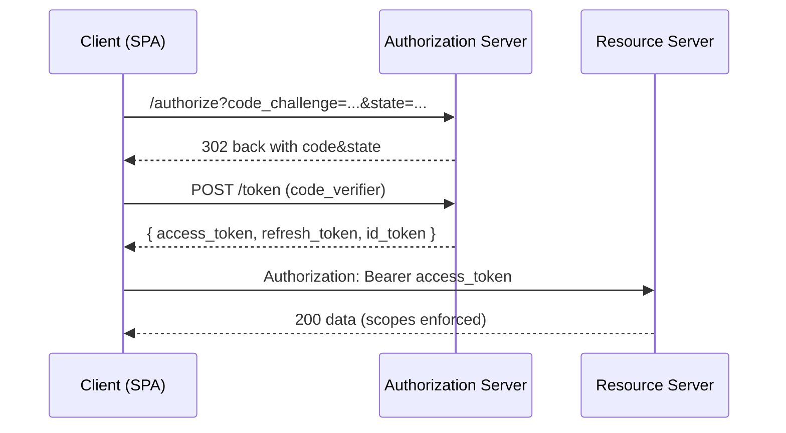

# Week 14 — **Web/API Dev Mastery**: Secure Backend Patterns + OAuth2/OIDC (Auth Code + PKCE) (Extra‑Deep)

_Generated: October 18, 2025_

> **Theme:** Build a production‑credible **AuthN/AuthZ stack** with OAuth2/OIDC (Authorization Code + PKCE), hardened **session** & **JWT** options, **refresh‑token rotation** with reuse detection, **CSRF/CORS** defenses, **scope‑based** and **role‑based** access checks, and an **API gateway** that enforces standards. You will ship a minimal **Authorization Server (AS)** + **Resource Server (RS)** + **Client** trio, a consent UI, and a rigorous test harness (conformance‑inspired). Maps to **OWASP Top 10 (A01/A02/A03/A05/A07/A08/A09)** and **OWASP API (API1/API2/API4/API5/API8/API9)**.

---

## Outcomes
- Stand up a minimal but **spec‑correct** OIDC provider (Auth Code + PKCE, Refresh Tokens, UserInfo, JWKs, Discovery).
- Offer **two token strategies**: **short‑lived JWT** (RS verifies via JWKs) and **opaque session cookie** (HttpOnly, `SameSite=Lax/Strict`, CSRF token).
- Implement **refresh‑token rotation** with **reuse detection** and **IP/UA binding** (defense‑in‑depth).
- Enforce **CORS** (allowlist, `Vary: Origin`), **CSRF** (double‑submit or SameSite+state), **rate limits** on token endpoints, and **mTLS** between gateway↔RS (optional lab).
- Scope & role model: `roles` (admin, user) + granular **scopes** (`orders:read`, `orders:write`, `tenants:admin`) wired to middleware and DB policies.
- Create **security headers** pack (CSP, HSTS, X‑Content‑Type‑Options, Referrer‑Policy, COOP/COEP where safe) and **consistent error handling** (problem+json).
- Publish `week14-web-api-auth` with AS, RS, Client, consent UI, test harness, and a report that maps to OWASP items.

## Repository layout (this week)

```
/week14-web-api-auth
  ├─ auth-server/                  # Authorization Server (AS)
  │  ├─ src/
  │  │  ├─ index.ts
  │  │  ├─ config.ts
  │  │  ├─ jwks.ts                 # rotated keys
  │  │  ├─ store/                  # users, sessions, grants, refresh tokens
  │  │  └─ views/                  # consent/login pages
  │  ├─ package.json
  │  └─ .env.example
  ├─ resource-server/              # API protected by scopes/roles
  │  ├─ src/
  │  │  ├─ server.ts
  │  │  ├─ middleware/authz.ts     # scope checks + RBAC
  │  │  └─ routes/                 # /orders, /me
  │  ├─ package.json
  │  └─ .env.example
  ├─ client-app/                   # SPA/Native simulator with PKCE
  │  ├─ src/
  │  │  ├─ app.ts
  │  │  └─ pkce.ts
  │  ├─ package.json
  │  └─ .env.example
  ├─ gateway/                      # reverse proxy (optional)
  │  ├─ traefik.yml|nginx.conf
  │  └─ mtls/                      # lab CA + certs (optional)
  ├─ tests/
  │  ├─ conformance/
  │  │  ├─ oidc_flow.test.ts
  │  │  └─ refresh_rotation.test.ts
  │  ├─ security/
  │  │  ├─ csrf_cors.test.ts
  │  │  └─ scopes_rbac.test.ts
  │  └─ perf/
  │     └─ k6_token_flows.js
  ├─ docs/
  │  ├─ threat-model.md
  │  ├─ flows.md                   # sequence diagrams
  │  ├─ owasp-matrix.md
  │  └─ report-week14.md
  └─ README.md
```

---

# Day 1 — **Architecture, Threat Model, & Project Skeletons**

### Morning (Build, ~4h)
- Sketch **DFD** and sequence diagrams for: Auth Code + PKCE, Token exchange, Refresh, UserInfo, RS access.
- Initialize **auth-server**, **resource-server**, and **client-app** with TypeScript (or Python FastAPI if you prefer).
- Choose libraries: **Node**: `oidc-provider` for AS, `jose` for JWKS/JWT, `express` for RS; **Python**: `authlib`, `fastapi`, `pyjwt`.


### Midday (Learn/Labs, ~3h)
- Threat model with **STRIDE**: spoofing (token theft), tampering (code, cookies), repudiation (logging), info disclosure (scopes), DoS (token endpoints), escalation (scope inflation).
- Define **trust boundaries**: Browser ↔ AS, Client ↔ AS/RS, Gateway ↔ RS.

### Afternoon (Drill/Test, ~3h)
- Write `docs/threat-model.md` including mitigations for each STRIDE item.
- Scaffold Express/FastAPI services; add health endpoints; set `helmet`/security headers defaults.

### Evening (Document/Share, ~2h)
- Commit initial README with components & ports; add `.env.example` for secrets and issuer/audience.

### Acceptance criteria
- AS/RS/Client skeletons run locally; diagrams & threat model committed; security headers baseline in place.

---

# Day 2 — **Authorization Server (AS) with OIDC: Auth Code + PKCE**

### Morning (Build, ~4h)
- Implement AS with **`oidc-provider`** (Node) or **Authlib** (Python): enable **PKCE (S256)**, consent screen, discovery document, and **JWKs** endpoint.
- Configure **clients**: SPA (public, PKCE), Backend (confidential, client_secret_basic), Scripted test (client_credentials).

```ts
// auth-server/src/index.ts (Node + oidc-provider sketch)
import Provider from 'oidc-provider';
const configuration = {
  pkce: { required: () => true, methods: ['S256'] },
  features: { devInteractions: false, revocation: { enabled: true }, introspection: { enabled: true } },
  clients: [
    { client_id: 'spa', redirect_uris: ['http://localhost:5173/callback'], response_types: ['code'], token_endpoint_auth_method: 'none' },
    { client_id: 'backend', client_secret: 'dev', redirect_uris: ['http://localhost:4000/cb'], response_types: ['code'] },
  ],
};
const oidc = new Provider('http://localhost:9000', configuration);
oidc.listen(9000);
```
### Midday (Learn/Labs, ~3h)
- Design **consent UI**: list scopes; store user grants; enforce **least privilege** by default.
- Rotate **signing keys** (JWKs) and support **key rollover** with `kid` and `jwks_uri`.

### Afternoon (Drill/Test, ~3h)
- Implement `/authorize`, `/token`, `/revocation`, `/introspection`, `/userinfo`.
- Add **rate limits** (Week 8 patterns) to `/token` and `/introspection`.

### Evening (Document/Share, ~2h)
- Document client configs and redirect URIs; add discovery URL to README.
- Write smoke tests: state/nonce required; PKCE verifier mismatch → 400; code reuse → invalid_grant.

### Acceptance criteria
- OIDC discovery works; code flow with PKCE succeeds; negative tests for state/nonce/PKCE errors pass.

---

# Day 3 — **Resource Server (RS), Scopes & RBAC, Error Model**

### Morning (Build, ~4h)
- Implement RS middleware to validate **JWT access tokens** with **JWKs** (offline) OR **opaque tokens** via **introspection** (online).
- Create scope guards: e.g., `orders:read`, `orders:write`; add **RBAC** roles in the token (`roles` claim) with admin‑only routes.

```ts
// resource-server/src/middleware/authz.ts (sketch)
import { createRemoteJWKSet, jwtVerify } from 'jose';
const jwks = createRemoteJWKSet(new URL('http://localhost:9000/.well-known/jwks.json'));
export function requireScope(scope){ return async (req,res,next)=>{
  try {
    const token = (req.headers.authorization||'').replace('Bearer ',''); 
    const { payload } = await jwtVerify(token, jwks, { issuer: 'http://localhost:9000', audience: 'api://orders' });
    if (!payload.scope?.split(' ').includes(scope)) return res.status(403).json({ error: 'insufficient_scope'});
    req.user = payload; return next();
  } catch(e){ return res.status(401).json({ error:'invalid_token'}); }
};}
```
### Midday (Learn/Labs, ~3h)
- Decide **JWT vs session cookie** per client type: SPA → short‑lived access token + refresh via **backend for frontend**; SSR app → **HttpOnly** session cookie.
- Specify **problem+json** error responses with correlation IDs.

### Afternoon (Drill/Test, ~3h)
- Add **CORS** allowlist (origins) and `Vary: Origin`; block wildcard credentials; add `Helmet` for headers.
- Create `/orders` (GET requires `orders:read`, POST requires `orders:write`); Admin `/admin/metrics` requires role.

### Evening (Document/Share, ~2h)
- Write `flows.md` showing SPA and backend flows; document CORS/CSRF strategies selected.

### Acceptance criteria
- RS validates tokens correctly; scopes/roles enforced; CORS/headers configured; consistent error model implemented.

---

# Day 4 — **Refresh Token Rotation, Reuse Detection, Sessions & CSRF**

### Morning (Build, ~4h)
- Implement **rotating refresh tokens**: each refresh invalidates the previous; store token family and last_seen fingerprint.
- Add **reuse detection**: if an older refresh token is presented, revoke the family and require re‑auth.

```ts
// auth-server/src/store/refresh.ts (concept)
/*
store schema:
refresh_tokens(id, user_id, client_id, family_id, current, prev_id, created_at, last_seen_ip, last_seen_ua, revoked_at)
*/
export function rotateRefresh(old){ /* create new token, mark old current=false, link prev_id, set family_id */ }
export function detectReuse(old){ /* if !old.current or already used -> REVOKE FAMILY */ }
```
### Midday (Learn/Labs, ~3h)
- **CSRF**: for session cookies, implement **double‑submit** token or SameSite=Lax + CSRF token on unsafe methods.
- Bind refresh tokens to **client fingerprint** (soft) and **IP/UA anomaly detection** (log & step‑up).

### Afternoon (Drill/Test, ~3h)
- Write tests: reuse old refresh token → family revoked; refresh from new IP triggers warning; CSRF token missing → 403.
- Ensure logout revokes refresh family and clears session.

### Evening (Document/Share, ~2h)
- Document rotation and reuse diagrams; note UX trade‑offs and recovery steps.

### Acceptance criteria
- Rotation implemented with family tracking; reuse triggers revocation; CSRF protection verified; logout reliable.

---

# Day 5 — **Gateway, mTLS (optional), Rate Limits, and Hardening**

### Morning (Build, ~4h)
- Introduce **gateway** (Traefik/Nginx) to terminate TLS, enforce **HSTS**, set security headers, and route `/auth` → AS, `/api` → RS.
- Optionally enable **mTLS** between gateway and RS; add **rate limits** on `/token` and `/login` paths.

```nginx
# gateway/nginx.conf (sketch)
server {
  listen 443 ssl http2;
  add_header Strict-Transport-Security "max-age=31536000" always;
  add_header Content-Security-Policy "default-src 'self'" always;
  location /api/ { proxy_pass http://rs:4000/; }
  location /auth/ { proxy_pass http://as:9000/; }
  # optional: proxy_set_header X-Client-Cert $ssl_client_escaped_cert;
}
```
### Midday (Learn/Labs, ~3h)
- Plan **key rotation**: JWKs for JWT, TLS certs for gateway; automate via scripts.
- Revisit **error handling**: do not leak internal errors; sanitize logs; include correlation IDs.

### Afternoon (Drill/Test, ~3h)
- Run k6 load on token flows; verify rate limiting and graceful degradation (Week 8 breaker/jitter patterns).
- Burp tests: CSRF PoC generator should **fail** for session‑protected endpoints; CORS checks behave as intended.

### Evening (Document/Share, ~2h)
- Update `owasp-matrix.md` mapping controls to A01/A02/A03/A05/A07/A08/A09 and API list.
- Snapshot configs and rationale in `docs/report-week14.md`.

### Acceptance criteria
- Gateway routes working; headers set; optional mTLS validated in lab; rate limits enforced; Burp checks pass.

---

# Day 6 — **Conformance‑Inspired Tests, Logging/Telemetry, and Recovery**

### Morning (Build, ~4h)
- Write **conformance‑inspired** tests: state/nonce handling, PKCE failure modes, token audience/issuer checks, alg/kid validation, clock skew tolerance.
- Integrate **OpenTelemetry logs/traces** and structured logs with CIDs for `/authorize`, `/token`, `/introspection`.

```ts
// tests/conformance/oidc_flow.test.ts (sketch with vitest/jest)
test('rejects missing/invalid state and nonce', async () => { /* ... */ });
test('requires S256 PKCE; plain/verifier mismatch fails', async () => { /* ... */ });
test('id_token audience/issuer claims validated', async () => { /* ... */ });
```
### Midday (Learn/Labs, ~3h)
- Plan **backup/restore** of keys and grants; simulate **key rollover** (new `kid`, old kept for verification).
- Define **incident runbooks**: refresh‑family compromise, key leak, token replay, consent reset.

### Afternoon (Drill/Test, ~3h)
- Execute rollover test: publish new JWK to `jwks_uri`, sign new tokens, verify old still validate in RS until TTL expires.
- Simulate refresh‑family reuse; ensure detection & revocation with audit logs visible in Week 12 dashboards.

### Evening (Document/Share, ~2h)
- Update dashboards (Week 12) to include **auth metrics**: token issuances/min, refresh reuses, revocations, 4xx/5xx at `/token`.
- Finalize test coverage table.

### Acceptance criteria
- Conformance tests pass; telemetry visible; key rollover drill successful; recovery runbooks documented.

---

# Day 7 — **Mini‑Project & Release: OIDC + Secure RS Pack**

### Morning (Build, ~4h)
- Polish consent UI, client app PKCE helper, and RS scope/RBAC middleware.
- Create **samples**: SPA login, backend exchange, device‑code (optional) demo.

### Midday (Learn/Labs, ~3h)
- Produce **release artifacts**: JWK set snapshot, config files, test reports, and screenshots of flows/headers.
- Include `curl` scripts for `/authorize` and `/token` to ease review.

### Afternoon (Drill/Test, ~3h)
- Run a fresh install from README; ensure secrets/envs are minimal and documented; verify all flows.
- Tag **v1.4.0-auth** and publish.

### Evening (Document/Share, ~2h)
- Write `report-week14.md` linking controls to OWASP/API items and to prior weeks (RLS, rate limits, monitoring).
- Open issues for **FAPI‑style** tightening and **par‑pushed auth requests** (future stretch).

### Acceptance criteria
- Release includes AS/RS/Client, consent UI, tests, headers configs, and docs; clean bring‑up succeeds.
- PKCE, rotation, scopes/RBAC, CORS/CSRF, and telemetry all verified.


---

## How this week advances your cybersecurity path
- **AppSec & API Security:** You can design and **prove** correct OAuth2/OIDC flows with PKCE and robust token/session handling.
- **Platform & SRE:** You operate key rotation, rate limits, telemetry, and incident runbooks for auth systems.
- **Blue/DFIR:** Your auth stack emits **useful evidence** (revocations, anomalies, reuse detection) that plugs into Week 12 dashboards.


---

## References / Study Hubs
- OAuth 2.1 drafts & RFC 6749/8252/7009/7662/7636 (PKCE)
- OpenID Connect Core & Discovery & Dynamic Client Registration
- oidc-provider (Node), Authlib (Python), jose/jwk/jwt libraries
- OWASP ASVS / MASVS (mobile PKCE notes), OWASP Cheat Sheets (CORS, CSRF, JWT, Session)

## Similar GitHub repos / inspiration
- panva/node-oidc-provider (reference implementation patterns)
- lepture/authlib examples (FastAPI / Flask)
- ory/hydra (full‑blown OIDC server) — for ideas & comparison (don’t copy/paste configs blindly)

## Rubric (Week 14)
- **Flows**: Auth Code + PKCE + refresh implemented; discovery/JWKS in place; state/nonce enforced.
- **Tokens/Sessions**: JWT validation or introspection; session cookies hardened; CSRF/CORS correct.
- **Rotation/Reuse**: refresh rotation with family tracking; reuse detection; logout revokes.
- **Scopes/Roles**: middleware enforces scope+RBAC; admin routes protected; errors are problem+json.
- **Ops**: headers, rate limits, telemetry, key rollover drill; v1.4.0 release with docs & tests.

